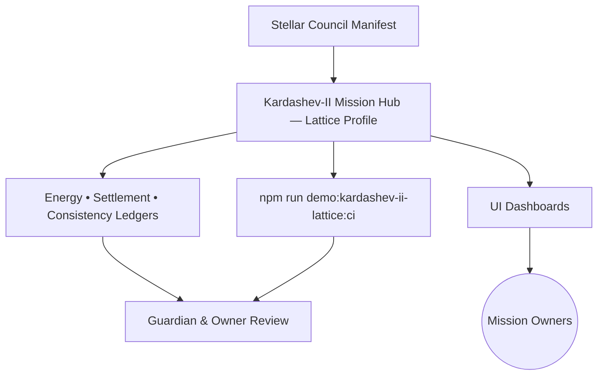

# AGI Jobs v0 (v2) — Demo → AGI Jobs Platform at Kardashev II Scale → Stellar Civilization Lattice

> **Execution scope:** deterministic offline simulation with synthetic, historically dated inputs. No provider calls,
> authenticated signatures, physical infrastructure control or payments are performed. Safe batches are unsigned
> proposals with placeholder targets and must not be submitted to a production wallet.

Follow the [complete parent runbook](../README.md) for toolchain setup, model interpretation, experiments and troubleshooting.
From the repository root: `nvm install`, `nvm use`, `npm ci`, then `npm run demo:kardashev-ii-lattice:orchestrate` and
`npm run demo:kardashev-ii-lattice:ci`. Serve this exact variant with
`npm run demo:kardashev-ii:serve -- --profile stellar-civilization-lattice`.
The server uses loopback only and the dashboard uses local Mermaid assets.
`--check` is a read-only artifact comparison and readiness gate; generation is the command without `--check`.
The run-manifest JSON records SHA-256 input hashes. Model scores and "proof" labels describe synthetic calculations and proposal structure.

> The Stellar Civilization Lattice profile runs the Kardashev-II operator experience with a Dyson-ready task lattice, lunar gateways, and Mars lifelines. It keeps every ledger, dashboard, and guardian hook coherent with the global AGI Jobs v0 (v2) sovereignty engine.

## Computer work, evidence and review-constrained scale

This variant includes the same ten synthetic work scopes, downloadable task drafts and interactive worker/reviewer capacity planner as the main deck.
Follow the [computer-work runbook](../COMPUTER-WORK.md) for real browser fixture execution, OpenClaw/ChatGPT Work commissioning and acceptance evidence.
The planner's USD 40 trillion/year market input is an assumption; it is separate from this variant's fictional energy, governance and economic ledgers.

## 🧭 Ultra-deep readiness map
- **Location**: `demo/AGI-Jobs-Platform-at-Kardashev-II-Scale/stellar-civilization-lattice/`
- **Operating manifest**: `config/kardashev-ii.manifest.json` (orbital council, guardian cadence, bridge tolerances).
- **Task lattice**: `config/task-lattice.json` (Dyson orchestration, Luna buffers, Mars lifelines).
- **Energy & compute telemetry**: `output/lattice-energy-feeds.json`, `output/lattice-telemetry.json`.
- **Decision ledger**: `output/lattice-orchestration-report.md` summarises the last lattice orchestrator pass.
- **CI gate**: `npm run demo:kardashev-ii-lattice:ci` (enforced on PRs touching this directory).

## 🚀 Kardashev-II operator quickstart
1. Install dependencies from the repo root: `npm ci`.
2. Run `npm run demo:kardashev-ii-lattice:ci` to validate artefacts and README integrity for the lattice profile.
3. Launch a deterministic dry-run with `npm run demo:kardashev-ii:orchestrate -- --check --profile stellar-civilization-lattice` to recompute ledgers without rewriting outputs.
4. Generate full artefacts with `npm run demo:kardashev-ii-lattice:orchestrate` (writes to `output/` with the `lattice-` prefix).
5. Escalate anomalies via [`OperatorRunbook.md`](../../../OperatorRunbook.md) and the guardian contacts in `config/kardashev-ii.manifest.json`.

## 🧱 Architecture overview

```mermaid
flowchart TD
    Council[Stellar Council Manifest] --> MissionHub[Kardashev-II Mission Hub — Lattice Profile]
    MissionHub --> Ledgers[Energy • Settlement • Consistency Ledgers]
    MissionHub --> Dashboards[UI Dashboards]
    MissionHub --> CI[npm run demo:kardashev-ii-lattice:ci]
    Ledgers --> Governance[Guardian & Owner Review]
    CI --> Governance
    Dashboards --> Operators((Mission Owners))
```
- `scripts/run-kardashev-demo.ts` ingests the lattice manifest and task lattice to regenerate outputs under `output/`.
- Dashboards in `index.html` + `ui/dashboard.js` ingest lattice ledgers to project readiness metrics for mission owners.
- CI validation (`scripts/ci-validate.ts`) replays orchestrator checks and enforces documentation parity.

## 🪪 Identity lattice & trust fabric
- Declared inside `config/kardashev-ii.manifest.json.identityProtocols` for the stellar lattice federations.
- Identity anchors, attestation latency and coverage assumptions appear in `output/lattice-telemetry.json`; owner-proof JSON describes encoded governance calls.
- Actual guardian approvals are external to this simulation. No signature is collected or authenticated by this runner.

## 🛰️ Compute fabric hierarchy

```mermaid
flowchart LR
    Earth[Solara Earth Core] --> Luna[Luna Logistics Spine]
    Luna --> Orbital[Orbital Research Array]
    Orbital --> Mars[Mars Terraforming Mesh]
    Mars --> MissionHub[Stellar Mission Hub]
```
- Fabric nodes live under `config/kardashev-ii.manifest.json.computeFabrics`.
- Availability, failover partner, and energy draw metrics synchronise into `output/lattice-telemetry.json`.
- `output/lattice-mermaid.mmd` auto-renders the hierarchy for downstream dashboards and is loaded by `ui/dashboard.js`.

## 🔌 Energy & compute governance
- Energy parameters sourced from `config/energy-feeds.json` plus `config/kardashev-ii.manifest.json.energyProtocols`.
- Governance playbook stored in `output/lattice-orchestration-report.md` with explicit guardian cadence.
- Thermostat ranges are inputs to local calculations. This runner does not send them to an external service.

## ⚡ Live energy feed reconciliation
- `output/lattice-energy-feeds.json` captures regional supply; `output/lattice-energy-schedule.json` cross-verifies dispatch windows.
- `scripts/run-kardashev-demo.ts` performs kahan- and pairwise-sum comparisons to eliminate reconciliation drift.
- Configured feed and cross-verification tolerances determine warnings; inspect the emitted tolerances rather than assuming a fixed ±0.1% rule.

## 🔋 Energy window scheduler & coverage ledger
- Scheduler logic resides in `scripts/run-kardashev-demo.ts` (energy schedule calculation) and writes to `output/lattice-energy-schedule.json`.
- Coverage and reliability projections appear in `output/lattice-energy-schedule.json`; fabric-ledger JSON describes shard routing and coverage references.
- Keep signed operational approvals separately; the generated owner-proof file is overwritten reproducibly and contains no authenticated signatures.

## 🚚 Interstellar logistics lattice
- Logistics corridors declared in `config/kardashev-ii.manifest.json.logisticsCorridors`.
- Runtime health published to `output/lattice-logistics-ledger.json` with capacity, jitter, and buffer-day metrics.
- Logistics visualisations refresh in `index.html` via the `renderLogistics` handler inside `ui/dashboard.js`.

## 🕸️ Sharded job fabric & routing ledger
- Federation shards and job registries defined in `config/fabric.json`.
- Routing results captured in `output/lattice-task-ledger.json`, mapping tasks to shards and guardians.
- Cross-reference validation checks declared identifiers; it cannot guarantee operational routing or consensus.

## 🎛️ Mission directives & verification dashboards
- Owner directives under `config/kardashev-ii.manifest.json.missionDirectives` map to Safe transaction bundles.
- Verification dashboards consume generated JSON ledgers. Read `output/lattice-orchestration-report.md` and `output/lattice-operator-briefing.md` alongside them.
- UI entry point: `index.html` with components rendered by `ui/dashboard.js`.

## 🌐 Settlement lattice & forex fabric
- Settlement exposures and forex references export to `output/lattice-settlement-ledger.json`.
- Treasury data originates from `config/kardashev-ii.manifest.json.interstellarCouncil` addresses.
- These are modeled exposures and finality assumptions. The runner releases no payments.

## ♾️ Consistency ledger & multi-angle verification
- `output/lattice-consistency-ledger.json` records agreement between local calculations. Input fingerprints are in the run manifest; no guardian signatures are produced.
- CI recomputes deterministic artifacts and readiness checks. Keccak256 hashes support consistency checks, not distributed consensus or signer authentication.
- Diff noise is surfaced in `output/lattice-orchestration-report.md` under the “Consistency” section.

## 🔭 Scenario stress sweep
- Stress vectors embedded within `config/kardashev-ii.manifest.json.verificationProtocols` (energy models, latency tolerances).
- Full sweep results land in `output/lattice-scenario-sweep.json` and are summarised in `output/lattice-orchestration-report.md`.
- Schedule a sweep post-change with `npm run demo:kardashev-ii:orchestrate -- --reflect --profile stellar-civilization-lattice` to attach introspection notes.

## 🪐 Mission lattice & task hierarchy
- Hierarchical missions live in `config/task-lattice.json` and include timelines, autonomy rates, and fallback plans.
- `output/lattice-task-hierarchy.mmd` renders the mission tree for rapid situational awareness.
- Guardians cross-link tasks to sentinel coverage inside `output/lattice-task-ledger.json`.

## 🧬 Stability ledger & unstoppable consensus
- System resilience metrics recorded in `output/lattice-stability-ledger.json`.
- Thermostat guardrails and pause levers surfaced in `output/lattice-owner-proof.json` for council audits.
- CI checks encoded pause/resume proposals and model readiness; it does not replay transactions on a chain.

## 🛡️ Governance and safety levers
- Pause, upgrade, and deployment levers defined in `config/kardashev-ii.manifest.json.missionDirectives.ownerPowers`.
- Guardian drill cadence (hours/minutes) is a configured assumption; see `missionDirectives.drills` in the manifest. The runner does not execute drills.
- Align with repo-level emergency playbooks under `demo/agi-governance/` for multi-mission escalations.

## 🗝️ Owner override proof deck
- Owner-call structure and payload hashes are recorded in `output/lattice-owner-proof.json`; the unsigned batch is in `output/lattice-safe-transaction-batch.json`.
- The orchestration report summarizes structural checks, not approvals from actual signers.
- No scheduled compliance export is performed by this demo. Archive reviewed artifacts separately when required.

## 📦 Artefacts in this directory
- `config/` — manifest, fabric topology, energy feeds, and mission lattice JSON for the stellar profile.
- `scripts/` — TypeScript automation for lattice orchestration and CI enforcement.
- `output/` — generated ledgers, complete offline dashboards, and Mermaid sources with the `lattice-` prefix.
- `ui/` — static dashboards consuming the latest lattice artefacts.
- `index.html` — launchpad for the operator experience.

## 🧪 Verification rituals
- **Per-change**: `npm run demo:kardashev-ii-lattice:ci` (required; fails if documentation or ledgers drift).
- **Pre-launch**: `npm run demo:kardashev-ii:orchestrate -- --check --profile stellar-civilization-lattice` to dry-run invariants against new manifests.
- **Full publish**: `npm run demo:kardashev-ii-lattice:orchestrate` to write refreshed artefacts and dashboards.
- **Cross-demo**: `npm run demo:kardashev-ii-stellar:ci` to ensure subordinate lattice states remain aligned.

## 🧠 Reflective checklist for owners
- [ ] Have the deterministic ledgers and run-manifest input hashes been regenerated and checked?
- [ ] Are energy windows (`output/lattice-energy-schedule.json`) covering ≥ 1.1× projected demand?
- [ ] Do logistics buffers in `output/lattice-logistics-ledger.json` exceed the minimums in the manifest?
- [ ] Has `npm run demo:kardashev-ii-lattice:ci` produced a ✔ result after your changes?
- [ ] Have unsigned proposal checks been kept separate from any real guardian approvals?

---

**Continuous alignment**: rerun `npm run demo:kardashev-ii-lattice:ci` after every change in this tree. A passing run establishes checked model behavior and reproducibility; it does not guarantee real-world consensus.
