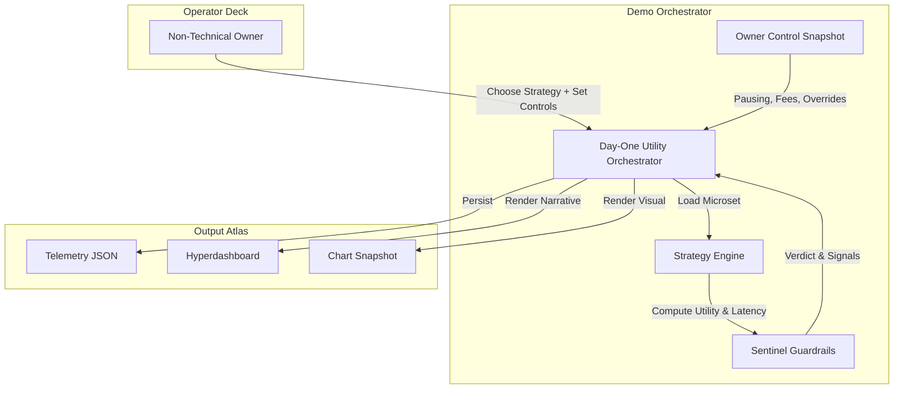
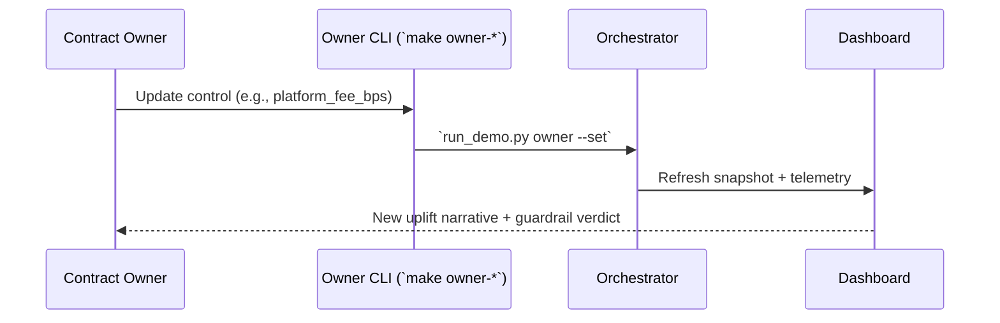
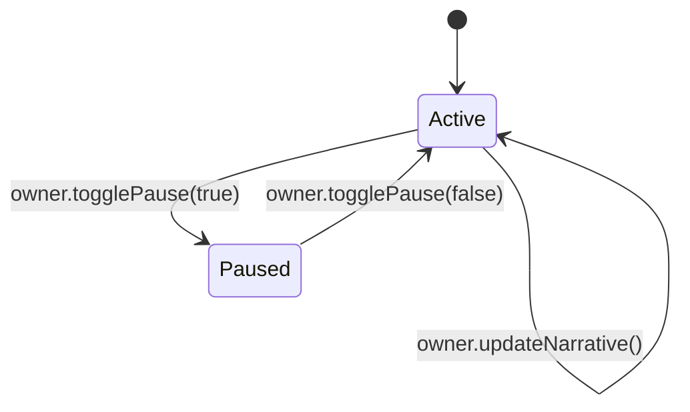

# AGI Jobs v0 (v2) — Day-One Utility Benchmark Demo

This demo scaffold proves that a non-technical operator can command an
ultra-powerful AGI employment lattice from day one. It blends deterministic
telemetry, sovereign owner controls, and cinematic dashboards to demonstrate the
full strength of **AGI Jobs v0 (v2)**.

> **Mission** — Show that anyone can launch a world-class AGI labour market with
> production-grade guardrails, realtime owner governance, and spectacular
> storytelling dashboards from a single, friendly command deck.

---

## Quickstart (non-technical operator)

1. **Install prerequisites (Python 3.10+).**
2. Run the flagship scenario:

   ```bash
   cd demo/AGIJobs-Day-One-Utility-Benchmark
   make e2e
   ```

   This installs dependencies, simulates the Day-One launch, writes JSON
   telemetry, exports a cinematic HTML dashboard (`out/dashboard_e2e.html`), and
   renders a high-fidelity chart snapshot.

3. Launch additional strategies to explore the expansion path:

   ```bash
   make alphaevolve
   make hgm
   make trm
   make omni
   ```

4. Inspect the owner command deck:

   ```bash
   make owner-show
   ```

   Update parameters live — no code edits required:

   ```bash
   make owner-set KEY=platform_fee_bps VALUE=220
   make owner-toggle  # Pause/resume entire orchestration instantly
   ```

5. Serve the dashboard (optional):

   ```bash
   python3 -m http.server --directory out 9000
   ```

   Open `http://localhost:9000/dashboard_e2e.html` and watch the mermaid-powered
   blueprint animate.

---

## Architecture at a glance



The orchestrator is intentionally linear: every step is observable, reversible,
and governed by the owner. The generated dashboard embeds mermaid schematics,
mission metrics, and treasury analytics in a single cinematic surface.

---

## Files & Roles

| Path | Purpose |
| ---- | ------- |
| `Makefile` | Friendly non-technical command deck with curated targets. |
| `run_demo.py` | Tiny CLI entrypoint delegating to the orchestrator. |
| `demo_runner.py` | Full simulation logic, guardrail enforcement, HTML renderer, charting. |
| `config/microset.yaml` | Baseline labour dataset; strategies derive candidate metrics from it. |
| `config/strategies.yaml` | Five iconic launch profiles (E2E, AlphaEvolve, HGM, TRM, OMNI). |
| `config/rules.yaml` | Sentinel thresholds controlling launch approval. |
| `config/owner_controls.yaml` | Owner-governed configuration (addresses, fees, overrides, pause switch). |
| `contracts/v2/modules/DayOneUtilityController.sol` | Upgrade-ready solidity module mirroring the owner controls contract. |
| `tests/test_demo_runner.py` | Pytest suite verifying guardrails, pausing, output artefacts. |

---

## Owner command deck

The owner retains absolute sovereignty — pausing, fee updates, guardrail
adjustments, and narrative shifts are one command away.



| Control | Description |
| ------- | ----------- |
| `platform_fee_bps` | Instant revenue tuning (0–2500 bps). Applied on every run. |
| `latency_threshold_override_bps` | Optional override of latency guardrail from the owner console. |
| `paused` | Hard stop for the entire orchestrator. When `true`, simulations refuse to run. |
| `narrative` | Text displayed in the dashboard hero, enabling storytelling updates without deployments. |

Every update triggers schema validation so a mis-typed value cannot compromise the
pipeline.

---

## Day-One dashboards

Running `make e2e` produces:

- `out/report_e2e.json` — canonical telemetry and guardrail verdicts
- `out/dashboard_e2e.html` — mermaid-enhanced cinematic dashboard
- `out/snapshot_e2e.png` — baseline vs candidate comparison chart
- `out/owner_controls_snapshot.json` — owner snapshot for audit trails


Open the HTML dashboard to explore interactive mermaid diagrams and the
owner-control narrative. The UI intentionally resembles an omnidomain command
center: glacial gradients, neon highlights, and high-contrast typography.

---

## Strategy atlas

```mermaid
gantt
dateFormat  X
axisFormat  %s
section Adoption Sprint
E2E Day-One Utility   :active, 0, 1
AlphaEvolve Surge     : 0, 1
HGM Governance        : 0, 1
Total Revenue Maximizer : 0, 1
Omni-Concord Launch   :milestone, 0, 1
```



- **E2E** — Launch proof. Balanced uplift, fast ROI, deterministic guardrails.
- **AlphaEvolve** — Experimental growth with predictive matching.
- **HGM** — Regulated market posture with hardened governance.
- **TRM** — Aggressive monetization under strict owner supervision.
- **OMNI** — Full omnidomain orchestration with interleaved modules.

---

## Smart contract mirror

To anchor the demo in mainnet-grade reality, `contracts/v2/modules/DayOneUtilityController.sol`
implements the same controls as the CLI. Owners can update fees, guardrails, and
narratives, plus pause/resume the system through a timelock-governed surface.



Compile or test with your existing Foundry/Hardhat stack — no extra wiring is
required.

---

## Continuous integration (CI)

A dedicated GitHub Actions workflow (`demo-day-one-utility-benchmark.yml`)
protects this demo. It:

1. Installs Python dependencies via the Makefile.
2. Runs the orchestrator across multiple strategies.
3. Validates output artefacts (JSON + dashboard).
4. Executes Pytest for regression coverage.
5. Exercises owner commands (set + toggle) to guarantee sovereignty features.

The workflow runs on every PR touching the demo and on `main` to guarantee
non-regression and a permanently green V2 CI shield.

---

## Testing locally

```bash
make verify  # Installs deps & runs pytest
```

`pytest` covers pausing behaviour, guardrail correctness, HTML export, and the
owner console.

---

## Next steps

- Connect the dashboard output to on-chain deployments by pointing the
  orchestrator to deployed `DayOneUtilityController` addresses.
- Extend `strategies.yaml` with new multipliers to model different market
  segments.
- Feed the exported JSON into the existing AGI Jobs analytics stack for further
  intelligence.

With this scaffold a non-technical founder can operate a sovereign AGI labour
platform at world-shaping scale the moment they clone the repository.
