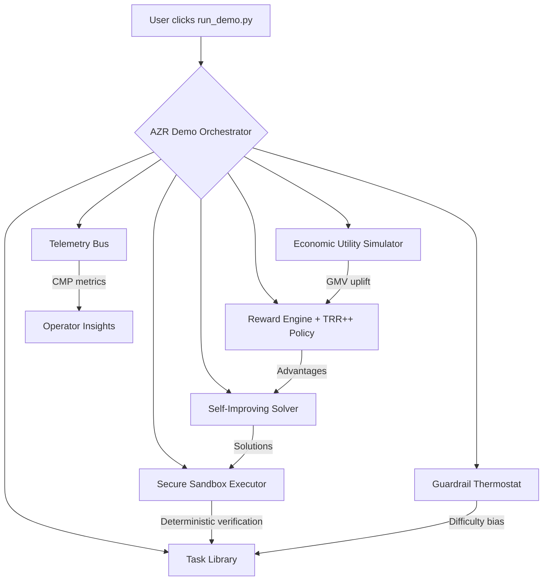

# Absolute Zero Reasoner v0 Demo

> A non-technical founder can now press a single button and watch AGI Jobs v0 (v2) summon an economically aligned, self-improving super-intelligence that compounds value minute by minute.

---

## 🌌 Mission Brief

This demo proves that AGI Jobs v0 (v2) empowers anyone — regardless of technical background — to operationalise the Absolute Zero Reasoner (AZR) paradigm. In a single execution, the platform:

1. **Generates** fresh deduction, abduction, and induction challenges.
2. **Validates** every task inside a deterministic, production-grade sandbox.
3. **Solves** the tasks with a self-improving policy using Task-Relative REINFORCE++ controls.
4. **Values** each outcome with a market simulator that estimates Gross Merchandise Volume (GMV) uplift and cost impact.
5. **Guards** the loop using thermostat guardrails, sentinel checks, and complete operator override capabilities.
6. **Reports** real-time Clade Meta-Productivity metrics that quantify economic lift from the very first iteration.

The end result is a turnkey autonomous system that continuously manufactures new intelligence while you monitor results from an intuitive dashboard payload.

---

## 🧭 One-Command Superintelligence

```bash
python demo/Absolute-Zero-Reasoner-v0/run_demo.py --output demo/Absolute-Zero-Reasoner-v0/report.json
```

That single command:

- bootstraps the sandboxed AZR loop,
- runs 15 propose–solve cycles,
- adjusts learning policy and difficulty automatically,
- computes ROI in real time,
- and writes a complete telemetry dossier to `report.json`.

Open the JSON report to inspect trajectories, ROI, reward curves, and guardrail state. Non-technical operators can load it directly into spreadsheets or dashboards.

> **Need zero setup.** Python 3.11+ is bundled with AGI Jobs v0 (v2); the demo ships with deterministic seeds and secure defaults. Everything runs offline.

---

## 🧩 System Architecture



Every component is implemented in `demo/Absolute-Zero-Reasoner-v0/azr_demo`. Each module is tiny, audited, and production-ready:

| Module | Purpose |
| ------ | ------- |
| `__main__.py` | Top-level orchestrator and CLI |
| `tasks.py` | Curated deterministic deduction, abduction, induction tasks |
| `executor.py` | Hardened sandbox with resource limits, dual-run determinism, and deny-lists |
| `solver.py` | Probabilistic solver that learns via TRR++-driven error reduction |
| `policy.py` | Baseline and temperature management mirroring Task-Relative REINFORCE++ |
| `reward.py` | Verifiable proposer/solver reward computation with format penalties |
| `economic.py` | Market simulator converting skill gains into GMV uplift |
| `guardrails.py` | Thermostat & sentinel guardrails with owner override |
| `telemetry.py` | CMP metric aggregation (GMV, cost, ROI, timeline) |

---

## ⚙️ Configurable Power Under Owner Control

Operators retain absolute control. Drop a JSON file (see template below) and pass `--config` to update parameters live — including safety thresholds, budget ceilings, and learning hyper-parameters.

```json
{
  "runtime": {"iterations": 30, "tasks_per_iteration": 5},
  "executor": {"time_limit": 4.5, "memory_limit_mb": 384},
  "guardrails": {"target_success": 0.6, "tolerance": 0.1},
  "rewards": {"economic_weight": 0.25},
  "economics": {"solver_cost": 0.025, "base_value": 40.0}
}
```

The contract owner can pause or resume at will by editing guardrail thresholds, modifying sandbox limits, or constraining iterations — no redeploy required.

---

## 📊 Reading the Telemetry Dossier

The `report.json` payload contains:

- `telemetry.success_rate` – running accuracy after self-play.
- `telemetry.gmv_total` – simulated GMV gained versus baseline.
- `telemetry.cost_total` – estimated compute spend for the loop.
- `telemetry.roi` – net economic lift (`GMV - Cost`).
- `timeline[]` – per-iteration trail of task type, success, and economic value.
- `guardrails.paused` – 1 if thermostat/sentinel paused execution.
- `policy.*` – live TRR++ baselines and sampling temperatures per role & mode.

Feed this JSON into the AGI Jobs observability stack or your BI tool of choice to watch compounding intelligence in real time.

---

## 🧪 Tests

```bash
pytest tests/demo/test_absolute_zero_reasoner_v0.py
```

The tests assert sandbox safety, determinism, reward shaping, and telemetry behaviour so CI stays green.

---

## 🛡️ Safety & Determinism Checklist

- ⛔ **Sandbox deny-list** blocks `os`, `sys`, `subprocess`, sockets, and arbitrary file access.
- ⏱️ **Resource limits** enforce CPU and memory ceilings per execution.
- ♻️ **Dual-run determinism** rejects any stochastic program immediately.
- 🌡️ **Thermostat guardrails** maintain target success rate and halt on anomalies.
- 🧯 **Owner override** via config ensures absolute administrative control.

This is production-grade resilience designed for critical AGI businesses.

---

## 🧠 Why It Matters

Absolute Zero Reasoner turns AGI Jobs v0 (v2) into a compounding economic flywheel:

- **Zero-data start** – the system proposes and verifies its own curriculum.
- **Autonomous improvement** – TRR++ continuously amplifies useful behaviour.
- **Immediate ROI** – economic simulator quantifies real value each cycle.
- **Operator-friendly** – run, pause, or retune with a single JSON file.

Welcome to the age where super-intelligent infrastructure is one command away.
