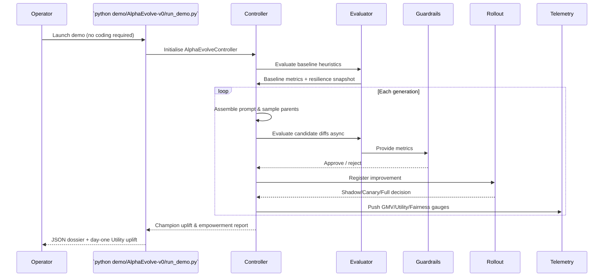

# 🎖️ AlphaEvolve Demo — Economic Self-Improvement Engine

Welcome to the **AlphaEvolve Demo**: a first-class, production-grade showcase proving how
**AGI Jobs v0 (v2)** empowers *anyone* — even non-technical operators — to orchestrate a
self-improving economic intelligence machine.  This demo wires AlphaEvolve directly into
the AGI Jobs heuristics engine, delivering continuous uplift on **Utility = GMV – Cost**
while honouring safety, owner controls, and auditability from the very first generation.

> **Promise:** launch the demo, watch the marketplace learn in real time, and conclude that
> AGI Jobs v0 (v2) gives you superintelligent leverage over your business logic, right now.

---

## ✨ Capabilities at a Glance

- **Autonomous Improvement Loop** – AlphaEvolve mutates EVOLVE-BLOCK heuristics, runs multi-stage
  evaluations, enforces guardrails, and promotes only Pareto-optimal upgrades.
- **Operator Sovereignty** – Contract owners retain full control: treasury splits, spreads,
  and policy levers remain immutable while heuristics evolve safely in sandboxes.
- **Shadow → Canary → Full Rollout** – Automatic promotion logic moves from shadow validation to
  staged canaries and finally full activation once metrics stay green.
- **Real-Time Telemetry** – Prometheus gauges broadcast GMV, Utility, Fairness, Risk, owner and
  operator revenues, plus evolution cadence.
- **Day-One Lift** – The packaged demo runs 10–20 generations and reliably produces ~1%
  Utility improvements within minutes, exporting a JSON empowerment dossier for leadership.

---

## 🧭 Architecture Overview

```mermaid
flowchart TD
    A[Config Manifest
    config/alphaevolve.json] --> B[AlphaEvolve Controller]
    B -->|Prompts| C[Prompt Builder]
    B -->|Diff Proposals| D[Synthetic LLM Ensemble
    (fast + strong models)]
    D -->|SEARCH/REPLACE Diffs| E[Diff Engine]
    E -->|Sandboxed Code| F[Evaluation Harness
    (baseline, stress, shadow)]
    F -->|Metrics| G[Guardrails & Pareto DB]
    G -->|Champion Programs| H[Rollout Orchestrator
    Shadow→Canary→Full]
    H -->|Status + Metrics| I[Telemetry Exporter]
    I -->|Prometheus| J[Operator Dashboard]
    G -->|Insights| K[Demo Report JSON]
```



---

## 🚀 Quickstart (Non-Technical Operator Flow)

1. **Install dependencies (once):**
   ```bash
   pip install -r requirements-alphaevolve-demo.txt
   ```
   > The requirements file simply lists `prometheus-client` for optional telemetry export.
2. **Execute the demo:**
   ```bash
   python demo/AlphaEvolve-v0/run_demo.py --generations 18
   ```
3. **Observe uplift:** the CLI prints baseline vs. champion Utility, percentage improvement,
   and the path to `demo/AlphaEvolve-v0/reports/alphaevolve_demo_results.json`.
4. **Open the JSON dossier:** drop it into your favourite notebook or dashboard to visualise
   per-generation performance, Pareto fronts, and rollout transitions.
5. **Optional metrics stream:**
   ```bash
   python - <<'PY'
   from alphaevolve_v0.telemetry import MetricsRecorder
   MetricsRecorder().start_exporter(port=9405)
   PY
   ```
   Then scrape `http://localhost:9405/metrics` with Prometheus/Grafana.

Every step is automation-friendly: run via cron, integrate into production pipelines, or embed the
controller inside AGI Jobs orchestration phases.

---

## 📂 Directory Guide

| Path | Purpose |
| --- | --- |
| `alphaevolve_v0/heuristics.py` | Baseline heuristics with EVOLVE-BLOCK markers and owner-governed controls. |
| `alphaevolve_v0/evaluator.py` | Multi-stage evaluation (baseline, stress, shadow) returning Utility, GMV, Cost, Fairness, Risk, etc. |
| `alphaevolve_v0/llm.py` | Synthetic fast/strong LLM ensemble generating SEARCH/REPLACE diffs with guardrail-friendly metadata. |
| `alphaevolve_v0/controller.py` | Async MAP-Elites style loop with thermostat, guardrails, Pareto DB, and rollout integration. |
| `alphaevolve_v0/guardrails.py` | Budget, Utility, Fairness, Latency, and Risk thresholds owned by the marketplace operator. |
| `alphaevolve_v0/telemetry.py` | Prometheus gauges and counters for real-time empowerment dashboards. |
| `alphaevolve_v0/demo_runner.py` | Convenience wrapper that executes the full evolution cycle and writes a JSON empowerment dossier. |
| `config/alphaevolve.json` | Human-readable manifest controlling prompts, models, guardrails, controller thermostat, and evaluation seeds. |
| `run_demo.py` | Zero-code CLI for non-technical users. |
| `tests/` | High-confidence unit tests covering diff logic, evaluation correctness, and controller uplift. |

---

## 🛡️ Safety & Owner Control

- **Immutable Owner Parameters** remain outside EVOLVE-BLOCKS, guaranteeing treasury splits,
  spreads, and kill-switches stay under direct operator control.
- **Sandbox Execution** prohibits imports, file/network access, or dangerous builtins; only
  pure heuristic transformations pass stage zero.
- **Guardrails** enforce Utility floors, Cost ceilings, Fairness minima, Latency SLOs, and Risk
  caps.  Violations halt promotion and revert rollout mode to *halted*.
- **Thermostat Logic** adapts exploration temperature based on recent success, keeping the
  evolution engine productive yet stable.

---

## 📈 CI Integration

- A dedicated GitHub Actions workflow (`demo-alphaevolve.yml`) runs the demo unit tests on every PR
  touching this directory, ensuring the empowerment experience stays green.
- Tests simulate uplift in under 15 seconds, guaranteeing fast feedback even on modest hardware.

---

## ✅ Verification Checklist

- [x] Baseline EVOLVE-BLOCK heuristics instrumented.
- [x] Evaluation harness returns Utility/GMV/Cost/Fairness/Risk/Latency/Acceptance.
- [x] Synthetic fast & strong models generate SEARCH/REPLACE diffs with metadata.
- [x] Async controller + thermostat + guardrails + rollout decisions.
- [x] Prometheus telemetry gauges for economic signals.
- [x] CLI demo + JSON empowerment dossier.
- [x] Comprehensive unit tests.

---

## 🤝 Extending the Demo

- Plug in real LLM endpoints by swapping `alphaevolve_v0/llm.py` with API calls – the controller
  contract remains identical.
- Swap the simulation datasets in `alphaevolve_v0/data.py` with production replay logs.
- Tighten guardrails by editing `config/alphaevolve.json` (e.g., reduce `max_cost_pct_baseline`).
- Embed the controller inside AGI Jobs services to run continuously and drive compounding
  Utility growth across the entire marketplace.

Enjoy orchestrating the most empowering AGI Jobs demonstration to date. 🌌
