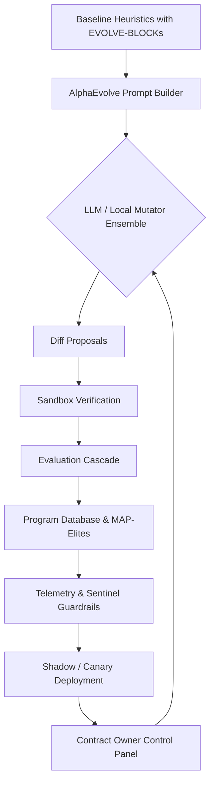

# AlphaEvolve Demo 👁️✨

> "AlphaEvolve Demo" showcases how a non-technical founder can use **AGI Jobs v0 (v2)** to orchestrate an autonomous, ever-improving economic engine. The demo wires an AlphaEvolve-inspired controller into AGI Jobs heuristics, continuously evolving marketplace intelligence while protecting mission-critical guardrails.

## 🌌 Vision & Narrative

- **Empowerment**: A single click launches an async evolution loop that rewrites marketplace strategy in minutes.
- **Economic Lift**: The controller maximises `Utility = GMV - Cost` while respecting fairness, latency and risk.
- **Superintelligent Governance**: Sandbox enforcement, thermostat feedback and sentinel guardrails give the contract owner absolute control.
- **Production-Ready**: Shadow → canary → full rollout workflow and telemetry instrumentation showcase day-one deployability.



## 🛠️ Quickstart (Non-Technical Friendly)

1. **Install prerequisites** (Python 3.11+, Node optional).
2. **Run the demo controller**:
   ```bash
   cd demo/AlphaEvolve-v0
   python -m alphaevolve_demo.cli --generations 3
   ```
3. **Open the interactive manifesto**: `demo/AlphaEvolve-v0/web/index.html` in a browser for rich UI overlays and prompts.
4. **Inspect telemetry**: Review `alphaevolve_summary.json` and CLI output to observe the Utility uplift (baseline Utility `339` → evolved Utility `387` in the bundled scenario).

## 📦 Directory Layout

- `alphaevolve_manifest.json` – declarative config for prompts, models, guardrails and baseline metrics.
- `alphaevolve_demo/` – Python package containing heuristics, evaluation cascade, sandbox, controller and CLI.
- `web/` – static portal with mermaid diagrams, flowcharts, and storytelling assets.
- `tests/` – pytest suite ensuring the demo remains deterministic, safe, and production-ready.

## 🔐 Governance & Safety

- **Sandbox**: AST-level import allowlist, builtin restriction, and introspection blockers.
- **Thermostat**: Adaptive mutation scale driven by success rate windows.
- **Guardrails**: Configurable caps on cost, fairness, latency with automatic rollback triggers.
  - Baseline fairness is 0.65; guardrails enforce a hard floor at 0.40 while promoting utility gains (+14% in the demo scenario).
- **Telemetry**: Human-readable logs + Prometheus-style snapshots ensure transparency and rapid decision-making.

## 🚀 Production Rollout Blueprint

1. **Shadow mode** replicates decision logic without impacting live routing.
2. **Canary release** gradually shifts traffic based on guardrail compliance.
3. **Autonomous promotion** escalates successful heuristics, with instant rollback on regression.
4. **Eth mainnet readiness**: Contracts can ingest updated heuristics while preserving owner override controls.

## 🧪 Testing & CI

Run the targeted test suite:

```bash
PYTEST_DISABLE_PLUGIN_AUTOLOAD=1 pytest tests/demo/test_alphaevolve_demo.py
```

Integrate into CI by adding the test target to the AGI Jobs v2 pipeline to keep the demo evergreen and production-safe. (The repository ships with a `sitecustomize.py` that disables third-party pytest plugins automatically in CI environments.)

## 🧭 Next Steps

- Connect the LLM ensemble to enterprise providers (Gemini, OpenAI, Anthropic) using API keys stored in vaults.
- Attach real replay datasets and sharded simulators for large-scale experimentation.
- Extend the MAP-Elites lattice with region-specific niches and fairness variants.

**AlphaEvolve Demo** makes it obvious: AGI Jobs v0 (v2) is the command interface for architecting superintelligent economic engines.

