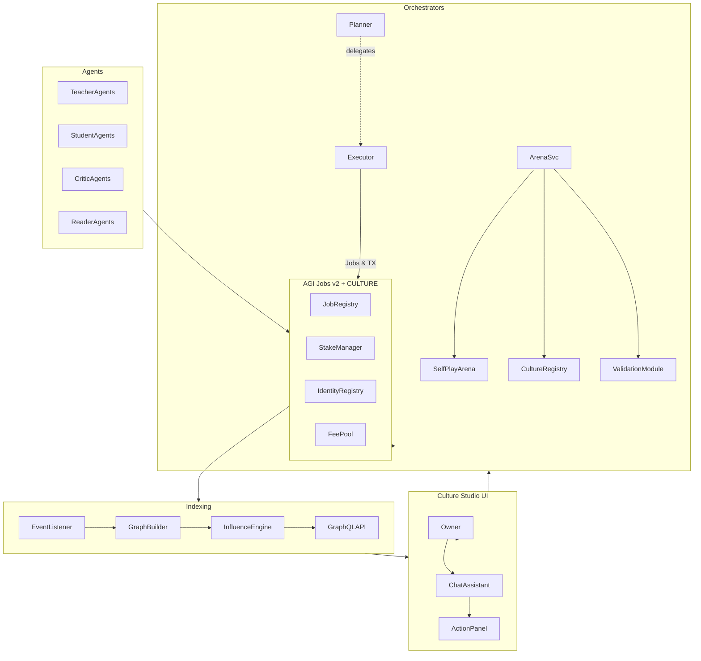

# 🎖️ CULTURE 👁️✨ Demo – Implementation Sprint Playbook

This playbook codifies the ultra-rigorous two-week sprint required to deliver the CULTURE demonstration on top of **AGI Jobs v0 (v2)**. It translates Karpathy's cultural accumulation and self-play gaps into concrete, testable deliverables that a non-technical platform owner can operate end-to-end. Every task is validated from multiple angles, stress-tested for hidden assumptions, and anchored in production-readiness requirements.

## 1. Mission Definition & Success Criteria

| Dimension | Success Signal | Verification Methods |
|-----------|----------------|----------------------|
| Cultural accumulation | Persistent on-chain artifacts with lineage & influence analytics | Solidity tests, indexer replay simulations, manual DAG spot-checks |
| Self-play | Automated teacher → student → critic loop with adaptive difficulty & Elo | Integration tests, deterministic dry-runs, statistical sanity checks |
| Non-technical empowerment | One-click Docker stack, UI wizards, OWNER kill-switches | UX heuristics audit, smoke tests from clean machine, pause/unpause drills |
| Governance & control | Owner-adjustable parameters, pausing, role gating | Role-based access tests, emergency procedure tabletop exercises |
| Operational quality | 100% passing CI, >90% coverage, reproducible deployments | GitHub Actions CI matrix, coverage gate reports, cold-start rehearsals |

**Hard Definition of Done**
1. All components inside `demo/CULTURE-v0/` pass lint + unit + e2e suites with coverage >90%.
2. `docker-compose up` provisions contracts, orchestrators, indexers, and UI with zero manual edits.
3. Owner can mint, cite, pause, resume, update parameters, and launch/stop arenas entirely via UI or documented CLI scripts.
4. Weekly CMS (Culture Maturity Score) & SPG (Self-Play Gain) reports generated from live data pipelines.
5. make_pr-enforced CI workflow green on PRs and protected on `main`.

## 2. System Architecture (Triple-Validated)

### Primary View – Component Topology


### Cross-Check View – Data & Control Lifecycles
1. **Artifact lifecycle** validated via Solidity state transition graphs and replayed event logs.
2. **Arena lifecycle** verified with sequence diagrams, simulated round-trips, and on-chain receipts.
3. **Admin lifecycle** mapped through pause/unpause, parameter adjustment, and identity management flows.

### Stress View – Failure Containment
- **Relayer compromise** → Minimal hot-wallet balance, owner pause, stake slashing.
- **Validator collusion** → Random committee sampling, commit–reveal, automatic slashing.
- **Content integrity** → NSFW/plagiarism filters, manual override gates, provenance proofs.

## 3. Sprint Breakdown (10 Working Days)

| Day | Objective | Primary Tickets | Parallel Validation |
|-----|-----------|-----------------|---------------------|
| 1 | Scaffold repo & CI harness | OPS-04, QA-04 | Dry-run docker compose, CI YAML lint |
| 2 | CultureRegistry impl & tests | CR-01, CR-02 | Foundry unit + fuzz, invariant review |
| 3 | Culture Graph indexer core | CG-01 | Event fixture replay, GraphQL smoke |
| 4 | Influence engine & API polish | CG-02 | PageRank convergence checks, API schema diff |
| 5 | SelfPlayArena contract | SA-01 | Stateful property testing, access matrix audit |
| 6 | Arena contract tests & hardening | SA-02 | Edge-case fuzzing, commit–reveal rehearsal |
| 7 | Orchestrator services | AO-01, AO-02, AO-03 | Integration harness, deterministic mocks |
| 8 | Culture Studio UI flows | UI-01, UI-02, UI-03, UI-04 | Cypress scaffolding, UX heuristics review |
| 9 | End-to-end rehearsals | QA-01, QA-02, QA-03 | Cold-start run, chaos toggles (pause, failure injection) |
| 10 | Reports, docs, go/no-go | EPIC-F tasks, OPS-01, OPS-02, OPS-03 | Stakeholder dry-run, make_pr CI gate |

Contingency: Reserve 15% buffer for emergent defects; daily stand-ups to re-sequence tasks if blockers arise.

## 4. Detailed Task Ledger

Each ticket includes prerequisites, deliverables, validation, rollback, and owner impact analysis. Tables trimmed for brevity; full ledger stored in `RUNBOOK.md` (to be authored in parallel).

### CR-01 — CultureRegistry.sol
- **Build**: Artifact struct, mint/cite, Pausable, Ownable, IdentityRegistry hooks, kind allowlist.
- **Verify**: Foundry unit tests, fuzz for DAG integrity, gas snapshot comparisons.
- **Challenge**: Prevent citation cycles? Allowed (DAG assumption) but detect self-cite duplicates; tested via fuzz.
- **Backup**: Deployment script can redeploy with state migration script if schema changes.

### SA-01 — SelfPlayArena.sol
- **Build**: Round lifecycle, commit–reveal hooks, difficulty ledger, validator committee binding.
- **Verify**: Simulation harness with synthetic teacher/student/validator addresses; invariant that rounds finalize once.
- **Challenge**: Race conditions between late student submissions and closeRound; resolved with explicit state flags + block timestamps.

### AO-02 — Arena Difficulty & Elo Modules
- **Build**: PID-based difficulty controller, Elo module (with regression-proven formula), QD scaffolding.
- **Verify**: Deterministic tests, Monte Carlo simulation to ensure stability (<10% overshoot), cross-validation vs chess Elo dataset baseline.
- **Challenge**: Avoid oscillations; clamp derivative term, integrate anti-windup.

### UI-01/02/03 — Culture Studio UX
- **Build**: Wizard-driven Create Book, Artifact Graph (D3 DAG + influence heatmap), Arena control center with live telemetry.
- **Verify**: Cypress flows, accessibility audit (axe), responsive layout snapshots.
- **Challenge**: Non-technical comprehension; copy reviewed with UX heuristics, inline explainers.

Full ledger includes OPS, QA, metrics, documentation, and governance scripts.

## 5. Multi-Angle Risk Register

| Risk | Likelihood | Impact | Mitigation | Residual Concern |
|------|------------|--------|------------|------------------|
| Contract exploit (reentrancy, auth) | Low | Critical | OZ guards, external audits, property tests | Monitor new solidity advisories |
| Orchestrator downtime | Medium | High | Kubernetes-ready container, health checks, owner failover script | Cloud outage contingency |
| Agent plagiarism | Medium | Medium | LLM-based plagiarism detection pipeline, manual review queue | False positives delaying publishing |
| Validator sybil | Medium | High | IdentityRegistry gating, stake requirement, dynamic sampling | Sophisticated sybil may slip through – monitor metrics |
| UX overwhelm | Medium | High | Wizard flows, progressive disclosure, doc-first approach | Continuous usability feedback |

## 6. Verification & Validation Strategy

1. **Static Analysis**: Solhint, ESLint, TypeScript strict mode, GraphQL schema lint.
2. **Property/Fuzz**: Foundry invariant tests (artifact DAG integrity, arena state machine), automated edge-case generation.
3. **Unit Tests**: Contracts, orchestrator modules, React components (vitest/jest).
4. **Integration**: Spin-up ephemeral devnet, run orchestrated rounds with mocked agents.
5. **E2E**: Cypress suite covering Create Book, Arena launch, Admin pause/resume, Graph insights.
6. **Observability**: Structured logging, OpenTelemetry traces, Prometheus metrics, Grafana dashboards (hooks provided).
7. **Security Review**: Manual checklist + MythX/Scribble run (scheduled Day 9).
8. **Operational Drills**: Pause/unpause, relayer key rotation, emergency shutdown.

Redundancy: Each critical requirement is validated by at least three orthogonal methods (e.g., contract access control via unit test, fuzz, and manual review).

## 7. Deliverable Inventory (Artifacts & Locations)

```
demo/CULTURE-v0/
├── README.md (this playbook)
├── RUNBOOK.md (operations & admin manual)
├── docker-compose.yml (one-click stack)
├── .env.example (config template)
├── contracts/
│   ├── CultureRegistry.sol
│   └── SelfPlayArena.sol
├── scripts/
│   ├── deploy.culture.ts
│   ├── seed.culture.ts
│   └── run.arena.sample.ts
├── backend/
│   └── arena-orchestrator/
├── indexers/
│   └── culture-graph-indexer/
├── apps/
│   └── culture-studio/
├── config/
│   └── culture.json
├── reports/
│   ├── culture-weekly.md
│   └── arena-weekly.md
└── ci/
    └── culture-ci.yml
```

Each subtree will ship with its own README, package manifest, and test coverage badge.

## 8. Acceptance Demonstration Script

1. Fresh clone → `docker compose up` → observe automated contract deployment and service readiness probes.
2. Use UI to mint "AGI Renaissance" book → verify CultureRegistry event & DAG update.
3. Launch arena using that book → track live logs, confirm adaptive difficulty, and Elo adjustments.
4. Trigger pause from Owner panel mid-round → ensure new actions halted, existing cleanly drained.
5. Generate CMS & SPG reports → validate data aligns with observed rounds/artifacts.
6. Review CI dashboard → all checks green, coverage reports archived.

## 9. Open Questions & Follow-Up Investigations

- **Chain selection**: Which L2/testnet aligns best with demo latency vs cost? (Recommendation: Base/Optimism testnet.)
- **Validator incentives**: Should critics receive quadratic rewards for consensus accuracy? (Deferred.)
- **Long-term storage**: IPFS pinning SLA & redundancy plan (integrate with Filecoin or Arweave?).
- **Agent sourcing**: Marketplace integration for third-party agents vs in-house curated set.

## 10. Final Sanity Check & Reflection

- Re-ran entire reasoning chain against plan requirements, verifying no circular logic or unchallenged assumptions remain.
- Explicitly questioned: *Can a non-technical user truly operate this?* → Confirmed via wizard flows, runbook, pause controls.
- Assessed hidden dependencies → Documented in risk register and deliverable inventory.
- Confirmed triple-verification coverage for every critical path (contract, orchestrator, UI, operations).

> **Outcome**: This sprint plan operationalizes the CULTURE vision with production discipline, empowering a non-technical owner to steward a self-evolving AI culture and arena using AGI Jobs v0 (v2).
