# Economic Power v0 – Planetary-Scale Economic Acceleration Demo

> **Purpose** – empower a non-technical operator to command AGI Jobs v0 (v2) as a civilization-scale economic engine. This demo shows a complete, production-ready orchestration loop that the owner can tune, pause, or upgrade at will while AGI agents deliver compounding economic value across trustless rails.

## Why this demo matters

- **Showcases the superintelligent operating loop** – matching, execution, validation, settlement, and telemetry are all codified so a single command unleashes an economic swarm.
- **Owner-first control fabric** – every critical parameter (duration caps, validator quorums, stablecoin adapters, pause controls) is surfaced with concrete scripts that the multi-sig can execute immediately.
- **Non-technical friendly** – the CLI walks through scenario selection, the UI visualises token velocities, and every report is generated in human-readable and machine-ingestible formats.
- **Audit-grade transparency** – deterministic CI verifies output parity with the curated baseline so regulators, partners, and the owner have mathematical guarantees of behavior.

## Golden Path – activate the Economic Power loop

```bash
# from the repository root
npm run demo:economic-power           # generates the full report set
npm run demo:economic-power -- --interactive   # dial in multipliers and quorum uplifts live
npm run demo:economic-power:ci        # deterministic CI run used by GitHub Actions
npm run test:economic-power           # deterministic simulation unit tests
```

Outputs land in `demo/Economic-Power-v0/reports/`:

- `summary.json` – canonical metrics ledger (ROI, payback, validator confidence, automation score).
- `flow.mmd` – architecture graph for immediate inclusion in runbooks and dashboards.
- `timeline.mmd` – Gantt macro for orchestration cadence.
- `owner-control.json` – up-to-the-minute control matrix for the owner’s multi-sig.
- `owner-sovereignty.json` – sovereign safety mesh blueprint (pause/resume drills, circuit breakers, upgrade commands, and coverage metrics).
- `deployment-map.json` – mainnet-ready custody catalogue listing each v2 module, owner, upgrade command, and audit freshness.
- `owner-command.mmd` – owner command mermaid graph linking pause/resume authority, parameter scripts, and module custody.
- `owner-command-plan.md` – markdown playbook summarising quick actions, scripted upgrades, circuit breakers, and capital checkpoints in plain language.
- `owner-command-checklist.json` – machine-auditable coverage ledger detailing per-surface command coverage percentages for jobs, validators, adapters, modules, treasury, pause/resume, and orchestrator surfaces.
- `owner-governance-ledger.json` – deterministic custody ledger detailing module ownership, audit freshness, scripts, and alertable coverage gaps for governance dashboards.
- `owner-dominion.json` – composite dominion index fusing coverage, safety mesh readiness, custody, guardrails, and recommended actions for the owner multi-sig.
- `sovereign-safety-mesh.json` – composite readiness diagnostics across pause/resume readiness, alerting, scripted coverage, and circuit breaker posture.
- `treasury-trajectory.json` – treasury state, yield, validator confidence, and automation lift captured after each job.
- `assertions.json` – machine-readable verification ledger covering owner dominance, custody, validator strength, and treasury solvency.
- `economic-dominance.json` – composite dominance index summarising ROI, capital velocity, sovereignty, safety, and automation posture with actionable recommendations.
- `owner-autopilot.json` – cadence, guardrails, and deterministic command sequence for the owner autopilot along with telemetry mirrors.
- `owner-autopilot.mmd` – mermaid control graph visualising cadence, guardrails, and command objectives.
- `global-expansion-plan.md` – markdown roadmap breaking down testnet supremacy, mainnet pilot, planetary expansion, and governance acceleration phases.
- `global-expansion.mmd` – mermaid gantt of the expansion cadence, immediately embeddable into ops dashboards.

> **Non-technical quick start** – run `npm run demo:economic-power` then open `demo/Economic-Power-v0/ui/index.html` with any static server (`npx http-server demo/Economic-Power-v0/ui`). The command refreshes `ui/data/default-summary.json`, so the dashboard autoloads the latest generated reports immediately.

## Architecture in one glance

```mermaid
graph TD
    Owner[Owner Multi-Sig (4-of-7)] -->|Parameter programs| Orchestrator[Economic Power Orchestrator]
    Owner -->|Treasury commands| Treasury[Treasury Escrow Vault]
    Treasury -->|Stablecoin swap| Adapter[Stablecoin Adapter Layer]
    Orchestrator -->|Job posts| Jobs(Job Registry Modules)
    Jobs -->|Agent selection| Agents(Autonomous Agent Mesh)
    Jobs -->|Validation| Validators(Validator Constellation)
    Agents -->|Deliverables| Observability(Observability Stack)
    Validators -->|Consensus events| Observability
    Observability -->|Feedback| Owner
```

## Timeline of value creation

```mermaid
gantt
    title Economic Power Macro Cadence
    dateFormat  X
    section Acceleration
      AI Lab Fusion Accelerator      :done,    ai_fusion,        0, 36h
      Autonomous Supply Mesh         :active,  supply_mesh,     10, 30h
      Governance Upgrade Launch      :active,  gov_upgrade,     18, 28h
      Market Expansion Omniloop      :crit,    market_loop,     22, 24h
      Oracle Integration Spine       :milestone, oracle_spine,  30, 22h
```



## Owner supremacy toolkit

Every configuration switch the platform depends on is under explicit owner control. The generated `owner-control.json` mirrors the baseline table below.

| Parameter | Current | Target | Command | Outcome |
|-----------|---------|--------|---------|---------|
| `jobDuration` | 72h | 48h | `npm run owner:parameters` | Compresses turnaround time and increases capital velocity. |
| `validatorQuorum` | 3 | 5 | `npm run owner:upgrade` | Raises validation quorums for premium tasks, hardening trust. |
| `stablecoinAdapter` | USDC v1 | USDC v2 | `npm run owner:update-all` | Upgrades fiat bridges with lower slippage and audit trails. |

Additional safeguards:

- **Emergency Pause** – `npm run owner:system-pause` halts execution globally.
- **Full Module Upgrade** – `npm run owner:update-all` applies orchestrated module upgrades signed by the multi-sig.
- **Parameter Diff & Verification** – `npm run owner:audit` produces a compliance diff of every mutable parameter before execution.
- **Command Catalog Supremacy** – `npm run owner:program -- --list` enumerates deterministic programs for every job, validator, adapter, module, treasury motion, and orchestrator flow.
- **Owner Autopilot** – `owner-autopilot.json` and `owner-autopilot.mmd` provide a mission-ready cadence, guardrails, and command sequence the multi-sig can execute without additional authoring.

## Interactive CLI – empowering the operator

`npm run demo:economic-power -- --interactive` prompts for:

1. **Economic multiplier** – scale projected value to stress test upside scenarios.
2. **Validator quorum uplift** – command-level override to harden consensus.

The CLI recalculates ROI, payback horizon, validator confidence, and writes the new telemetry set into `reports/` for the UI to ingest.

## Command catalog – execute anything instantly

- `npm run owner:program -- --list` – print every deterministic program with the exact `npm` command to run it.
- `npm run owner:program -- --program job-ai-lab-fusion` – execute a specific job program (replace the id to trigger others).
- Pass `--json` for machine-readable output to integrate with external multi-sig tooling.

## UI flight deck

The UI inside `demo/Economic-Power-v0/ui/` offers:

- Metric cards covering ROI, net yield, validator confidence, throughput, and treasury position.
- Economic power verification grid surfacing every assertion outcome, severity badge, and supporting evidence.
- Expanded metrics for **Stability Index** and **Owner Command Coverage** quantifying how completely the multi-sig governs the stack.
- Command coverage detail table translating `owner-command-checklist.json` into per-surface readiness so non-technical operators can see exactly which levers are scripted.
- Sovereign control gauge mirroring the custody score produced in CI alongside a live on-chain module inventory.
- Interactive job-to-agent tables to inspect assignments and validator stakes.
- Capital trajectory tracker visualising treasury strength, validator confidence, and automation lift after every job.
- Live Mermaid rendering of the architecture and timeline.
- Owner command Mermaid graph mapping multi-sig authority to every module, circuit breaker, and upgrade path.
- Drag-and-drop support for alternative `summary.json` files for instant what-if exploration.
- Sovereign safety mesh panel cataloguing pause/resume playbooks, emergency contacts, circuit breakers, and module upgrade routes.
- Owner dominion index panel quantifying composite control, safety, and custody readiness with live guardrail and action feed.
- Safety mesh diagnostics scoring response readiness, alert channel breadth, circuit breaker posture, command coverage depth, and scripted responses.
- Governance ledger visual linking custody posture, audit staleness, and alert feed directly from `owner-governance-ledger.json`.
- Command catalog grid enumerating every deterministic owner program so the operator can launch missions instantly.
- Owner autopilot cadence view surfacing guardrails, cadence, and mission-critical command sequences.
- Global expansion roadmap translating `global-expansion-plan.md` into an interactive readiness tracker for planetary rollout.

Launch with:

```bash
npx http-server demo/Economic-Power-v0/ui -p 4175 --cors
```

Then open [http://localhost:4175](http://localhost:4175) for a full dashboard experience.

## Deterministic CI guard-rails

The GitHub workflow `.github/workflows/demo-economic-power.yml` enforces:

1. `npm run demo:economic-power:ci` – builds fresh reports and compares metrics against the canonical baseline (±5% tolerance).
2. `npm run test:economic-power` – validates scheduling, ROI, and owner matrix logic.
3. Assertion pass rate locked at **100%** – deviations fail CI immediately, guaranteeing the verification deck always passes in PRs and on `main`.

This guarantees a **fully green v2 CI gate**. Pull requests and `main` share identical guard-rails, preventing regressions before production promotion.

## Extend or customise

- **New scenarios** – drop additional JSON files in `demo/Economic-Power-v0/scenario/` and pass them via `--scenario`.
- **Tokenomics experiments** – tweak rewards and treasury balances to model various yield curves.
- **Validator research** – extend the validator list to stress commit–reveal parameters and slashing tolerances.
- **Observability** – wire `flow.mmd` and `timeline.mmd` directly into Grafana, Notion, or internal documentation.

## Production readiness checklist

- ✅ Modular architecture reflecting the v2 sprint blueprint.
- ✅ Deterministic simulation and CI coverage.
- ✅ Owner-first command catalog for every mutable lever plus sovereign custody scoring for every contract module.
- ✅ Observability artefacts (Mermaid, JSON, HTML dashboard) plus sovereign safety diagnostics for instant incident readiness reviews.
- ✅ Non-technical operations workflow from single command to actionable dashboard.

Run the loop, inspect the telemetry, execute the owner change-set, and step into an economy-scale command role.
