# Emergency Authority Console

Scenario **AGIJobs Economic Power Launch** (economic-power-v0-baseline)
Generated at 2/1/2025, 12:00:00 AM

## Immediate control commands
- Pause: `npm run owner:system-pause`
- Resume: `npm run owner:update-all`
- Response cadence: 9 minutes (target ≤ 15 minutes)
- Autopilot status: READY — All emergency thresholds satisfied – autopilot can be engaged immediately.

## Safety and custody metrics
- Safety mesh: 97.9%
- Custody supremacy: 100.0%
- Shock resilience: 98.0% (impregnable)
- Command coverage: 100.0%

## Alert mesh & emergency contacts
- Alert channel: slack://agi-ops-economic-power
- Alert channel: pagerduty://agi-critical
- Emergency contact: governance@agijobs.ai
- Emergency contact: security-operations@agijobs.ai
- Emergency contact: treasury@agijobs.ai

## Circuit breaker catalogue
- validatorConfidence < 0.95 → `npm run owner:system-pause` (Pause contracts if validator confidence slips below 95% to protect settlement integrity.)
- automationScore < 0.8 → `npm run owner:parameters` (Recalibrate automation if orchestration coverage drops under 80%.)
- treasuryAfterRun < 1800000 → `npm run owner:audit` (Trigger treasury forensic audit when buffers fall below the defensive floor.)

## Modules requiring attention
- ValidationModule (0xAGIJobsGovernor0000000000000000000000003) — Pending upgrade • 48.0 day lag • upgrade via `npm run owner:upgrade`

## Deterministic emergency programs
- [JOBS] `npm run owner:program -- --program job-ai-lab-fusion` – Dispatch Helios and Atlas to fuse AI labs into a consolidated planetary accelerator.
- [JOBS] `npm run owner:program -- --program job-supply-chain` – Reconfigure autonomous supply mesh coverage for instant cross-border fulfilment.
- [JOBS] `npm run owner:program -- --program job-governance-upgrade` – Authorize Sentinel assurance fabric to promote the upgraded governance module.
- [JOBS] `npm run owner:program -- --program job-market-expansion` – Activate Aurora omni-loop teams for immediate market penetration.
- [JOBS] `npm run owner:program -- --program job-oracle-integration` – Command Helios to ship the oracle integration spine with hardened adapters.
- [VALIDATORS] `npm run owner:program -- --program validator-alpha` – Escalate Validator Alpha quorum weighting and deploy fresh attestations.
- [VALIDATORS] `npm run owner:program -- --program validator-beta` – Rotate Validator Beta committees and enforce staking deltas.
- [VALIDATORS] `npm run owner:program -- --program validator-gamma` – Deploy Gamma macro-policy validators to contested economic tasks.
- [VALIDATORS] `npm run owner:program -- --program validator-delta` – Refresh Delta’s ML-evaluation pipelines with latest defence heuristics.
- [VALIDATORS] `npm run owner:program -- --program validator-epsilon` – Escalate Epsilon red-team programs for adversarial fortification.
- [STABLECOINADAPTERS] `npm run owner:program -- --program adapter-usdc` – Upgrade the USDC bridge adapter with deterministic slippage guards.
- [MODULES] `npm run owner:program -- --program module-job-registry` – Promote the JobRegistry v2 deployment with zero-downtime migration.
- …and 22 additional programs online.

## Recommended owner actions
- Maintain autopilot cadence and periodic drills to preserve total dominion.
- Supremacy absolute – maintain guardrail rehearsals to preserve total control.
- Maintain drill cadence and telemetry mirroring to preserve impregnable resilience.

```mermaid
graph TD
  Owner["Owner Multi-Sig 4-of-7"]
  Owner --> Pause["Pause npm run owner:system-pause"]
  Owner --> Resume["Resume npm run owner:update-all"]
  Owner --> Coverage["Command Coverage"]
  Coverage --> Safety["Safety Mesh"]
  Safety --> Alerts["Alert Mesh"]
  Safety --> Contacts["Emergency Contacts"]
  Owner --> Modules["Protocol Modules"]
  Modules --> Module1["JobRegistry"]
  Modules --> Module2["StakeManager"]
  Modules --> Module3["⚠️ ValidationModule"]
  Modules --> Module4["ReputationEngine"]
  Modules --> Module5["DisputeModule"]
  Modules --> Module6["CertificateNFT"]
  Owner --> Guardrails["Guardrail Catalog"]
  Guardrails --> Guardrail1["Pause • npm run owner:system-pause"]
  Guardrails --> Guardrail2["Resume • npm run owner:update-all"]
  Guardrails --> Guardrail3["validatorConfidence < 0.95 → npm run owner:system-pause"]
  Guardrails --> Guardrail4["automationScore < 0.8 → npm run owner:parameters"]
  Owner --> Autopilot["Autopilot Ready"]
  Owner --> Circuit["Circuit Breakers"]
  Circuit --> Circuit1["validatorConfidence < 0.95"]
  Circuit --> Circuit2["automationScore < 0.8"]
  Circuit --> Circuit3["treasuryAfterRun < 1800000"]
  Autopilot --> Programs["Command Programs"]
  Programs --> Program1["JOBS: job-ai-lab-fusion"]
  Programs --> Program2["JOBS: job-supply-mesh"]
  Programs --> Program3["JOBS: job-governance-upgrade"]
  Programs --> Program4["JOBS: job-market-expansion"]
```

> Shock summary: Shockwaves are fully absorbed – treasury buffers, guardrails, and automation form an impregnable shield.
