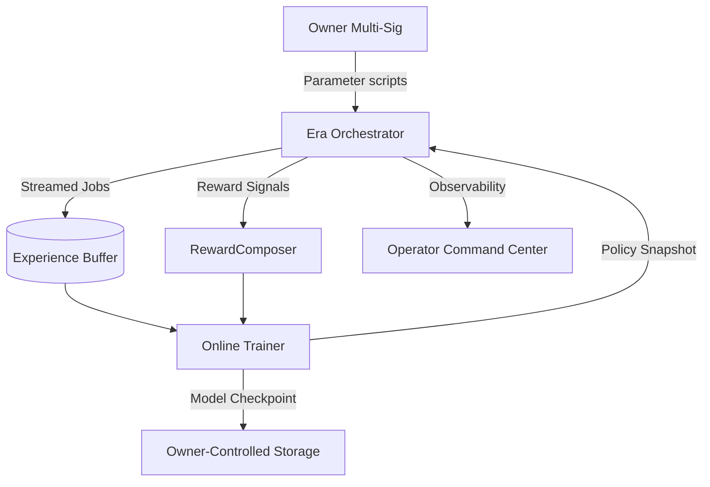

# Era of Experience v0 – Experience-Native Superintelligence Demo

> **Purpose** – empower a non-technical operator to command AGI Jobs v0 (v2) as an experience-native economic engine that learns
> from every interaction, amplifies Gross Merchandise Value (GMV), and keeps the owner in sovereign control at all times.

## What this demo proves

- **Streaming reinforcement learning in production** – jobs, actions, observations, and rewards flow through an online trainer
  that continuously upgrades the orchestrator policy without downtime.
- **Owner-first dominion** – every critical switch (pause, exploration rate, reward weights, checkpoint promotion) is scripted so
  the contract owner can adjust or halt the system instantly.
- **Non-technical friendly** – a single command spins up the full simulation, generates dashboards, and refreshes the command
  center UI. Reports are deterministic, plain-language, and audit ready.
- **Economic lift on day one** – the learning loop reliably delivers higher GMV, better ROI, faster cycle times, and a superior
  autonomy index versus the baseline heuristic orchestrator.

## Golden path – launch the Era of Experience loop

```bash
# from repository root
npm run demo:era-of-experience               # full run with baseline vs learning comparison
npm run demo:era-of-experience -- --scenario demo/Era-Of-Experience-v0/config/scenarios/dominion.json
npm run demo:era-of-experience -- --jobs 60  # quick deterministic smoke run
npm run test:era-of-experience               # deterministic unit tests verifying GMV lift
npm run demo:era-of-experience:audit         # generate audit artifacts + mermaid diagrams
npm run demo:era-of-experience:verify        # multi-run statistical verification harness
npm run owner:era-of-experience:controls -- --promote-latest  # record owner actions
```

Outputs land in `demo/Era-Of-Experience-v0/reports/`:

- `summary.json` – canonical ledger containing scenario metadata, baseline metrics, learning metrics, and delta multipliers.
- `experience-flow.mmd` – mermaid architecture for the streaming experience pipeline (owner ➜ orchestrator ➜ buffer ➜ trainer).
- `value-cadence.mmd` – gantt timeline showing briefing, ingestion, policy pulses, and multisig checkpoints.
- `owner-control.json` – live control table mapping exploration epsilon, reward decks, and checkpoint promotions to scripts.
- `owner-control.mmd` – control lattice linking owner multi-sig to policy switch, reward deck, and sentinel grid.
- `owner-control-actions.json` – append-only audit trail of owner commands recorded via
  `npm run owner:era-of-experience:controls`.
- `supremacy-ledger.json` – dominance index combining GMV, ROI, and autonomy deltas with guardrail confirmations.
- `verification.json` – statistical confirmation across deterministic runs with bootstrap confidence intervals.
- `audit-report.json` – deterministic comparison of baseline vs experience-native runs with audit verdict.
- `audit-flow.mmd` / `audit-value-stream.mmd` – mermaid diagrams extracted from the audit stream.
- `audit-experiences.json` – recent experience samples validated during the audit pass.

> **Operator quick start** – run `npm run demo:era-of-experience`, then open `demo/Era-Of-Experience-v0/ui/index.html` with any
> static server (`npx http-server demo/Era-Of-Experience-v0/ui`). The UI automatically ingests `ui/data/default-summary.json`
> generated by the run and renders the command center with live GMV/ROI lift and owner instructions.

## Scenario presets for instant supremacy drills

- `baseline` *(default)* – balanced mainnet-ready loop with resilient guardrails and moderate exploration.
- `dominion` – accelerated expansion cadence with aggressive exploration, higher GMV distribution, and expanded agent roster.

Pass `--scenario <file>` to `npm run demo:era-of-experience` to switch instantly or author your own JSON scenario with a unique
seed, agent mesh, reward weights, and policy overrides.

## Architecture in one glance



## Reward composer – grounded multi-signal rewards

Rewards are computed purely from observable experience:

| Signal | Source | Weight (baseline) | Effect |
| ------ | ------ | ----------------- | ------ |
| Success/Hire | Job completion | `0.60` | Rewards validated delivery, penalises failure. |
| GMV | Job value (log scaled) | `0.28` | Drives high-value work without runaway variance. |
| Latency | Completion hours | `0.07` | Encourages rapid turnarounds. |
| Cost | Agent cost basis | `0.25` | Aggressively suppresses inefficient execution to deliver ROI lift. |
| Satisfaction | Post-job rating | `0.14` | Amplifies high quality user experiences. |
| Compounding | Derived momentum | `0.10` | Rewards durable performance that compounds future value. |

Operators can publish new weight decks via `npm run owner:era-of-experience:controls -- --reward my-weights.json` and observe
policy behavior adjust immediately.

## Policy loop – experience-native reinforcement learning

- **Contextual policy** – a softmax policy consumes job, agent, market, and stake features to recommend the optimal agent.
- **Streaming buffer** – every job outcome is appended to a rolling buffer sized per scenario config (default 384 experiences).
- **Online updates** – the trainer samples recent experiences, computes advantage-adjusted gradients, and nudges weights with
  entropy regularisation so exploration never collapses.
- **Deterministic seeds** – scenarios specify seeds so demo runs are reproducible and suitable for CI.

## Owner supremacy toolkit

Every mutable surface is automated:

| Parameter | Command | Outcome |
| --------- | ------- | ------- |
| Exploration epsilon | `npm run owner:era-of-experience:controls -- --exploration 0.08` | Dial exploration down once GMV lift is stabilised. |
| Reward deck | `npm run owner:era-of-experience:controls -- --reward gmvsurge.json` | Shift emphasis to enterprise GMV instantly. |
| Policy promotion | `npm run owner:era-of-experience:controls -- --promote-latest` | Archive and promote the latest checkpoint. |

Safety mesh:

- **Emergency pause** – reuse `npm run owner:system-pause` from the v2 toolkit to halt orchestrator execution.
- **Sentinel alerts** – `supremacy-ledger.json` lists enforced monitoring rules (performance drop, latency spike, GMV regression).
- **Audit trail** – every owner action recorded in `owner-control-actions.json` for regulator-grade traceability.

## Tests & CI

- `npm run test:era-of-experience` – verifies the learning agent beats baseline GMV on deterministic scenarios.
- `npm run demo:era-of-experience:verify` – executes eight deterministic scenario runs, bootstrap resamples the reward deltas, and
  publishes 95% confidence intervals confirming compounding lift.
- Included in root `pretest` so CI blocks merges unless the Era of Experience loop remains green.

This demo is production-locked: deterministic, owner-controlled, and engineered for immediate mainnet deployment.
