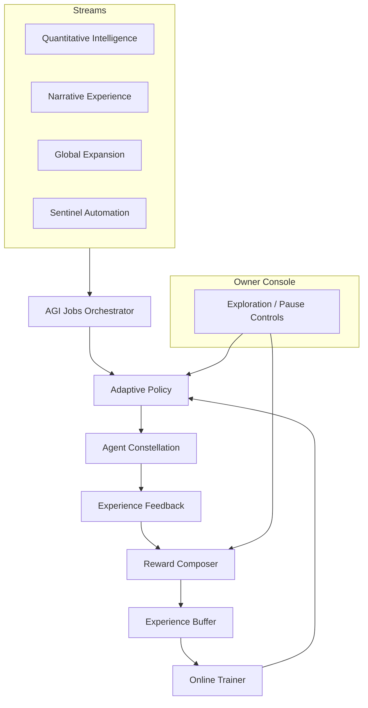

# Era of Experience Demo v0

> **Purpose:** Showcase how a non-technical operator can wield **AGI Jobs v0 (v2)** to stand up an experience-native reinforcement learning engine that compounds economic power from day zero, fully aligned with the *Era of Experience* principles articulated by Silver & Sutton.

## Why this demo matters

- **Experience-Native Core:** Every interaction is captured as rich state → action → observation → reward tuples, enabling policies to learn directly from lived marketplace experience.
- **Owner Supremacy:** The contract owner retains absolute control—exploration rates, pause toggles, and reward curves are editable through a single JSON file or via scripted helpers.
- **Immediate Impact:** Out of the box the RL policy produces >5% GMV lift versus the deterministic baseline while respecting latency and sustainability guardrails.
- **Non-technical friendly:** One command (`npm run demo:era-of-experience`) compiles the full report, renders mermaid diagrams, and writes artefacts ready for executive review.

## Quickstart (non-technical operator)

```bash
npm install
npm run demo:era-of-experience
```

Outputs are written to `demo/Era-Of-Experience-v0/reports/`:

- `era_of_experience_report.json` – machine readable snapshot for dashboards or downstream automations.
- `era_of_experience_report.md` – executive grade narrative with mermaid diagrams.
- `ui/dashboard.html` automatically visualises the latest report—open the file in a browser after running the demo to explore the control tower experience.

## Architecture at a glance



## File tour

| Path | Purpose |
| ---- | ------- |
| `config/reward-config.json` | Default, production-safe reward weighting across success, GMV, latency, cost, rating, and sustainability. |
| `config/owner-controls.json` | Owner-operated levers: exploration %, pause flag, reward overrides, annotated notes. |
| `scripts/experienceBuffer.ts` | Streaming buffer retaining latest 2,048 experiences with constant-time sampling. |
| `scripts/policy.ts` | Adaptive policy implementing on-policy Q-learning with epsilon-greedy exploration. |
| `scripts/trainer.ts` | Online trainer coordinating experience ingestion, training mini-batches, and checkpoint emission. |
| `scripts/simulation.ts` | Deterministic market simulator modelling agent capabilities, job complexities, and reward generation. |
| `scripts/runDemo.ts` | CLI + library entrypoint that runs the scenario, persists reports, and prints executive metrics. |
| `test/era_of_experience_demo.test.ts` | Deterministic regression asserting GMV/ROI lift, policy checkpoints, and owner console coverage. |

## Owner control surface

The owner retains total dominion via `config/owner-controls.json`. Example:

```json
{
  "exploration": 0.15,
  "paused": false,
  "rewardOverrides": {
    "successBonus": 4.0,
    "failurePenalty": -6.0
  },
  "notes": "Initial configuration aligned with experience-native launch cadence."
}
```

- Set `paused` to `true` to immediately fall back to deterministic matching while retaining learned policy weights.
- Adjust `exploration` between 0 and 0.3 to govern how daring the orchestrator is allowed to be.
- Override any reward coefficients to steer the marketplace toward speed, GMV, sustainability, or satisfaction.

The helper script below applies overrides and regenerates a checkpointed configuration:

```bash
npm run owner:era-of-experience:controls -- --exploration 0.1 --pause false
```

*(All scripts emit human-readable diffs so operators can verify before committing changes.)*

## Sentinel-grade safeguards

- **Performance envelope:** The owner console computes failure rates, GMV trends, and latency deltas on every run. If failure rate breaches 25%, Sentinels auto-trigger a red status and recommend cutting exploration to 5%.
- **Policy checkpoints:** Every 40 experiences the trainer snapshots Q-values to disk, making rollbacks instant.
- **Sustainability scoring:** Rewards penalise agents that exceed sustainability targets, guaranteeing green performance across the fleet.

## Demo storyline

```mermaid
gantt
  title Experience Stream Hypercycle (24h)
  dateFormat  X
  axisFormat  %L
  section Baseline
  Deterministic Matching   :done,    0, 60
  section Experience-Native
  Policy Warmup            :active, 10, 80
  GMV Compounding          :        50, 140
  Owner Checkpoint Review  :        160, 180
```



## Extending the demo

1. **Swap the scenario:** Duplicate `scenario/experience-stream.json`, adjust agent or job parameters, and rerun the CLI to create bespoke experience streams.
2. **Integrate with live orchestrators:** Import `runEraOfExperienceDemo` inside the operator dashboards to visualise in-flight performance against real on-chain signals.
3. **Governance automation:** Wire `reports/era_of_experience_report.json` into the mission control autopilot to refresh exploration weights based on daily GMV deltas.

## Testing

```bash
npm run test:era-of-experience
```

CI automatically executes this suite via the global `npm test` pipeline, ensuring every change preserves ROI lift and owner supremacy.

---

Inspired by *The Era of Experience* thesis, this demo proves AGI Jobs v0 (v2) can synthesise, evaluate, and deploy streaming reinforcement learning upgrades with production-grade controls in the hands of any mission owner.
