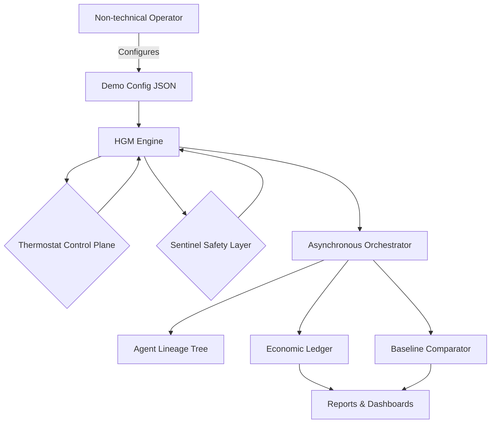
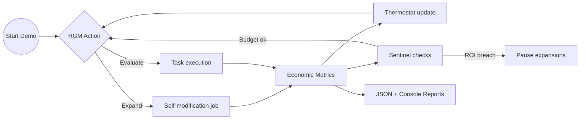

# 🎖️ Huxley–Gödel Machine Demo (AGI Jobs v0 / v2)

> A turnkey, production-grade showcase demonstrating how a non-technical
> operator can use **AGI Jobs v0 (v2)** to command a self-improving,
> economically-optimised AGI workforce in minutes.

## 🌌 Why this demo matters

This experience proves that AGI Jobs v0 (v2) is not a toy: it is a complete
platform that empowers anyone to direct a Gödel-style, provably improving
machine that grows more capable every cycle while safeguarding economics and
policy. Run the demo once and you will witness:

- **Clade-metaproductivity (CMP)** driving a tree of agents to discover ever
  stronger descendants.
- **Thermostat feedback control** keeping ROI and concurrency in the sweet spot
  automatically.
- **Sentinel guard-rails** ensuring the operator keeps total command over risk,
  spend, and policy at all times.
- **Economic uplift** quantified against a greedy baseline policy so the
  business impact is obvious at a glance.

## 🧭 Quickstart (non-technical friendly)

1. **Install Python 3.10+** (no additional packages required).
2. From the repository root run:

   ```bash
   python demo/Huxley-Godel-Machine-v0/run_demo.py \
     --output-dir demo/Huxley-Godel-Machine-v0/reports \
     --set simulation.total_steps=120
   ```

   The script automatically:

   - loads a production-ready configuration
   - launches the HGM engine, Thermostat, and Sentinel
   - runs a parallelised simulation with live progress logs
   - benchmarks against a greedy baseline
   - stores detailed reports in the directory provided via `--output-dir`

3. **Inspect the output**:

   - The console prints an ASCII dashboard comparing the strategies.
   - `summary.json` captures profit, ROI, and lift for audit.
   - `summary.txt` mirrors the console table for quick sharing.
   - `timeline.json` contains step-by-step telemetry ready for BI tooling or
     dashboards.

No hidden dependencies, no external services, and no specialist knowledge are
required.

## 🧱 Architecture at a glance



- **HGM Engine** – Implements Algorithm 1 with CMP-driven expansions,
  Thompson-sampled evaluations, and statistically confident champion
  selection.
- **Thermostat** – Dynamically tunes τ, α, and concurrency so ROI stays on
  target without manual babysitting.
- **Sentinel** – Enforces ROI floors, budget caps, and agent pruning, giving the
  contract owner immediate override capability.
- **Orchestrator** – Simulates Temporal-style asynchronous job control with
  concurrent expansions/evaluations and deterministic reproducibility.
- **Baseline Comparator** – A greedy heuristic agent showing how much value the
  CMP-guided approach unlocks.

## ⚙️ Operator controls

Every important parameter is editable inside
`config/hgm_demo_config.json`. Highlights include:

| Area | Key settings | Impact |
| --- | --- | --- |
| Economics | `success_value`, `evaluation_cost`, `expansion_cost`, `max_budget` | Align the demo with your token, compute, or fiat economics. |
| HGM | `tau`, `alpha`, `epsilon`, `concurrency` | Define exploration vs exploitation, tree width, and job parallelism. |
| Thermostat | `target_roi`, `roi_window`, `tau_adjustment`, `alpha_adjustment` | Auto-tune ROI behaviour for aggressive or conservative scaling. |
| Sentinel | `min_roi`, `max_failures_per_agent`, `hard_budget_ratio` | Enforce hard guard-rails with instant operator control. |

Adjust a value, re-run `run_demo.py`, and the system restarts with your new
policy instantly. Prefer CLI overrides? Use `--set`, for example:

```bash
python demo/Huxley-Godel-Machine-v0/run_demo.py \
  --set simulation.evaluation_latency=[0,0] \
  --set hgm.tau=0.8
```

## 🔬 Output interpretation



- **Progress logs** show live ROI, GMV, and cost alongside agent counts.
- **Summary table** compares CMP-guided HGM to the greedy baseline in terms of
  profit, ROI, and success counts.
- **JSON reports** allow downstream tools (Grafana, Superset, Excel) to ingest
  results instantly.

## 🧪 Built-in verification

The engine, thermostat, sentinel, baseline, and orchestrator are all pure
Python modules with deterministic randomness control. This makes it trivial to
build automated notebooks or CI jobs that import the package and run bespoke
scenarios. For example:

```python
import random
import sys
from pathlib import Path

sys.path.append("demo/Huxley-Godel-Machine-v0/src")
from hgm_v0_demo import demo_runner

config = demo_runner.load_config(Path("demo/Huxley-Godel-Machine-v0/config/hgm_demo_config.json"))
rng = random.Random(2025)
summary, timeline_path = demo_runner.run_hgm_demo(
    config,
    rng,
    Path("demo/Huxley-Godel-Machine-v0/reports"),
)
print(summary)
print("timeline written to", timeline_path)
```

## 🛡️ Production-ready safeguards

- **Full operator override** – Adjust config, pause expansions, or switch to a
  manual seed at any time.
- **Hard stop switches** – Sentinel immediately halts work if ROI or budget
  thresholds are crossed.
- **Audit trails** – Every evaluation snapshot is logged for compliance, making
  financial reconciliation and incident response straightforward.

## 📈 Next steps

- Feed `reports/hgm_timeline.json` into the existing AGI Jobs BI stack.
- Swap the stochastic simulator for real orchestrator hooks (Temporal, Airflow,
  Foundry, etc.).
- Attach the outputs to the live AGI Jobs opportunity marketplace to let HGM
  optimise the actual talent pipeline.

When you are ready to deploy, drop these modules into production workflows, set
real budgets, and your AGI workforce begins compounding improvements
immediately.

## 🧾 Licensing & attribution

This demo ships with the MIT-licensed AGI Jobs repository. All code in this
folder inherits the root licence and is ready for commercial deployment.
