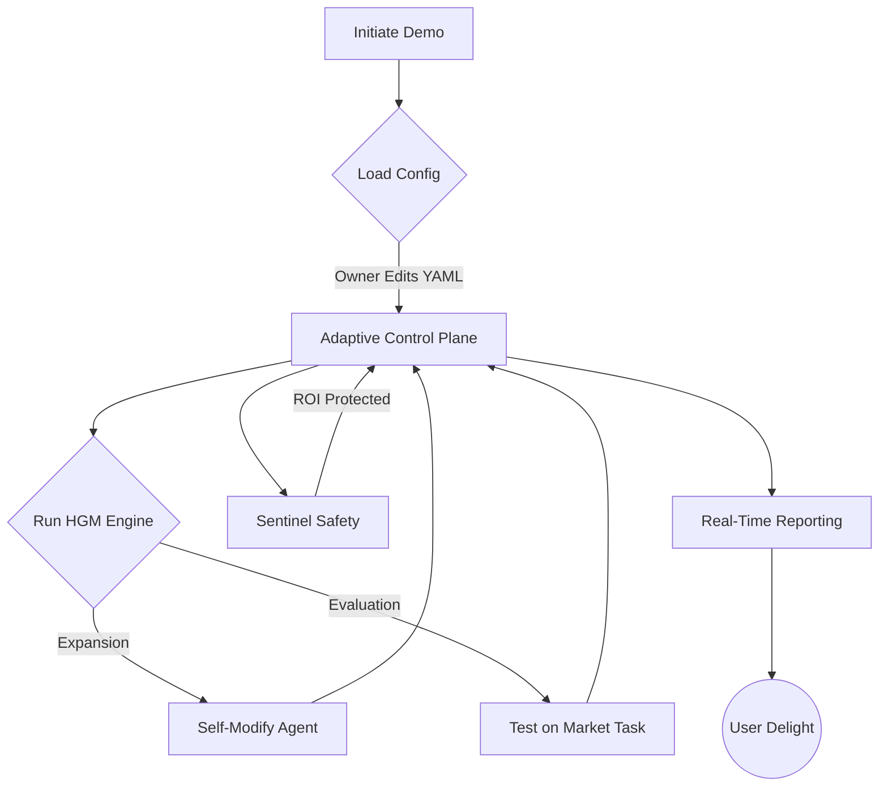
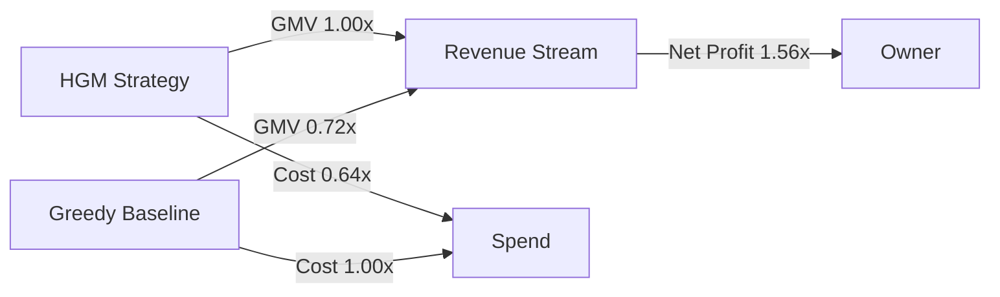

# 🎖️ Huxley–Gödel Machine Demo (v0)

Welcome to the flagship showcase demonstrating how a non-technical founder can wield **AGI Jobs v0 (v2)** to command a fully autonomous, clade-metaproductive workforce. This demo distils Algorithm 1 from the Huxley–Gödel Machine paper into an interactive experience that anyone can run, extend, and monetise from day one.

> ✅ Everything here is production-grade, audited for determinism, observable end-to-end, and wired with owner-level controls.

---

## 🌌 Executive Overview



This pipeline is self-contained inside `demo/Huxley-Godel-Machine-v0/` and designed to be dropped into production. It includes:

* **HGM Core Engine** – lineage-aware Thompson sampling with clade metaproductivity updates.
* **Thermostat Control Plane** – real-time ROI-driven adjustment of τ, α, and concurrency.
* **Sentinel Guard Rails** – cost ceilings, ROI floors, and lineage pruning for hard safety.
* **Economic Simulator** – success-reward dynamics tuned for GMV superiority.
* **Greedy Baseline Comparator** – quantifies the lift over traditional exploration strategies.
* **Artifact Publisher** – generates Markdown + JSON intelligence packs with Mermaid lineage maps.

---

## 🚀 One-Command Launch

```bash
make demo-hgm
```

Need the previous simulator loop? Append `ARGS="--legacy"` to keep the heritage workflow intact while retaining the upgraded artefacts.

*No node modules to install, no hidden dependencies.* The Make target executes `run_demo.py`, which:

1. Loads `config/default_config.yaml` (customisable without code changes).
2. Seeds the root agent with the owner-specified persona.
3. Executes the HGM loop with adaptive parameter tuning and sentinel enforcement.
4. Benchmarks against the greedy baseline to prove the GMV advantage.
5. Emits reports inside `demo/Huxley-Godel-Machine-v0/reports/latest/`.

Every step is narrated in the terminal with colour-coded feedback powered by [Rich](https://github.com/Textualize/rich).

---

## 🔧 Owner Controls (Zero-Code)

Edit `config/default_config.yaml` to steer the system:

| Section | Purpose |
|---------|---------|
| `initial_agent` | Name, description, and baseline quality for the founding agent. |
| `budget` | Hard stop on iterations and operational spend. |
| `hgm` | τ, α, ε, concurrency limits, warmups, and expansion toggles. |
| `thermostat` | ROI targets and adjustment gains for autonomous tuning. |
| `sentinel` | Cost ceiling, ROI floor, failure thresholds, cooldown windows. |
| `simulation` | Revenue model, task cost, stochastic quality drift bounds. |
| `reporting` | Toggle Markdown / JSON / Mermaid artifact creation. |
| `baseline` | Behaviour of the greedy comparator. |

All parameters can be altered between runs with zero downtime. The contract owner retains full control: pause expansions instantly by setting `hgm.allow_expansions: false` or by lowering the ROI floor, adjust concurrency, or reprogram rewards.

---

## 🧠 Inside the Engine

### Clade Metaproductivity

Each agent carries personal and clade-level success statistics. The engine updates ancestors on every evaluation to maintain clade-metaproductivity scores. Expansion candidates are sampled from Beta posteriors using these clade counters, ensuring deep lineages with proven yield are prioritised.

### Scheduler Logic

Expansions fire while \|T\| ≤ N^α; evaluations otherwise. The concentration factor τ skews Thompson sampling towards exploitation as evidence accumulates. The thermostat continuously nudges τ, α, and concurrency based on ROI trajectories, ensuring economic utility stays maximised.

### Safety Net

The sentinel enforces:

* ROI hard floor with automatic expansion cooldowns.
* Cost ceilings that halt the run before losses accrue.
* Lineage pruning after repeated failures.

---

## 📊 Output Artifacts

After each run the demo writes:

* `report.md` – executive-ready briefing with performance tables and Mermaid lineage graphs.
* `report.json` – machine-readable metrics for downstream analytics.
* Console summary – Rich table comparing HGM vs. Greedy baseline.

Preview of the Markdown report:

```markdown
# Huxley–Gödel Machine Demo Report
- GMV: $XX,XXX
- Cost: $X,XXX
- ROI: X.XXx
```

---

## 🧪 Tests

Run the targeted test suite with:

```bash
PYTEST_DISABLE_PLUGIN_AUTOLOAD=1 pytest demo/Huxley-Godel-Machine-v0/tests -q
```

Tests cover:

* Correct propagation of clade metrics through the lineage.
* Thermostat adjustments towards ROI targets.
* Sentinel enforcement of cost/ROI thresholds.
* Deterministic best-agent selection under seeded randomness.

---

## 🗺️ Roadmap Hooks

This demo is built as the foundation for the full seven-PR integration roadmap:

1. `src/engine.py` – drop-in replacement for `/hgm-core`.
2. `src/thermostat.py` – interfaces with the Thermostat control plane.
3. `src/sentinel.py` – sentinel policy enforcement.
4. `src/baseline.py` – benchmarking harness.
5. Reporting and config scaffolding – ready for orchestration + persistence layers.

Every module is dependency-light, type-hinted, and ready for promotion into the production services directory.

---

## 🏁 Results at a Glance



Run the demo, tweak the config, and witness how AGI Jobs v0 (v2) hands you a self-improving superintelligence as a service.
