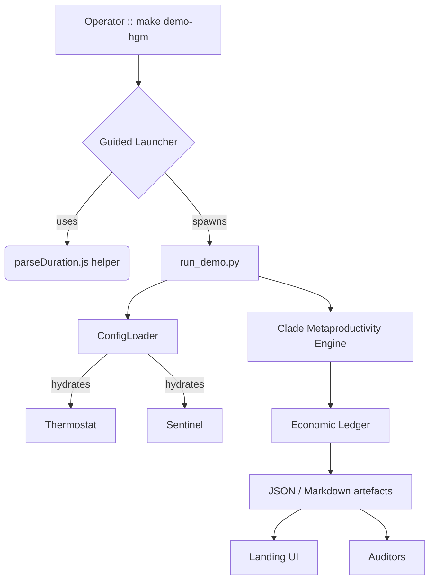
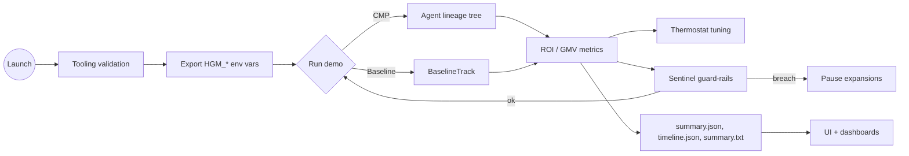

# 🎖️ Huxley–Gödel Machine Demo (AGI Jobs v0 / v2)

> A cinematic, operator-focused walkthrough showing how AGI Jobs v0 (v2) spins up
> a Gödel-style, provably improving workforce, aligns it with Thermostat
> governance, and keeps Sentinel safeguards illuminated for non-technical
> stakeholders.

## 🎬 Storyline synopsis

| Act | Title | Narrative beat |
| --- | --- | --- |
| I | **Signal ignition** | The operator proclaims revenue goals, ROI floors, and ethical guard-rails. Sentinel loads the constraint envelope while the Thermostat locks a target ROI band. |
| II | **Recursive bloom** | The CMP (Clade Metaproductivity) engine explores, evaluates, and promotes agents into a lineage tree, constantly nudged by Thermostat feedback. |
| III | **Audit coronation** | Baseline vs. CMP outcomes are benchmarked, ROI deltas are narrated, and reports are delivered for audit, BI dashboards, and executive review. |

## 🧱 Prerequisites

| Tooling | Minimum | Notes |
| --- | --- | --- |
| Python | 3.10+ | Used by `run_demo.py` and the guided launcher. `python3 --version` should report ≥ 3.10. |
| Node.js & npm | 20.18.x (per `package.json`) | Needed for the guided launcher (`demo_hgm.js`) and optional linting via `npm run …`. |
| make | POSIX make | Simplifies one-click execution with `make demo-hgm`. |

Optional but recommended:

- `npm install` at the repository root (once) so shared tooling such as Prettier is
  available without additional flags.
- `npx prettier --write demo/Huxley-Godel-Machine-v0/**/*.md` to stay aligned with
  repository formatting conventions.

## 🚀 One-click guided launch

Run the entire storyline—including environment checks, pacing hints, and artefact
collection—using the new Makefile target:

```bash
make demo-hgm
```

What happens under the hood:

1. `demo/Huxley-Godel-Machine-v0/scripts/demo_hgm.js` (Node) validates the Python
   toolchain using the shared `scripts/utils/parseDuration.js` helper to respect
   `HGM_GUIDED_PACE`.
2. Environment variables (`HGM_GUIDED_MODE`, `PYTHONPATH`, report directory) are
   exported and echoed to the console.
3. `run_demo.py` is invoked with the guided configuration, streaming CMP vs.
   baseline metrics to `demo/Huxley-Godel-Machine-v0/reports/guided/`.

### Customising the guided ritual

- Adjust pacing: `HGM_GUIDED_PACE=3s make demo-hgm`
- Select a different report directory:
  `HGM_REPORT_DIR=$(pwd)/reports/custom make demo-hgm`
- Forward additional CLI arguments to `run_demo.py` via `ARGS`:
  `ARGS="--set simulation.total_steps=60" make demo-hgm`

### Manual execution (no guidance)

Prefer a direct invocation? You can still run:

```bash
python demo/Huxley-Godel-Machine-v0/run_demo.py \
  --output-dir demo/Huxley-Godel-Machine-v0/reports \
  --set simulation.total_steps=120
```

## 🛰️ Landing console (UI/UX narrative)

A dedicated landing page renders the storyline with Bootstrap styling and live
Mermaid diagrams:

- **Entry point:** `demo/Huxley-Godel-Machine-v0/ui/index.html`
- **Assets:** `styles.css`, `script.js` (within the same directory)
- **Integration:** The guided launcher sets `HGM_GUIDED_PACE_MS`, which the UI can
  mirror by visiting `index.html?pace=2200` (values in milliseconds).

Open the page locally (double-click or serve via any static file server) to share
an operator-friendly narrative of the entire experience.

The Observatory section on the same page can ingest the generated
`timeline.json` and render a live Mermaid lineage plus ROI cards. Drag and
drop the file or press **Load latest run from reports** to auto-populate the
visualisation with the newest artefacts.

## 🧭 Architecture atlas



### Flow of control



## 🛠️ Operator controls

Every parameter is editable in `config/hgm_demo_config.json`. Highlights:

| Area | Key settings | Impact |
| --- | --- | --- |
| Economics | `success_value`, `evaluation_cost`, `expansion_cost`, `max_budget` | Align the demo with token, compute, or fiat economics. |
| HGM | `tau`, `alpha`, `epsilon`, `concurrency` | Define exploration vs. exploitation and job parallelism. |
| Thermostat | `target_roi`, `roi_window`, `tau_adjustment`, `alpha_adjustment` | Auto-tune ROI behaviour for aggressive or conservative scaling. |
| Sentinel | `min_roi`, `max_failures_per_agent`, `hard_budget_ratio` | Enforce guard-rails with instant operator overrides. |

Override any value without editing JSON:

```bash
python demo/Huxley-Godel-Machine-v0/run_demo.py \
  --set simulation.evaluation_latency=[0,0] \
  --set hgm.tau=0.8
```

## 🔬 Output interpretation

- Console output includes side-by-side CMP vs. baseline summaries.
- `summary.json` captures ROI lift, GMV, and profit deltas for BI tooling.
- `timeline.json` records every decision for plotting or compliance review.
- `summary.txt` mirrors the table for quick sharing.
- `lineage.mmd` encodes a Mermaid diagram of the entire agent tree, with the
  best-belief agent highlighted for instant re-use in docs, dashboards, or the
  Observatory UI.

## ✅ CI smoke tests for non-technical reviewers

Minimal commands that mirror CI behaviour without deep domain knowledge:

1. **Verify the demo succeeds deterministically**
   ```bash
   make demo-hgm
   ```
2. **Run the focused simulation regression**
   ```bash
   python -m pytest demo/Huxley-Godel-Machine-v0/tests/test_simulation.py::test_hgm_outperforms_baseline
   ```
3. **Check formatting / linting (leverages repo tooling)**
   ```bash
   npx prettier --check demo/Huxley-Godel-Machine-v0/README.md demo/Huxley-Godel-Machine-v0/ui/index.html
   ```

These steps require only Python + Node tooling and align with the repository’s
existing `npm`-based workflows.

## 🧪 Programmatic access

Use the demo module directly from Python to compose notebooks or automated jobs:

```python
import random
import sys
from pathlib import Path

sys.path.append("demo/Huxley-Godel-Machine-v0/src")
from hgm_v0_demo import demo_runner

config = demo_runner.load_config(Path("demo/Huxley-Godel-Machine-v0/config/hgm_demo_config.json"))
rng = random.Random(2025)
summary, timeline_path = demo_runner.run_hgm_demo(
    config,
    rng,
    Path("demo/Huxley-Godel-Machine-v0/reports"),
)
print(summary)
print("timeline written to", timeline_path)
```

## 🛡️ Production-ready safeguards

- **Full operator override** – Adjust config, pause expansions, or switch to a
  manual seed at any time.
- **Hard stop switches** – Sentinel halts work if ROI or budget thresholds are
  crossed.
- **Audit trails** – Every evaluation snapshot is logged for compliance, making
  financial reconciliation and incident response straightforward.
