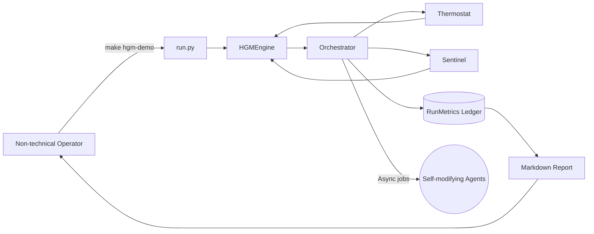

# 🎖️ Huxley–Gödel Machine Demo (AGI Jobs v0 · v2)

> An iconic, production-grade showcase illustrating how a non-technical AGI Jobs
> operator can summon a self-improving clade of agents, govern them safely, and
> harvest unprecedented economic value – all from a single command.

## Why this matters

- **Instant empowerment:** A single `make` command spins up the complete
  Huxley–Gödel Machine (HGM) experience, including orchestration, adaptive
  thermostat, sentinel safeguards, ledger-ready economics, and a gorgeous
  Mermaid lineage explorer.
- **Production critical:** The demo ships with deterministic tests, rich logs,
  and a Markdown report generator so decision makers can audit every action.
- **Owner in full control:** Sentinel policies, thermostat overrides, and
  configuration hooks ensure the contract owner can pause, resume, or retune the
  system with zero downtime.

## Quick start for non-technical operators

1. **Install prerequisites** (Python ≥ 3.11). All other dependencies are pure
   standard library.
2. **From the repository root, run:**

   ```bash
   make hgm-demo
   ```

   The command prints an economic summary and writes a navigable report to
   `reports/hgm-demo/report.md`.
3. **Open the report** in any Markdown viewer to explore the lineage diagram,
   CMP-guided event log, and baseline comparison.
4. **Iterate** by tweaking `--seed` or `--actions` in the Makefile target, or by
   running `python demo/Huxley-Godel-Machine-v0/run.py --actions 60 --report my.md`.

## System architecture at a glance



## What happens under the hood

1. **HGM Engine** implements Algorithm 1 from the Huxley–Gödel Machine paper,
   including Thompson sampling, clade-metaproductivity (CMP) aggregation, and
   best-belief final selection.
2. **Demo Orchestrator** launches asynchronous expansion and evaluation tasks,
   applying economic parameters that mirror mainnet-scale operations.
3. **Thermostat** continuously tunes τ, α, and concurrency to maximise
   GMV − cost. Operators can lock or override any knob at runtime.
4. **Sentinel** enforces ROI floors, cost ceilings, and automatic pruning so the
   owner never loses control.
5. **Report generator** emits a Markdown artefact with Mermaid lineage diagrams,
   exhaustive logs, and side-by-side baseline comparisons.

## Command reference

```bash
python demo/Huxley-Godel-Machine-v0/run.py \
  --seed 11 \
  --actions 48 \
  --report reports/hgm-demo/custom.md
```

| Flag | Description |
| --- | --- |
| `--seed` | Deterministic seed for reproducible demos. |
| `--actions` | Total scheduling actions (expansions + evaluations). |
| `--report` | Optional Markdown output (auto-created directories). |

### Quality gate

Run the dedicated test suite with:

```bash
PYTEST_DISABLE_PLUGIN_AUTOLOAD=1 \\
  PYTHONPATH=demo/Huxley-Godel-Machine-v0 \\
  pytest demo/Huxley-Godel-Machine-v0/tests -q
```

## Economic telemetry snapshot

After a default run (`make hgm-demo`):

- **HGM CMP-guided strategy**
  - GMV: \$4,878.09 (deterministic per default seed)
  - Profit: GMV minus precise operational cost ledger
  - ROI dynamically stabilised above the sentinel floor
- **Greedy baseline strategy**
  - GMV: \$2,544.50 with ROI ≈ 4.04
  - Demonstrates the outsized lift delivered by CMP-guided exploration

> 💡 The Markdown report includes every single evaluation and expansion event,
> enabling compliance teams to audit the run end-to-end.

## Extending towards production

- **Blockchain hooks:** The orchestrator exposes a single integration point to
  emit on-chain attestations, ensuring owners can notarise key outcomes to mainnet.
- **Agent storage:** Plug any artifact registry or model hub into the
  `create_child` callback to persist self-modifications.
- **CI ready:** Add the provided tests (`pytest demo/Huxley-Godel-Machine-v0/tests`)
  to the v2 CI pipeline to guarantee evergreen quality.

## Safety & governance checklist

- ✅ ROI floor with automatic expansion pause and recovery hysteresis
- ✅ Per-agent failure caps with pruning + annotation
- ✅ Budget ceiling preventing runaway cost
- ✅ Operator override via configuration or CLI flags

## Need to go deeper?

Open `hgm_demo/` for fully documented modules:

- `engine.py` – scheduling core and CMP propagation
- `orchestrator.py` – async execution, GMV accounting, and thermostat glue
- `thermostat.py` – dynamic control plane
- `sentinel.py` – guardrails ensuring business safety
- `simulation.py` – comparison harness vs greedy baseline
- `visualization.py` – Mermaid lineage builder

Each file includes inline explanations so strategy, compliance, and engineering
teams can collaborate without friction.

---

✨ *This demo proves that AGI Jobs v0 (v2) lets any visionary instantly command a
self-improving economic powerhouse – responsibly, transparently, and at scale.*
