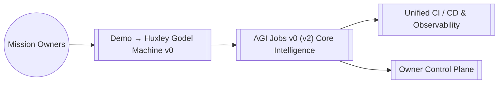

# Huxley–Gödel Machine · AGI Jobs

**Turn intelligence into useful work, and use reviewed outcomes to guide the next investment.**

[Open the research console](https://montrealai.github.io/AGIJobsv0/experiments/huxley-godel/) · [Operator runbook](RUNBOOK.md) · [Validation and limits](VALIDATION.md)

AGI Jobs is designed as a scalable machine labor layer for authorized, lawful screen-based work—coordinating specialized agents to execute tasks, produce reviewable evidence, and support independent verification and settlement across a broad range of computer-based workflows.

This module makes the improvement loop inspectable: compare hierarchical exploration with a greedy baseline, enforce an experiment budget, inspect the lineage, and produce a source-bound benchmark analysis. The long-term ambition is a productive network that can reinvest demonstrated value into better research, software, infrastructure and eventually greater energy and industrial capacity. Scale follows evidence, resource availability and governance.

## Start in two minutes

From the repository root, with Python 3.12:

```bash
python demo/Huxley-Godel-Machine-v0/run_demo.py --seed 7
```

The standard-library simulator writes reports to `demo/Huxley-Godel-Machine-v0/reports/` and its current comparison to `demo/Huxley-Godel-Machine-v0/web/artifacts/comparison.json`. Open the published console and import that comparison file. Uploaded files are processed in your browser; the page does not dispatch workers, connect wallets or send payments.

For a local, self-contained viewer, use the repository's pinned Node/npm versions (`.nvmrc`, `package.json`) and locked dependencies:

```bash
npm ci
npm run demo:hgm:build
python -m http.server 8765 --bind 127.0.0.1 --directory build/hgm
```

Open <http://127.0.0.1:8765>. The build includes three freshly generated recordings: reference, constrained budget and owner pause. **Import a new comparison to view your own run**; the bundled reference does not update when another process runs. Stop the local viewer with Ctrl+C.

## What is implemented

| Surface              | Working behavior                                                                                                        | Evidence boundary                                                                                    |
| -------------------- | ----------------------------------------------------------------------------------------------------------------------- | ---------------------------------------------------------------------------------------------------- |
| HGM simulator        | Seeded lineage search, clade bookkeeping, thermostat, sentinel, owner limits, queued-cost reservation                   | Synthetic outcomes; no customer task execution                                                       |
| Greedy baseline      | Separate seeded strategy with the same budget ceiling and owner controls                                                | Different scheduling rates and RNG stream; not a controlled efficacy trial                           |
| Research console     | Scenario selection, exact totals, SVG chart, lineage, logs, record import/export                                        | Imported records have untrusted provenance                                                           |
| Analysis deliverable | Computes committed cost and value less commitments, binds source summaries by SHA-256, exports JSON                     | Actual local computation on simulation inputs                                                        |
| Candidate checker    | Recomputes the expected source-bound output and rejects changed fields or approval flags                                | Content checks, not independent provider provenance or substantive review                            |
| Screen-work planner  | Ten workflow categories, USDC budget, reserved reviewer time, exportable work-order draft                               | A draft requires buyer-specific scope and operator admission                                         |
| Connected worker     | Reuses the repository's admitted OpenClaw Responses adapter with exact task/job binding and persistent dispatch journal | Requires a separately commissioned runtime, credentials and admission; not run by the static website |
| ChatGPT Work         | Export a bounded task for an authorized operator-led session; import the candidate                                      | No assumed remote Work dispatch endpoint                                                             |

The scope spans software, research, public datasets, web applications, scientific reproduction, AI evaluations, editable documents/presentations, vendor research, tooling and other authorized computer workflows. Tool availability expands what can be attempted; it does not prove that every task can be completed reliably. Use approved public, licensed or synthetic non-personal inputs. This module's connected benchmark task uses synthetic input only.

## Read the numbers correctly

- `gmv` is simulated gross value, in USD-equivalent units. It is not a USDC balance, customer revenue or settled work.
- The historical `roi` field is **gross value / completed cost**, a gross multiple. Net return would be `(gmv - cost) / cost`. Undefined ratios serialize as JSON `null`.
- `reserved_cost` is the cost of queued, unfinished work. Admission checks `cost + reserved_cost + next_cost <= max_budget` before scheduling. Reports retain these commitments at the horizon instead of pretending they completed.
- `pending_tasks` records unfinished work. The console's value-less-commitments metric is `gmv - cost - reserved_cost`.
- Both strategies observe the same budget ceiling and owner directives. Compare seeds, evaluation counts, elapsed steps and costs; a favorable single seed does not establish superiority.
- The website's **$40 trillion/year** opportunity is a user-supplied planning assumption. The calculator applies eligibility and capture percentages; its result is illustrative gross work value before costs, not measured TAM, platform revenue or a forecast.

## Run a bounded experiment

```bash
python demo/Huxley-Godel-Machine-v0/run_demo.py --seed 7 \
  --set economics.max_budget=100 \
  --output-dir /tmp/hgm-budget-study \
  --ui-artifact /tmp/hgm-budget-study/comparison.json

python demo/Huxley-Godel-Machine-v0/run_demo.py \
  --set owner_controls.pause_all=true \
  --output-dir /tmp/hgm-paused \
  --ui-artifact /tmp/hgm-paused/comparison.json
```

Malformed values, non-finite numbers, unknown configuration keys, negative costs and inconsistent ranges fail before output creation. Owner pause prevents new scheduling; it does not revoke effects already dispatched in another system. The simulator is a finite experiment, not a continuously running controller.

Outputs: `effective_config.json`, `summary.json`, `summary.txt`, `hgm_timeline.json`, `baseline_timeline.json`, `hgm_lineage.mmd`, `roi_comparison.svg`, `logs.md`, plus the requested comparison file. Save different experiments to different directories. The same seed and resolved configuration reproduce metrics; timestamps and destination paths vary.

## Preserve the system map


```mermaid
flowchart LR
    Operators((Mission Owners)) --> demo_Huxley_Godel_Machine_v0[[Demo → Huxley Godel Machine v0]]
    demo_Huxley_Godel_Machine_v0 --> Core[["AGI Jobs v0 (v2) Core Intelligence"]]
    Core --> Observability[[Unified CI / CD & Observability]]
    Core --> Governance[[Owner Control Plane]]
```

This is the original conceptual systems map. The static console is an observer and authoring surface; integration with live orchestration requires the explicit admission process in the runbook. The original web evolution flow and Grand Operator Console diagrams are also retained. Their terms “self-modification” and “mission execution” describe simulated quality mutations and sampled outcomes here, not changes to production code.

## Directory and compatibility guide

| Path                                                        | Role                                                                                                |
| ----------------------------------------------------------- | --------------------------------------------------------------------------------------------------- |
| `run_demo.py`, `simulator/runner.py`, `src/hgm_v0_demo/`    | Canonical simulator and report writer                                                               |
| `config/hgm_demo_config.json`                               | Canonical experiment configuration                                                                  |
| `web/`, `scripts/build_site.mjs`                            | Research console, content checker and offline asset build                                           |
| `scripts/worker.cjs`, `config/worker-profiles.example.json` | Shared admitted-worker integration; empty admissions by default                                     |
| `ui/`                                                       | Preserved Grand Operator Console, bundled under `legacy/`                                           |
| `run.py`, `hgm_demo/`, `config/hgm_config.json`             | Preserved historical simulator with its own assumptions; not the canonical bounded-worker interface |
| `scripts/demo_hgm.js`, `scripts/hgm_owner_console.py`       | Guided launcher and owner override helper                                                           |
| `tests/`, `web/tests/`                                      | Simulation regressions, content-contract tests and browser QA                                       |
| `reports/`                                                  | Generated artifacts, excluded from source control                                                   |

`make demo-hgm` and `python -m demo.huxley_godel_machine_v0.simulator` remain supported. The historical `run.py` path remains available for comparison. Do not mix configuration or telemetry formats between implementations.

## Verify before merging

```bash
PYTEST_DISABLE_PLUGIN_AUTOLOAD=1 python -m pytest demo/Huxley-Godel-Machine-v0/tests -q
npm run demo:hgm:build
npm run demo:hgm:test
npm run demo:hgm:lint
npm run demo:hgm:qa
```

Changes land through a pull request with required checks green. The dedicated workflow exercises the simulator, task inspector and browser; the Pages workflow also checks the published HGM route. No live deployment, unrelated reviewer acceptance, buyer use, payment or production commissioning is asserted by these checks.
