# 🎖️ Huxley–Gödel Machine Demo (AGI Jobs v0)

> An empowering end-to-end experience showing how a non-technical founder can command AGI Jobs v0 (v2) to deploy a clade-metaproductive, self-improving superintelligence in minutes.

## Why this matters

- **Economic command center:** Tune ROI targets, safety rails, and exploration depth from a single JSON file. No code editing is required.
- **Autonomous lineage management:** The demo spins up a Gödel-style agent tree, continuously self-modifies, and deploys the highest-confidence agent with statistical guarantees.
- **Sentinel-grade safety:** Built-in guardrails halt runaway spend, prune unproductive branches, and surface real-time profitability to operators.
- **Baseline comparison:** Instantly quantify the uplift against a naive greedy policy – every run prints the profit delta so your stakeholders see the value.

## Run the experience

```bash
npm install  # installs shared repo tooling once
python demo/Huxley-Godel-Machine-v0/run_demo.py
open demo/Huxley-Godel-Machine-v0/web/index.html  # optional interactive dashboard
```

The script produces console analytics, `artifacts/hgm_run.json`, and `artifacts/summary.txt`. The web dashboard automatically visualizes the newest run.

### Live parameter overrides (no JSON editing required)

The contract owner can now retune the machine directly from the CLI:

```bash
python demo/Huxley-Godel-Machine-v0/run_demo.py \
  --set engine.tau=2.6 \
  --set sentinel.min_roi=1.35 \
  --set simulation.evaluation_latency=[0.0,0.0]
```

Each `--set section.key=value` instruction auto-coerces to the existing type, supporting scalars, lists, and booleans. Overrides work alongside custom JSON config files, so every safety rail and economic knob stays under instant human control.

## System architecture at a glance

```mermaid
sequenceDiagram
    participant User as Visionary Operator
    participant Config as config/hgm_config.json
    participant Orchestrator as AdaptiveOrchestrator
    participant Engine as HGMEngine
    participant Thermostat as Thermostat
    participant Sentinel as Sentinel
    participant Ledger as EconomicLedger

    User->>Config: Adjust ROI, budgets, exploration knobs
    User->>Orchestrator: python run_demo.py
    Orchestrator->>Engine: next_action()
    Engine-->>Orchestrator: expand | evaluate decision
    Orchestrator->>Thermostat: update(ledger)
    Thermostat->>Engine: tune τ, α
    Orchestrator->>Sentinel: evaluate(ledger)
    Sentinel->>Engine: toggle expansions / prune
    Orchestrator->>Ledger: persist GMV & cost
    Orchestrator-->>User: report + artifacts
```




## Configuration power tools

All levers live in [`config/hgm_config.json`](config/hgm_config.json):

- `economic_model`: define the dollar value of each success, the marginal cost per evaluation, and expansion R&D cost.
- `engine`: Gödel policy knobs (τ, α, ε) plus absolute budgets (`max_agents`, `max_actions`).
- `thermostat`: ROI target, concurrency limits, and adaptive step sizes.
- `sentinel`: hard safety rails – ROI floor, total budget, and per-agent failure caps.
- `baseline`: parameters for the greedy comparison run.

Change values and rerun the script to instantly feel the impact.

## Files generated for you

| Artifact | Purpose |
| --- | --- |
| `artifacts/hgm_run.json` | Rich telemetry consumed by the dashboard and other systems. |
| `artifacts/summary.txt` | Human-readable executive summary. |
| `web/index.html` | Control tower UI with flowcharts, lineage explorer, and ROI lift visualization. |

## Extending into production

1. **Swap the simulation** in `hgm_demo/simulation.py` with calls to live AGI Jobs tasks or smart contracts.
2. **Persist results** by streaming `telemetry.to_dict()` into your data lake.
3. **Trigger payouts** by reading `artifacts/summary.txt` and pushing on-chain transactions through the existing paymaster stack.
4. **Deploy watchers** by wiring the `Sentinel` events into your monitoring/alerting infrastructure.

This demo proves that AGI Jobs v0 (v2) already ships with the orchestration, safety, and control primitives required to wield a superintelligent, self-improving workforce.
