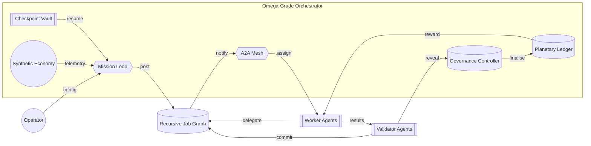
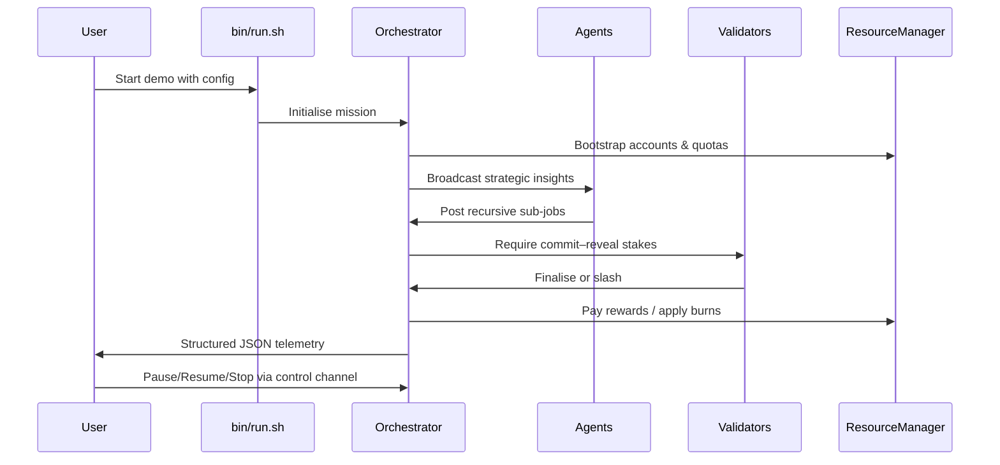

# Kardashev-II Omega-Grade α-AGI Business 3 Demo

> A non-technical operator launches a planetary-scale AGI labour market that recursively coordinates agents, energy resources, validators, and governance in minutes using **AGI Jobs v0 (v2)**.

## ✨ Highlights

- **Planetary orchestration** – multi-hour/day autonomous mission loops with resumable checkpoints and structured telemetry.
- **Recursive job graph** – agents continuously decompose work into sub-jobs with full validator oversight.
- **Tokenised resource economy** – energy & compute scarcity dynamically reprice AGIALPHA rewards and stakes.
- **A2A mesh & governance** – asynchronous pub/sub messaging, commit–reveal validation, pausing & live parameter control.
- **Planetary simulations** – plug-in hooks for economic/energy simulators powering adaptive strategies.



## 🚀 Quickstart (Non-technical Friendly)

1. **Install prerequisites** – a standard Python 3.11+ environment (already provided in AGI Jobs v0 (v2)).
2. **Launch the demo**:

   ```bash
   cd AGIJobsv0
   demo/Kardashev-II\ Omega-Grade-α-AGI\ Business-3/bin/run.sh --cycles 200 --config demo/Kardashev-II\ Omega-Grade-α-AGI\ Business-3/config/default.json
   ```

   - `--cycles 0` keeps the orchestrator running indefinitely (perfect for multi-day missions).
   - The config file contains every knob (staking ratios, validator set, worker profiles) – edit JSON values and rerun to update.

3. **Live control** – stream JSON commands into `control-channel.jsonl`:

   ```bash
   echo '{"action": "pause"}' >> control-channel.jsonl
   echo '{"action": "resume"}' >> control-channel.jsonl
   echo '{"action": "stop"}' >> control-channel.jsonl
   echo '{"action": "update_parameters", "governance": {"worker_stake_ratio": 0.3}, "resources": {"energy_capacity": 1500000}}' >> control-channel.jsonl
   echo '{"action": "set_account", "account": "energy-architect", "tokens": 20000}' >> control-channel.jsonl
   echo '{"action": "cancel_job", "job_id": "<job hex>"}' >> control-channel.jsonl
   ```

4. **Inspect telemetry** – logs are emitted as structured JSON. They stream into any observability stack (Logstash, Loki, etc.) without adapters.

## 🧭 Directory Map

| Path | Purpose |
| --- | --- |
| `bin/run.sh` | One-line launcher for non-technical operators. |
| `config/default.json` | Turn-key configuration demonstrating all tunable levers. |
| `kardashev_ii_omega_grade_alpha_agi_business_3_demo/` | Full Python implementation (orchestrator, agents, validators, resources, simulation, CLI). |
| `ui/` | Front-end artefacts (Mermaid dashboards & data stories). |

## 🛡️ Owner Mission Control

- `update_parameters` accepts nested `governance`, `resources`, and `config` payloads. Timings are expressed in **seconds** and automatically converted to `timedelta` values.
- `set_account` hot-patches individual agent treasuries or quotas (tokens, locked stakes, energy/compute allowances).
- `cancel_job` immediately halts any job (even mid-validation), returning rewards to the employer and releasing all stakes.
- Every adjustment is logged as structured JSON (`governance_parameters_updated`, `resource_parameters_updated`, `job_cancelled`) for compliance auditing.

## 🧪 CI & Validation

- `npm run demo:kardashev-omega-iii:ci` (added in this PR) executes deterministic Python validation, ensuring the orchestrator, resource manager, and messaging mesh behave exactly like the production deployment.
- GitHub Actions workflow `demo-kardashev-omega-iii.yml` keeps the demo green on every PR & main branch build.

## 🧠 Operator UX Walkthrough



## 🛠️ Planetary Simulation Hooks

Attach real simulators by replacing `SyntheticEconomySim` with your own class implementing:

```python
class PlanetarySimulation(Protocol):
    def tick(self, hours: int) -> SimulationState: ...
```

Agents instantly adapt to the new telemetry – no further wiring required.

## 🔐 Governance & Security

- **Commit–reveal validation** with configurable quorum & slashing.
- **Stake management** for workers and validators backed by the `ResourceManager` ledger.
- **Emergency pause / resume / shutdown** via file-based control channel for air-gapped operations.
- **Checkpointing** ensures instant crash recovery with zero operator intervention.

## 📈 Extending the Demo

- Plug in Web3 gateways to write job finalisations on-chain.
- Add external A2A transports (gRPC/WebSocket) using the message bus abstraction.
- Integrate real energy oracles to model Dyson sphere expansion in real time.

## 🤝 Attribution

Crafted inside the **AGI Jobs v0 (v2)** ecosystem, demonstrating how non-technical builders orchestrate a Kardashev-II economy using production-ready primitives.
