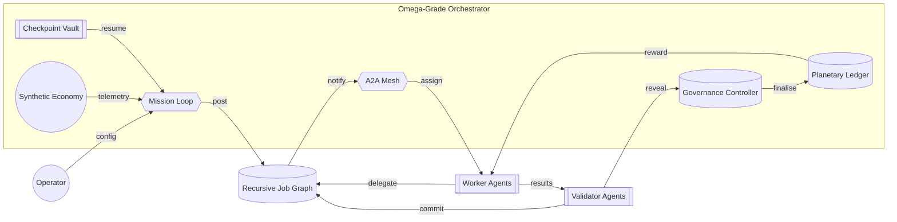
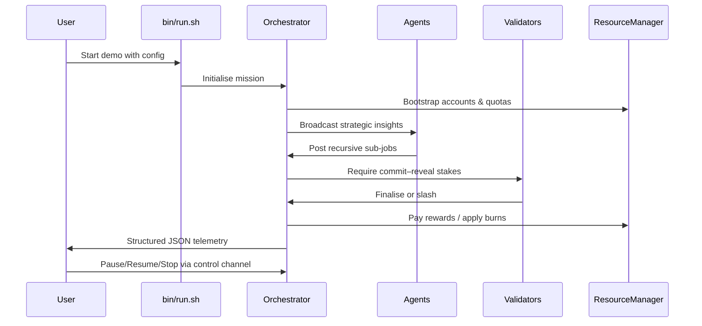

# Kardashev-II Omega-Grade α-AGI Business 3 Demo

> A non-technical operator launches a planetary-scale AGI labour market that recursively coordinates agents, energy resources, validators, and governance in minutes using **AGI Jobs v0 (v2)**.

## ✨ Highlights

- **Planetary orchestration** – multi-hour/day autonomous mission loops with resumable checkpoints and structured telemetry.
- **Recursive job graph** – agents continuously decompose work into sub-jobs with full validator oversight.
- **Tokenised resource economy** – energy & compute scarcity dynamically reprice AGIALPHA rewards and stakes.
- **Simulation-driven economics** – synthetic economy telemetry continuously rescales planetary energy & compute capacity.
- **A2A mesh & governance** – asynchronous pub/sub messaging, commit–reveal validation, pausing & live parameter control.
- **Tamper-evident audit** – optional BLAKE3 (or BLAKE2b fallback) message hashing to JSONL for compliance-grade traceability.
- **Planetary simulations** – plug-in hooks for economic/energy simulators powering adaptive strategies.
- **Resilient mission scheduler** – checkpointed event graph restarts instantly with deadlines, validation windows, and control events intact.
- **Self-healing agent mesh** – heartbeat telemetry with automatic unresponsive detection and recovery logging keeps thousands of agents trustworthy during week-long runs.
- **Autonomous integrity sweeps** – triple-verification of job graphs, scheduler queues, and planetary ledgers with every run streamed into the status channel.



## 🚀 Quickstart (Non-technical Friendly)

1. **Install prerequisites** – a standard Python 3.11+ environment (already provided in AGI Jobs v0 (v2)).
2. **Launch the demo**:

   ```bash
   cd AGIJobsv0
   demo/Kardashev-II\ Omega-Grade-α-AGI\ Business-3/bin/run.sh --cycles 200 --audit-log logs/omega-audit.jsonl --config demo/Kardashev-II\ Omega-Grade-α-AGI\ Business-3/config/default.json
   ```

   - `--cycles 0` keeps the orchestrator running indefinitely (perfect for multi-day missions).
   - The config file contains every knob (staking ratios, validator set, worker profiles, simulation scaling) – edit JSON values and rerun to update.
   - Use `--simulation-tick`, `--simulation-hours`, `--simulation-energy-scale`, and `--simulation-compute-scale` for rapid experimentation without editing files.
   - Append `--status-output logs/omega-status.jsonl` to stream machine-readable mission snapshots for dashboards or external automations.
   - Add `--energy-oracle logs/omega-energy-oracle.jsonl` to emit a dedicated energy & compute oracle ledger for governance systems.
   - Tune `--heartbeat-interval`, `--heartbeat-timeout`, and `--health-check-interval` live to control agent health sensitivity without restarting.
   - Adjust `--integrity-interval` (or the JSON config) to change how often autonomous integrity sweeps run.

3. **Live control** – stream JSON commands into `control-channel.jsonl`:

   ```bash
   echo '{"action": "pause"}' >> control-channel.jsonl
   echo '{"action": "resume"}' >> control-channel.jsonl
   echo '{"action": "stop"}' >> control-channel.jsonl
   echo '{"action": "update_parameters", "governance": {"worker_stake_ratio": 0.3}, "resources": {"energy_capacity": 1500000}}' >> control-channel.jsonl
   echo '{"action": "set_account", "account": "energy-architect", "tokens": 20000}' >> control-channel.jsonl
   echo '{"action": "cancel_job", "job_id": "<job hex>"}' >> control-channel.jsonl
   ```

4. **Inspect telemetry** – logs are emitted as structured JSON. They stream into any observability stack (Logstash, Loki, etc.) without adapters.

## 🧭 Directory Map

| Path | Purpose |
| --- | --- |
| `bin/run.sh` | One-line launcher for non-technical operators. |
| `config/default.json` | Turn-key configuration demonstrating all tunable levers. |
| `kardashev_ii_omega_grade_alpha_agi_business_3_demo/` | Full Python implementation (orchestrator, agents, validators, resources, simulation, CLI). |
| `ui/` | Front-end artefacts (Mermaid dashboards & data stories). |

## 🛡️ Owner Mission Control

- `update_parameters` accepts nested `governance`, `resources`, and `config` payloads. Timings are expressed in **seconds** and automatically converted to `timedelta` values.
- `set_account` hot-patches individual agent treasuries or quotas (tokens, locked stakes, energy/compute allowances).
- `cancel_job` immediately halts any job (even mid-validation), returning rewards to the employer and releasing all stakes.
- Every adjustment is logged as structured JSON (`governance_parameters_updated`, `resource_parameters_updated`, `job_cancelled`) for compliance auditing.
- `simulation_energy_scale`, `simulation_compute_scale`, and `simulation_tick_seconds` can be adjusted live to model external energy or demand shocks.
- `scheduler` snapshots (visible via `--status-output`) expose pending deadlines & validation windows, allowing operators to time new sub-jobs or pauses precisely.
- `integrity` records (in the same stream) provide pass/warn/fail verdicts for job graph structure, scheduler queues, and resource ledgers so owners can prove operational health instantly.

## 📜 Audit Ledger

- Supply `--audit-log audit.jsonl` (or set `"audit_log_path"` in JSON config) to activate the append-only ledger.
- Each message bus publication is canonicalised, hashed (BLAKE3 if available, BLAKE2b-256 otherwise), and written as JSONL with timestamp, topic, publisher, and digest.
- The ledger is safe for hot-rotation; records are flushed immediately for non-technical operators tailing the file.
- Pair with `--status-output` to obtain high-level mission snapshots (job counts, resource balances, governance settings) that external BI tools can ingest in real time.

## ⚡ Energy Oracle Telemetry

- Enable the energy oracle stream via `--energy-oracle logs/omega-energy-oracle.jsonl` (or set `"energy_oracle_path"` in JSON).
- Records include energy & compute availability, dynamic scarcity pricing, token supply, and simulation-derived Dyson swarm output.
- The oracle is append-only JSONL, making it trivial to mirror into IPFS, blockchains, or compliance archives without extra tooling.
- Interval defaults to 60 seconds but can be tuned live with `--energy-oracle-interval` or the control channel to match governance cadence.

## 🩺 Agent Health Monitoring

- Heartbeats are emitted every few seconds and logged into the status stream under the `agents` key.
- Unresponsive agents trigger warning logs and surface in `omega-status.jsonl` so non-technical operators immediately see who needs attention.
- Adjust health sensitivity at runtime via the CLI flags or control channel without restarting the orchestrator.

## 🧪 CI & Validation

- `npm run demo:kardashev-omega-iii:ci` (added in this PR) executes deterministic Python validation, ensuring the orchestrator, resource manager, and messaging mesh behave exactly like the production deployment.
- GitHub Actions workflow `demo-kardashev-omega-iii.yml` keeps the demo green on every PR & main branch build.

## 🧠 Operator UX Walkthrough



## 🛠️ Planetary Simulation Hooks

Attach real simulators by replacing `SyntheticEconomySim` with your own class implementing:

```python
class PlanetarySimulation(Protocol):
    def tick(self, hours: float) -> SimulationState: ...
```

Agents instantly adapt to the new telemetry – no further wiring required.

The default `SyntheticEconomySim` feeds the orchestrator with gigawatt production, prosperity, and sustainability scores. The
orchestrator multiplies these metrics by `simulation_energy_scale` and `simulation_compute_scale` to refresh `ResourceManager`
capacities in real time, which in turn updates scarcity pricing and validator/worker quotas.

## 🔐 Governance & Security

- **Commit–reveal validation** with configurable quorum & slashing.
- **Stake management** for workers and validators backed by the `ResourceManager` ledger.
- **Emergency pause / resume / shutdown** via file-based control channel for air-gapped operations.
- **Checkpointing** ensures instant crash recovery with zero operator intervention.

## ♾️ Persistent Scheduler Telemetry

- `scheduler.json` payloads saved inside checkpoints now persist every in-flight deadline, commit window, and finalisation timer; restarts simply resume the queue.
- The status stream’s `scheduler` object surfaces pending counts and the next scheduled event with an ETA, enabling dashboards to highlight looming risk.
- The adjacent `integrity` block tracks the outcome of every automated verification sweep so long-running missions can evidence compliance-grade resilience.

## 📈 Extending the Demo

- Plug in Web3 gateways to write job finalisations on-chain.
- Add external A2A transports (gRPC/WebSocket) using the message bus abstraction.
- Integrate real energy oracles to model Dyson sphere expansion in real time.

## 🤝 Attribution

Crafted inside the **AGI Jobs v0 (v2)** ecosystem, demonstrating how non-technical builders orchestrate a Kardashev-II economy using production-ready primitives.
