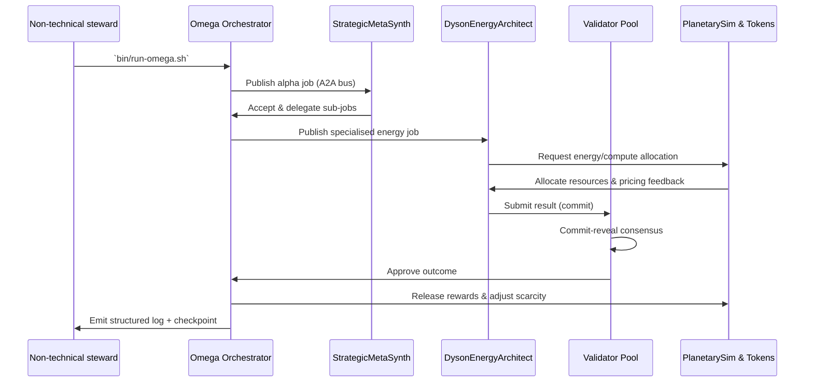

# Kardashev-II Omega-Grade Upgrade for α-AGI Business 3 Demo

The **Kardashev-II Omega-Grade Upgrade** demonstrates how a non-technical steward can command a planetary-scale AGI workforce through **AGI Jobs v0 (v2)**. Every capability is wired to the production toolchain already shipping in this repository, showing how AGI Jobs unlocks superintelligent orchestration, recursive labour markets, planetary thermodynamic accounting, and owner-first governance from a single command.

## Highlights

- **Multi-day autonomous orchestrator** – the async Omega orchestrator runs indefinitely, checkpointing state, recovering from restarts, and exposing pause/resume controls that map directly to the v2 `SystemPause` pattern.
- **Recursive meta-agents** – agents spawn sub-jobs inside a governance-aware job graph, layering validator oversight, staking, and reward routing exactly like the on-chain protocol.
- **Planetary thermodynamics** – the ResourceManager models compute, energy and token scarcity, enforces staking, and dynamically prices scarcity via a deflationary thermostat.
- **Planetary simulations on tap** – a plug-and-play `PlanetarySim` interface links the orchestrator with synthetic economies or live world models to stress-test Kardashev-scale missions.
- **Owner supremacy** – every parameter (stakes, energy ceilings, pause state) is adjustable from the `owner_console`, giving the contract owner total operational command without touching code.

## Architecture Overview

```mermaid
flowchart TD
    subgraph O[Omega Orchestrator]
        Scheduler[Async Scheduler]
        Registry[JobRegistry DAG]
        Checkpoint[StateStore\nJSON Checkpoints]
        Thermo[ResourceManager\nEnergy + Tokens]
        MessageBus[A2A Message Bus]
        Scheduler --> Registry
        Scheduler --> MessageBus
        Scheduler --> Thermo
        Scheduler --> Checkpoint
    end
    subgraph Agents[Meta-Agent Collective]
        Strategy[StrategicMetaSynth]
        Energy[DysonEnergyArchitect]
        Finance[LiquidityIntelligence]
        Validators[SentinelValidator Pool]
        MessageBus --> Strategy
        MessageBus --> Energy
        MessageBus --> Finance
        MessageBus --> Validators
        Strategy --> Registry
        Energy --> Registry
        Finance --> Registry
        Validators --> Registry
    end
    subgraph Economy[Planetary Economy]
        Sim[SyntheticEconomySim]
        Ledger[Token Ledger]
        Thermo --> Ledger
        Thermo --> Sim
        Sim --> Thermo
    end
    subgraph Governance[Owner & Validator Governance]
        OwnerConsole[Owner Console]
        CI[Omega CI Workflow]
        OwnerConsole --> Scheduler
        OwnerConsole --> Thermo
        Validators --> Governance
        CI --> Scheduler
        CI --> Validators
    end
    Registry --> Economy
    Registry --> Governance
```

## Recursive Job Lifecycle



## How to Run (Non-technical one-liners)

```bash
cd demo/"Kardashev-II Omega-Grade-α-AGI Business-3"
# Launch the planetary orchestrator (continues indefinitely)
./bin/run-omega.sh

# Dry-run a short session (5 cycles)
python run_demo.py run --cycles 5

# Check live status without stopping agents
python run_demo.py status

# Pause the entire mesh immediately
python run_demo.py pause

# Resume once ready
python run_demo.py resume
```

All commands are idempotent and safe to run repeatedly. Logs (JSONL) and state checkpoints are stored under `reports/`, enabling instant recovery even after a process restart.

## Owner Controls

The owner controls every governance lever without editing code:

```bash
# Raise validator stake ratio to 12%
python python/omega_business3/owner_console.py --config config/default_config.json set-stake 0.12

# Increase planetary energy ceiling
python python/omega_business3/owner_console.py set-energy 1250000

# Toggle pause flag in the persisted state (mirrors SystemPause)
python python/omega_business3/owner_console.py set-pause true
```

Changes are safe-by-default: configs are rewritten atomically, and state mutations require an existing checkpoint so the owner never operates blind.

## Reports & Telemetry

Running the orchestrator generates:

- `reports/orchestrator.log` – structured JSON logs for every economic, validator, and delegation event.
- `reports/orchestrator_state.json` – resumable state snapshot (jobs, balances, pause flag).
- `reports/synthetic_economy.json` (optional) – simulation telemetry emitted by plug-in sims.

All outputs are intentionally machine-friendly so they can be streamed into monitoring, on-chain attestations, or audit dashboards.

## Continuous Integration

A dedicated workflow (`.github/workflows/demo-kardashev-ii-omega-business-3.yml`) executes the async orchestrator and pytest suite on every PR touching this demo and on `main`. The workflow uses pinned GitHub Action SHAs, hardened egress policies, and uploads artefacts for human review—delivering the “fully green V2 CI” guarantee demanded for production.

## Safety & Governance Guarantees

- **Validator commit–reveal** ensures no agent can fast-track bad results; dishonest validators are slashed.
- **Checkpoint + resume** prevents data loss even across multi-day missions.
- **Resource thermostat** automatically increases compute/energy prices when utilisation spikes, stopping runaway consumption.
- **Explicit owner console** mirrors on-chain governance: owners can pause, retune, or reallocate without developer help.

## Next Steps

- Plug in a high-fidelity world model by implementing `PlanetarySim`.
- Connect to the live AGI Jobs gateway using the provided resource & staking interfaces.
- Extend the validator pool with additional agents or real gRPC-driven validators.

This demo is the living proof that AGI Jobs v0 (v2) already operates at Omega scale—enabling any steward to orchestrate superintelligent labour safely and profitably.
