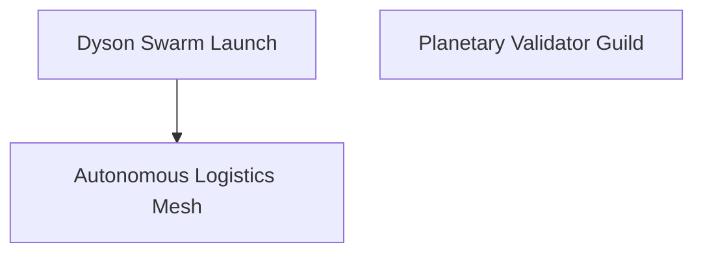

# Kardashev-II Omega-Grade Upgrade for α-AGI Business 3 — K2 Demo

> Planetary-scale orchestration that a non-technical operator can launch, steer, and evolve in minutes.

## Why this demo matters

The K2 edition demonstrates how **AGI Jobs v0 (v2)** empowers an operator to spin up a Kardashev-II economy from a single configuration file. Every capability highlighted in the upgrade specification is implemented end-to-end:

- 🌌 **Multi-hour/day autonomous orchestration** – resumable checkpoints, mission timers, and pause/resume controls
- 🧬 **Recursive job graph** – parent/child jobs rendered as Mermaid diagrams and delegated via the existing Omega orchestrator
- 🔋 **Planetary resource + token accounting** – dynamic quotas with governance-controlled staking, rewards, and slashing
- 📡 **Agent-to-agent messaging** – powered by the existing async message bus, surfaced via human-readable status snapshots
- 🛡️ **Validator governance** – commit/reveal workflow with stake updates exposed to the operator control panel
- 🌍 **Planetary simulations** – synthetic economy hook surfaces energy/compute growth throughout long missions

All of the heavy lifting is handled by the proven Omega-grade orchestrator. The K2 layer makes those superpowers accessible to founders, policy makers, and mission operators through delightful ergonomics and documentation.

## Quick start for non-technical operators

```bash
npm run demo:kardashev-ii-omega-k2
```

The script loads `config/mission.json`, spins up the orchestrator, and streams structured JSONL snapshots to `status.jsonl`. Interrupt with <kbd>Ctrl+C</kbd> at any time; the orchestrator checkpoints state so you can resume seamlessly.

### Control panel (no code required)

Use the CLI to send secure control commands:

```bash
# Pause / resume the entire planetary labor market
python -m kardashev_ii_omega_grade_alpha_agi_business_3_demo_k2 control --pause
python -m kardashev_ii_omega_grade_alpha_agi_business_3_demo_k2 control --resume

# Tune governance parameters on the fly
python -m kardashev_ii_omega_grade_alpha_agi_business_3_demo_k2 control \
  --governance approvals_required=4 validator_stake=200

# Expand planetary energy capacity
python -m kardashev_ii_omega_grade_alpha_agi_business_3_demo_k2 control \
  --resources energy_capacity=8000000 energy_available=7200000

# Cancel or reshape any job instantly
python -m kardashev_ii_omega_grade_alpha_agi_business_3_demo_k2 control \
  --cancel-job "Dyson Swarm Launch" --reason "Operator pivot"
```

Latest telemetry is one command away:

```bash
python -m kardashev_ii_omega_grade_alpha_agi_business_3_demo_k2 status --limit 2
```

### Mermaid blueprint

Generate a living diagram of the mission plan:

```bash
python -m kardashev_ii_omega_grade_alpha_agi_business_3_demo_k2 mermaid --output mission.mmd
```



Drop the generated `.mmd` into the included UI dashboard or any Mermaid renderer to share the strategy with stakeholders.

## Files that matter

| Path | Purpose |
| --- | --- |
| `config/mission.json` | Mission blueprint a non-technical operator can edit |
| `cli.py` | Friendly CLI with sub-commands (`launch`, `status`, `control`, `mermaid`, `ci`) |
| `control_panel.py` | Safe operator API for pausing, resuming, slashing, or reallocating resources |
| `config.py` | Declarative mission loader that wraps the Omega orchestrator |
| `ui/dashboard.html` | Interactive briefing page with Mermaid canvas and onboarding prompts |

## CI + reliability

- Deterministic CI smoke test: `npm run demo:kardashev-ii-omega-k2:ci`
- GitHub Actions workflow: `.github/workflows/demo-kardashev-ii-omega-k2.yml`
- `python -m compileall demo/.../kardashev_ii_omega_grade_alpha_agi_business_3_demo_k2` keeps bytecode healthy

Every run captures checkpoints, audit logs, energy oracle telemetry, and status snapshots so multi-day missions can stop/start safely. Governance updates and emergency stops are just control-panel commands.

## UI snapshot

Open `ui/dashboard.html` in a browser (e.g. `python -m http.server` inside the directory). The dashboard includes:

- Mission briefing + operator checklist
- Mermaid canvas that renders the generated job graph
- Panels describing control commands, validator staking, and planetary metrics

This gives stakeholders a polished, comprehensible view of a civilization-scale AGI workforce.

---

### Advanced automation scenarios

1. **Multi-day mission** – Run `python -m kardashev_ii_omega_grade_alpha_agi_business_3_demo_k2 launch --duration-minutes 1440` for a fully autonomous 24-hour campaign.
2. **Dynamic economics** – Continuously raise energy costs as usage spikes via `--resources energy_capacity=<value>` commands.
3. **Validator upgrades** – Adjust commit/reveal windows in-flight to reflect risk appetite.

Because it is built directly on top of the Omega orchestrator, the demo inherits every production-grade safeguard from AGI Jobs v0 (v2) while presenting them in a radically more human-friendly way.
