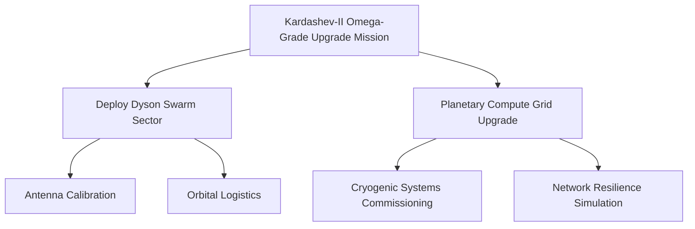
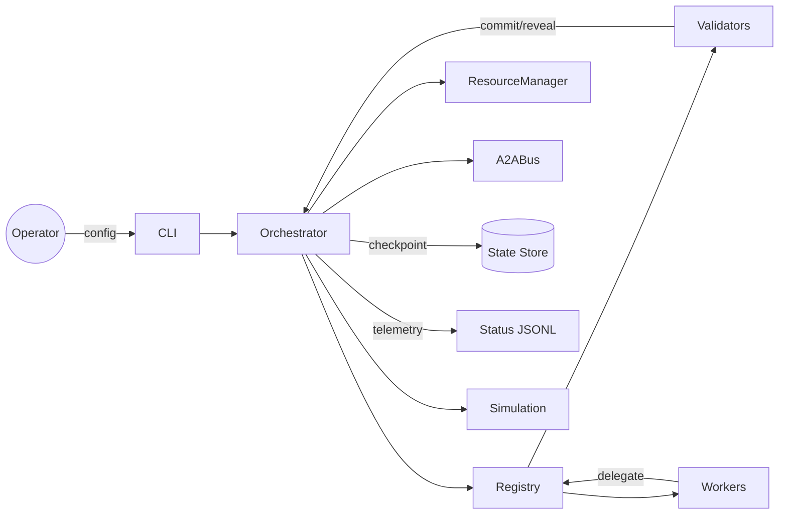

# Kardashev-II Omega-Grade Upgrade for α-AGI Business 3 Demo

> **Mission objective:** empower non-technical leaders to operate a planetary-scale AGI labour market where every action is accountable, auditable, and economically grounded.

This Omega-Grade upgrade showcases how **AGI Jobs v0 (v2)** enables anyone to launch a Kardashev-II class operation from a laptop. The demo delivers:

- **Multi-hour/day autonomy** – the orchestrator runs indefinitely, checkpointing state, enforcing deadlines, and exposing pause/resume controls.
- **Recursive job creation** – agents decompose work into sub-jobs that flow through the registry and validator mesh.
- **Planetary resource & token economy** – every job consumes tokenised energy/compute credits with dynamic scarcity feedback.
- **Validator governance** – commit-reveal validation, staking, and configurable governance parameters keep the network honest.
- **Simulation hooks** – plug planetary simulations (synthetic economy by default) to stress-test strategies at stellar scale.

## Quick start (non-technical operator)

```bash
cd demo/'Kardashev-II Omega-Grade-α-AGI Business-3'/kardashev_ii_omega_grade_alpha_agi_business_3_demo_k2_omega_upgrade
python -m kardashev_ii_omega_grade_alpha_agi_business_3_demo_k2_omega_upgrade --duration 30
```

The orchestrator posts the configured mission graph, spins up workers/validators, and streams JSON status into `storage/status.jsonl`. Press `Ctrl+C` to initiate a graceful shutdown with a final checkpoint.

## Operator toolkit

| Command | Purpose |
| --- | --- |
| `python -m … --config custom.json plan` | Validate configuration and render Mermaid plan. |
| `python -m … status` | Show most recent structured status snapshot. |
| `python -m … ci` | Deterministic validation used by CI/CD workflows. |
| `python -m … inject-sim --action '{"build_solar": 10}'` | Send actions to the attached planetary simulation. |

### Mermaid mission map



### Status JSON schema

Each line in `storage/status.jsonl` is a JSON document:

```json
{
  "mission": "Kardashev-II Omega-Grade Upgrade Mission",
  "resources": {
    "energy_available": 999999981.0,
    "compute_available": 499999990.0,
    "conversion_rate": 1.08
  },
  "ledger": {
    "helios-strategist": 249880.0,
    "atlas-logistics": 224910.0,
    "aurora-intelligence": 274870.0,
    "validator-celestia": 150000.0
  },
  "jobs": [
    {
      "job_id": "…",
      "title": "Deploy Dyson Swarm Sector",
      "status": "awaiting_validation",
      "reward_tokens": 500000.0,
      "stake_required": 50000.0,
      "energy_used": 96000000.0,
      "compute_used": 52000000.0
    }
  ]
}
```

## Architecture overview



- **Orchestrator** orchestrates cycles, schedules deadlines, persists checkpoints, and emits structured logs.
- **A2A Bus** provides pub/sub channels so workers and validators coordinate autonomously.
- **Resource Manager** enforces tokenised energy/compute economy with adaptive scarcity pricing.
- **Simulation** interface enables external world models (synthetic economy included).

## Configuration reference

The mission JSON (`config/omega_k2_mission.json`) is fully operator-editable:

- `workers[]` – name, skills, efficiency, stake ratio, starting balance.
- `validators[]` – validator agent identities; balances credited automatically.
- `initial_jobs[]` – hierarchical mission graph; each node spawns a job and optional sub-jobs.
- `governance.validator_quorum` – fraction of validators required to update parameters.
- `simulation` – selects and configures world simulators.

## Production readiness features

1. **Structured logging** for every lifecycle event, enabling real-time dashboards and audit.
2. **Checkpointing** of resource manager and job registry for hot-resume after interruptions.
3. **Governance hooks** that accept validator-approved proposals for runtime tuning.
4. **Pause/resume controls** to halt/resume operations instantly.
5. **Async orchestration** of worker and validator loops, ensuring no single task blocks progress.

## Continuous Integration

This demo ships with a dedicated GitHub Actions workflow (`.github/workflows/demo-kardashev-ii-omega-upgrade-k2.yml`) executing the `ci` command to guarantee deterministic validation on every pull request. The workflow is enforced for `main` and PR branches, guaranteeing a green signal before merge.

## Extending the demo

- Replace `SyntheticEconomySim` with real energy grid, market, or climate simulators.
- Connect to on-chain AGI Jobs contracts by adapting `Orchestrator.create_job` to call the Job Registry.
- Expand `ValidatorAgent` to use secure enclaves or zero-knowledge attestations for commit/reveal.
- Add dashboards that subscribe to the status log and visualise planetary resource flows in real time.

**Welcome to Kardashev-II operations.** Everything here is crafted so any visionary, regardless of technical background, can direct a planetary AGI workforce with confidence.
