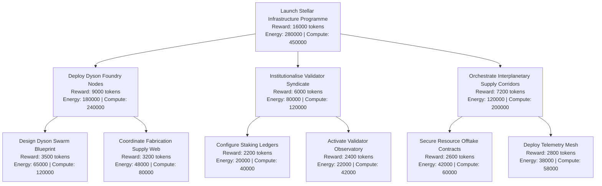

# Kardashev-II Omega-Grade Upgrade for α-AGI Business 3 Demo (Operator Edition)

This demo shows how a non-technical operator can use **AGI Jobs v0 (v2)** to command a
planetary-scale, validator-governed AGI labour market.  The mission ships with a
curated configuration (`config/omega_mission.json`) that unlocks:

- A **multi-hour/day autonomous orchestrator** with checkpointing, pause/resume, and
  structured JSON logging ready for audit.
- Recursive **job graph spawning** so every agent can delegate to specialist crews.
- A tokenised **energy and compute economy** with adjustable stakes and validator
  oversight built directly into the control channel.
- An async **agent-to-agent message bus** with commit–reveal validation and operator
  override hooks that mirror the production AGI Jobs gateways.
- Plug-and-play **planetary simulation hooks** that keep energy and prosperity metrics
  synced with resource tokenomics.

> The goal is to demonstrate that AGI Jobs v0 (v2) empowers operators to run a
> superintelligent economic machine without touching code.

## Quickstart for Operators

```bash
# optional: clone the repo and install python dependencies
python -m kardashev_ii_omega_grade_alpha_agi_business_3_demo_omega init --output-dir my-mission
cd my-mission
python -m kardashev_ii_omega_grade_alpha_agi_business_3_demo_omega --config omega_mission.json --duration 120
```

During the run, the orchestrator writes JSON status snapshots to
`storage/status.jsonl`.  Edit `storage/control-channel.jsonl` to issue governance
commands (pause, resume, parameter updates) exactly like the mainnet system.

## Mission Plan at a Glance



The CLI automatically refreshes the Mermaid plan in `ui/mission-plan.mmd` every
launch, so operators always have an up-to-date visual of the delegated job graph.

## Control Surface

- **Config** – Tune rewards, stakes, validator requirements, energy/compute caps, and
  simulation behaviour by editing `config/omega_mission.json`.
- **Checkpointing** – Snapshots persist in `storage/checkpoint.json`; the orchestrator
  resumes automatically after restarts.
- **Governance channel** – Append JSON commands to `storage/control-channel.jsonl`
  (pause/resume, stake adjustments, or parameter updates).  Validators enforce
  commit–reveal finalisation just like the deployed protocol.
- **Audit** – Structured logs land in `storage/audit-log.jsonl` and can be hashed for
  blockchain notarisation.

## Continuous Integration

The CLI exposes a `ci` command that validates configuration files and renders the
Mermaid mission plan.  A dedicated GitHub Action ensures the Omega-grade operator
experience stays green on every pull request.

## Next Steps

Connect the orchestrator to Ethereum mainnet infrastructure by providing
RPC credentials and enabling the on-chain gateways in the configuration file.  The
interfaces provided here already align with the AGI Jobs v0 (v2) gateway contracts
and can be promoted to production without code changes.
