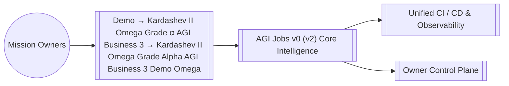

# AGI Jobs v0 (v2) — Demo → Kardashev II Omega Grade α AGI Business 3 → Kardashev II Omega Grade Alpha AGI Business 3 Demo Omega

## Current operating path

[Open the Business 3 workbench guide](../../kardashev_ii_omega_grade_alpha_agi_business_3/workbench/README.md) for the shared website, bounded launch commands, ten computer-work templates and approved-task worker integration. Run `npm run demo:kardashev-business:serve` from the repository root.

This directory implements a **synthetic orchestration simulation**. Its token, energy, planetary and validator metrics are not evidence of live settlement, physical infrastructure or production-ready autonomous work. The preserved architecture below describes the intended system; qualify a live deployment using the workbench guide.

## Overview

This Python demo models job orchestration, resource accounting and governance. The ASCII-safe launchers provide stable entry points into the canonical implementation. The shared workbench adds task specifications, reproducible evidence checks and an explicit adapter path to a separately configured worker.

## Capabilities

- Preserve the original mission configuration, simulation and architecture diagrams.
- Run bounded local scenarios and inspect their checkpoint or telemetry artifacts.
- Prepare synthetic screen-work tasks for separately admitted OpenClaw execution.
- Require independent substantive review and a separate settlement authority for real jobs.

## Systems Map

```mermaid
flowchart LR
    Operators((Mission Owners)) --> demo_Kardashev_II_Omega_Grade___AGI_Business_3_kardashev_ii_omega_grade_alpha_agi_business_3_demo_omega[[Demo → Kardashev II Omega Grade α AGI Business 3 → Kardashev II Omega Grade Alpha AGI Business 3 Demo Omega]]
    demo_Kardashev_II_Omega_Grade___AGI_Business_3_kardashev_ii_omega_grade_alpha_agi_business_3_demo_omega --> Core[["AGI Jobs v0 (v2) Core Intelligence"]]
    Core --> Observability[[Unified CI / CD & Observability]]
    Core --> Governance[[Owner Control Plane]]
```

## Working With This Module

1. Follow the current operating guide above for the exact command for this engine. Use Python 3.12 from the repository root; the selected Python launch paths use the standard library.
2. Run `npm run demo:kardashev-business:smoke` to check all five engines with temporary state and process timeouts.
3. Run the focused regression and browser checks documented in the workbench guide. Passing them qualifies the tested local behavior, not a live production deployment.
4. Keep simulation state separate from live job evidence. Qualify the provider, tool permissions, independent reviewer and settlement integration before real operation.

## Directory Guide
### Key Directories
- `bin`
- `config`
- `ui`
### Key Files
- `__init__.py`
- `__main__.py`
- `cli.py`
- `scenario.py`
- `visuals.py`

## Quality & Governance
- Every change must land through a pull request with all required checks green (unit, integration, linting, security scan).
- Reference [`RUNBOOK.md`](../../../RUNBOOK.md) and [`OperatorRunbook.md`](../../../OperatorRunbook.md) for escalation patterns and owner approvals.
- Keep secrets outside the tree; configure private worker credentials outside the repository, with a separate signer boundary.

## Next Steps
- Review this module's issue board for open automation, data, or research threads.
- Link new deliverables back to the central manifest via `npm run release:manifest`.
- Publish artefacts (dashboards, mermaid charts, datasets) into `reports/` for downstream intelligence alignment.
