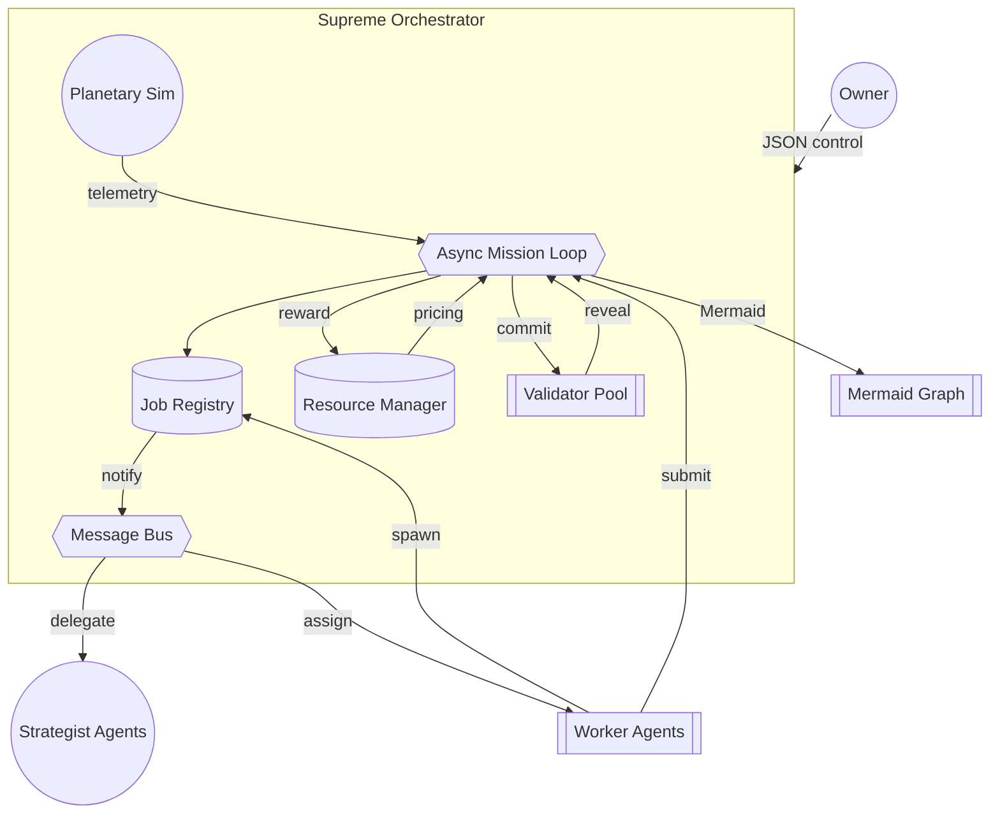
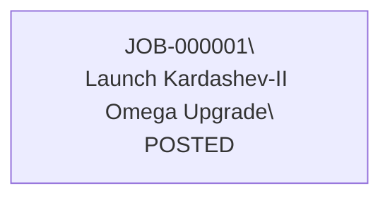

# 🎖️ Kardashev-II Omega-Grade Upgrade for α-AGI Business 3 — Supreme Demo

> A non-technical operator uses **AGI Jobs v0 (v2)** to command a Kardashev-II scale AGI labour market that autonomously schedules planetary missions for hours or days, verifies every result with validators, dynamically prices energy & compute, and visualises the entire job graph via Mermaid dashboards.

## 🚀 What makes this demo Supreme?

- **Long-run durability** – mission loops checkpoint state, resources, and message history so a multi-day operation can resume instantly.
- **Recursive job graph** – agents post sub-jobs with parent references, forming a planetary DAG that bubbles results upwards.
- **Validator governance** – commit–reveal validation with automatic staking, rewards, and slashing to keep every result honest.
- **Planetary tokenomics** – dynamic scarcity pricing for energy & compute anchored in an AGIALPHA-style ledger.
- **A2A mesh** – asynchronous pub/sub message bus with JSONL audit trail for instant observability.
- **Simulation hooks** – plug-in planetary simulations (Synthetic Economy by default) influencing resource availability.
- **Owner supremacy** – JSON control channel for pause/resume, emergency stop, governance parameter tuning, and live job injection.
- **Mermaid command theatre** – every job transition regenerates a beautiful Mermaid graph depicting the recursive economy.



## 🧭 Directory map

| Path | Purpose |
| --- | --- |
| `__main__.py`, `cli.py` | CLI entrypoint (`python -m demo.kardashev_ii_omega_grade_alpha_agi_business_3_demo_supreme`). |
| `orchestrator.py` | Supreme orchestrator coordinating jobs, validators, resources, checkpoints, and dashboards. |
| `agents.py` | Strategist, Worker, and Validator agents with recursive delegation support. |
| `resources.py` | Planetary resource & token economy manager with dynamic scarcity pricing. |
| `messaging.py` | Async pub/sub message bus with JSONL audit log. |
| `jobs.py` | Hierarchical job DAG data model & registry. |
| `simulation.py` | Planetary simulation interfaces with the default Synthetic Economy plug-in. |
| `persistence.py` | Checkpoint persistence utilities. |
| `config.py` | Dataclass configuration model (all knobs exposed). |
| `README.md` | This operator playbook. |

A compatibility wrapper at `demo/kardashev_ii_omega_grade_alpha_agi_business_3_demo_supreme` exposes the package as an importable module.

## 🛠️ 30-second launch (non-technical friendly)

```bash
cd AGIJobsv0
python -m demo.kardashev_ii_omega_grade_alpha_agi_business_3_demo_supreme \
  --cycles 0 \
  --log_path logs/omega_supreme.jsonl \
  --owner_control_path control/omega_supreme_commands.json \
  --owner_ack_path control/omega_supreme_ack.json \
  --mermaid_dashboard_path dashboards/omega_supreme.mmd
```

- **Runs forever** (`--cycles 0`) while streaming JSON logs for dashboards or spreadsheets.
- **Mermaid dashboard** auto-updates at `dashboards/omega_supreme.mmd`; render with any Mermaid viewer.
- **Control files** sit under `control/` so an operator can edit JSON without coding.

## 🕹️ Owner control channel

Create/edit the JSON file specified by `--owner_control_path` (defaults to `./omega_owner_commands.json`). The orchestrator picks it up within two seconds and writes an acknowledgement to `--owner_ack_path`.

### Pause / resume
```json
{"issuer": "owner", "action": "pause"}
{"issuer": "owner", "action": "resume"}
```

### Emergency stop
```json
{"issuer": "owner", "action": "emergency_stop"}
```

### Planetary parameter tuning
```json
{
  "issuer": "owner",
  "action": "update_resource",
  "field": "dynamic_cost_multiplier",
  "value": 1.6
}
```

### Spawn a brand-new mission
```json
{
  "issuer": "owner",
  "action": "spawn_job",
  "spec": {
    "title": "Deploy Dyson Swarm Segment",
    "description": "Commission orbital collectors for Jovian flux.",
    "reward": 4200,
    "stake_required": 420,
    "energy_budget": 150000,
    "compute_budget": 80000,
    "deadline_epoch": 1893456000,
    "required_skills": ["engineering", "governance"]
  }
}
```

Every command is logged as structured JSON for auditability.

## ♾️ Long-run autonomy guarantees

| Capability | Implementation |
| --- | --- |
| **Checkpointing** | `persistence.StatePersistence` serialises the entire job registry + metadata every `checkpoint_interval_seconds` (default 300s). |
| **Resume** | `--resume_from_checkpoint` (default `True`) automatically reloads jobs, resource balances, and simulation state. |
| **Structured logging** | JSONL at `--log_path` for ingestion into ELK/Loki/Grafana. |
| **Bus history** | All A2A messages append to `--bus_history_path` for forensic replay. |
| **Mermaid regeneration** | `_refresh_mermaid_dashboard()` rebuilds the DAG diagram on every job update & checkpoint. |
| **Simulation feedback** | `SyntheticEconomySim` emits telemetry that feeds back into the resource ledger so scarcity drives token pricing. |
| **Async orchestration** | Validation, checkpointing, simulation, and owner command loops run as dedicated asyncio tasks to prevent stalls. |

## 🧮 Token economy cheat sheet

- **Initial balances** – owner: 100k tokens; agents & validators: 10k each (editable via config or governance commands).
- **Staking** – employer stakes `stake_required` up-front (default 10% of reward).
- **Rewards** – honest completion rewards worker + 5% bonus to each approving validator.
- **Slashing** – failed validation burns the worker stake and slashes dishonest validators.
- **Dynamic pricing** – scarcity adjusts `dynamic_cost_multiplier`, increasing compute/energy costs as reserves drop.

## 🌍 Planetary simulation plug-in

- Default: `SyntheticEconomySim` with population, energy, compute, and stress metrics.
- Extend by creating a class implementing `PlanetarySim` and add its import path (`package.module:ClassName`) to `--simulation_plugins`.
- Simulation outputs automatically adjust the resource ledger (`energy_reserve`, `compute_reserve`).

## ✅ Health checklist for production pilots

- `logs/omega_supreme.jsonl` – structured event log.
- `logs/omega_bus_history.jsonl` – message audit trail.
- `dashboards/omega_supreme.mmd` – live Mermaid job DAG.
- `omega_state.json` – checkpoint snapshot (safe to commit to cold storage/IPFS).
- `omega_metrics.jsonl` – resource snapshots for BI dashboards.

## 🧩 Extending the demo

1. **Add more agents** – subclass `AgentBase`, register additional skill topics, and plug into `SupremeOrchestrator._start_agents`.
2. **Bring real validators** – replace `ValidatorAgent` with gRPC or web3-based validators using AGI Jobs contracts.
3. **On-chain integration** – wire `post_job` and validation outcomes into the AGI Jobs JobRegistry / StakeManager when connected to a chain.
4. **Swap simulations** – integrate climate, logistics, or macroeconomic models via the PlanetarySim interface.

## 🛰️ Mermaid dashboard example (auto-generated)



As the mission progresses the file evolves automatically, capturing the entire recursive job tree.

---

This Supreme demo proves that **AGI Jobs v0 (v2)** enables non-technical leaders to command a Kardashev-II calibre AGI workforce with production-grade safety, economics, and governance in minutes.
