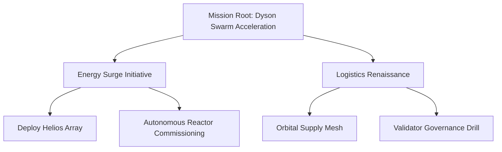

# Kardashev-II Omega-Grade Ultra Mission Demo

> **Purpose**: empower a non-technical operator to command a Kardashev-II scale AGI enterprise by
> orchestrating autonomous agents, validators, and resource markets through AGI Jobs v0 (v2).

This demo layers a "mission control" experience on top of the proven
`kardashev_ii_omega_grade_alpha_agi_business_3_demo` stack. Operators launch planetary-scale
campaigns, define recursive job plans, checkpoint state for days-long autonomy, and steer
governance parameters with one-line commands.

## Highlights

- **Ultra-grade orchestration** – resilient loops maintain multi-day operation with runtime caps,
  rotating archives, and mission-aware deadline alerts.
- **Recursive job graph** – mission files declare nested jobs. The orchestrator posts the graph,
  relays sub-jobs when parents finalise, and keeps lineage metadata for audit trails.
- **Planetary treasury** – all activity flows through AGI Jobs v0 (v2) token, stake, and resource
  controllers. Owners can retune budgets, validator stakes, and burn policies live.
- **Owner command stream** – pause/resume, reconfigure governance, or cancel jobs instantly via the
  `owner` CLI. Acknowledge files capture the full control history.
- **Mission dashboards** – JSON snapshots stream to `artifacts/status/`. The included UI renders
  metrics, mermaid diagrams, and operator briefings for non-technical stakeholders.

## Quickstart

```bash
# Launch the Omega-grade ultra mission from the packaged plan
python -m demo.kardashev_ii_omega_grade_alpha_agi_business_3_demo_ultra launch

# Run the deterministic CI plan (used in GitHub Actions)
python -m demo.kardashev_ii_omega_grade_alpha_agi_business_3_demo_ultra ci

# Pause / resume the entire mission from the owner console
python -m demo.kardashev_ii_omega_grade_alpha_agi_business_3_demo_ultra owner pause
python -m demo.kardashev_ii_omega_grade_alpha_agi_business_3_demo_ultra owner resume

# Update governance + resource parameters using declarative JSON
python -m demo.kardashev_ii_omega_grade_alpha_agi_business_3_demo_ultra owner \
    governance --payload mission-governance.json
python -m demo.kardashev_ii_omega_grade_alpha_agi_business_3_demo_ultra owner \
    resources --payload mission-resources.json
```

## Mission plan structure

Mission configuration lives in [`config/mission.json`](config/mission.json). It combines
high-level directives with orchestrator overrides and a recursive job plan.



Each job node accepts the same fields as the base demo (`title`, `description`,
`required_skills`, `reward_tokens`, `deadline_hours`, `validation_window_hours`, etc.).
Nested `children` arrays represent recursive delegation. Metadata such as `plan_path` and
`mission` are automatically injected to preserve provenance.

## Files & artefacts

| Path | Description |
|------|-------------|
| `config/mission.json` | Canonical ultra mission plan with nested jobs and parameter overrides. |
| `ui/dashboard.html` | Zero-dependency dashboard visualising mission state and resource telemetry. |
| `bin/run.sh` | Convenience script for containerised launches. |
| `README.md` | You are here. |

## Owner payload examples

`mission-governance.json`:
```json
{
  "governance": {
    "worker_stake_ratio": 0.15,
    "validator_stake": 3500,
    "slash_ratio": 0.4,
    "approvals_required": 2
  }
}
```

`mission-resources.json`:
```json
{
  "resources": {
    "energy_capacity": 5000000,
    "compute_capacity": 9000000,
    "accounts": [
      {"name": "macro-strategist", "tokens": 120000},
      {"name": "energy-architect", "tokens": 80000}
    ]
  }
}
```

## Mission dashboard

Open [`ui/dashboard.html`](ui/dashboard.html) in a browser to explore live metrics, mermaid flow
charts, and operator annotations. The page reads JSONL/JSON artifacts emitted by the orchestrator,
so it works offline and requires no web server.

## Planetary-scale assurances

- **Resilience** – checkpoints and mission archives rotate across `artifacts/status/`. Restart the
  mission at any time; the orchestrator rehydrates jobs, reservations, and scheduled events.
- **Governance** – validator commit/reveal windows, stake requirements, and pause controls all map
  directly to AGI Jobs v0 (v2) modules. Owner commands are JSONL-auditable.
- **Autonomy** – asynchronous loops juggle simulation ticks, validation deadlines, and long-running
  jobs without blocking other agents. Mission runtime caps trigger graceful auto-shutdowns.

## Support multi-hour/day operations

This ultra mission is tuned for multi-day autonomy. Increase `mission.runtime_hours` in the config
and deploy. The orchestrator maintains structured logging, rotating archives, resource telemetry,
heartbeat monitoring, and operator controls continuously—no manual babysitting required.

Enjoy orchestrating planetary-scale AGI labor markets!
