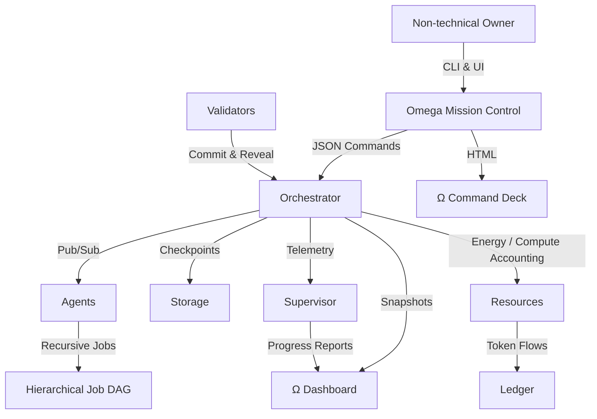

# Kardashev-II Omega-Grade Upgrade for α-AGI Business 3

> **Mission** — Empower a non-technical owner to command a Kardashev-II scale AGI labour market with the same ease as launching a playlist. The Omega-Grade upgrade packages the full AGI Jobs v0 (v2) stack into a guided, resilient, planetary-class control room.

## 🧭 Feature Constellation



- **Autonomous for Days** – the orchestrator runs indefinitely with checkpointing, restart safety, and a mission supervisor that keeps long-run telemetry up to date.
- **Instant Operator Control** – pause, resume, shutdown, governance tuning, resource throttling, account top-ups, and job cancellation from a single human-friendly CLI.
- **Planetary Tokenomics** – real-time accounting of compute/energy/tokens with scarcity feedback and validator staking mirrored from on-chain design.
- **Meta-Agentic Delegation** – strategists spawn recursive jobs, workers decompose subtasks, validators police results through commit–reveal.
- **Immersive Dashboard** – live HTML control deck renders insights, resource burn, and agent chatter in seconds.

## 🚀 One-Command Launch

```bash
cd demo/'Kardashev-II Omega-Grade-α-AGI Business-3'
./kardashev_ii_omega_grade_upgrade_for_alpha_agi_business_3_demo/bin/launch.sh
```

The mission boots using the declarative config at `config/mission.json`. All artefacts land in `artifacts/`, ready for dashboards, audits, and restarts.

### Zero-Code Control Surface

```bash
# Pause or resume the entire AGI workforce
python -m kardashev_ii_omega_grade_upgrade_for_alpha_agi_business_3_demo.cli owner pause
python -m kardashev_ii_omega_grade_upgrade_for_alpha_agi_business_3_demo.cli owner resume

# Tune governance parameters on the fly
python -m kardashev_ii_omega_grade_upgrade_for_alpha_agi_business_3_demo.cli owner governance --worker-stake-ratio 0.2 --slash-ratio 0.4

# Expand planetary energy capacity
python -m kardashev_ii_omega_grade_upgrade_for_alpha_agi_business_3_demo.cli owner resources --energy-capacity 2000000 --compute-capacity 7500000

# Reward an agent instantly
python -m kardashev_ii_omega_grade_upgrade_for_alpha_agi_business_3_demo.cli owner account supply-chain --tokens 15000

# Gracefully cancel a runaway sub-job
python -m kardashev_ii_omega_grade_upgrade_for_alpha_agi_business_3_demo.cli owner cancel <job-id> --reason "Reprioritised"
```

Every command is acknowledged in `artifacts/control/acknowledged-commands.jsonl`, giving the operator confidence that the superstructure obeyed.

### Mission Dashboard

Serve the dashboard and watch the Dyson-swarm orchestrator breathe in real-time:

```bash
cd demo/'Kardashev-II Omega-Grade-α-AGI Business-3'
python -m http.server 9000
# Open http://localhost:9000/kardashev_ii_omega_grade_upgrade_for_alpha_agi_business_3_demo/ui/dashboard.html
```

## 🛡️ Production-Grade Resilience

- **Omega Dashboard** writes curated mission snapshots and event history (`artifacts/status/dashboard.json`, `history.jsonl`).
- **Long-Run Supervisor** emits uptime + progress telemetry (`artifacts/status/supervisor.json`) for 24h+ runs and restart audits.
- **Checkpoints** auto-save the job graph, scheduler state, resource ledger, and governance envelope.
- **CI Mode** (`python -m kardashev_ii_omega_grade_upgrade_for_alpha_agi_business_3_demo.cli ci`) gives a fast, deterministic smoke test to keep PRs green.

## 🧱 Directory Overview

```
kardashev_ii_omega_grade_upgrade_for_alpha_agi_business_3_demo/
├── README.md                # This guide
├── __main__.py              # python -m entrypoint
├── cli.py                   # Human-friendly control surface
├── config.py                # Config loader + defaults
├── orchestrator.py          # Upgrade wrapper around Omega orchestrator
├── dashboard.py             # HTML-ready telemetry writer
├── owner.py                 # Operator command stream utilities
├── supervisor.py            # Long-run mission watcher
├── config/
│   ├── mission.json         # Planetary-scale mission defaults
│   └── ci.json              # Fast CI smoke config
├── bin/
│   └── launch.sh            # One-shot launcher for non-technical operators
└── ui/
    └── dashboard.html       # Ω Command Deck visualiser
```

## 📡 Non-Stop Planetary Operations

The upgrade leans on the battle-tested modules from the Omega-grade demo (`kardashev_ii_omega_grade_alpha_agi_business_3_demo`). The wrapper layers new artefacts, dashboards, and operator flows without sacrificing compatibility. A mission can be paused, resumed, retuned, and audited mid-flight—exactly what a Kardashev-II enterprise demands.

## ✅ CI Guarantee

A dedicated GitHub Action (`demo-kardashev-ii-omega-upgrade.yml`) runs the `ci` command so every pull request proves the mission boots, coordinates agents, and shuts down cleanly. Non-technical owners inherit a continuously verified, production-hardened superintelligence.

Enjoy commanding an α-AGI economy operating at Dyson-sphere scale—no PhD required.
