# Kardashev-II Omega-Grade Upgrade v2 for α-AGI Business 3

> **Purpose** — Give a non-technical owner a single command that brings a Kardashev-II labour market to life, keeps it stable for
> multi-day missions, and surfaces every decision through rich telemetry and governance controls.

## 🌌 Omega Architecture

```mermaid
flowchart TD
    User["Non-technical Owner"] -->|CLI & UI| MissionControl{{"Ω Mission Control"}}
    MissionControl -->|Commands| Orchestrator
    MissionControl -->|Telemetry JSON| Dashboard
    Orchestrator -->|Pub/Sub| Agents
    Orchestrator -->|Mermaid Graph| Dashboard
    Orchestrator -->|Long-Run Ledger| Ledger[(Resilience Ledger)]
    Orchestrator -->|Checkpoints| Storage[(Checkpoint Vault)]
    Agents -->|Recursive Jobs| JobGraph((Hierarchical Job DAG))
    Validators -->|Commit/Reveal| Orchestrator
    Orchestrator -->|Energy & Compute| Resources[[Planetary Resource Manager]]
    Resources -->|Token Flows| Treasury[(AGIALPHA Treasury)]
    Simulation[[Synthetic Economy]] --> Orchestrator
```



## 🚀 One Command Launch

```bash
cd demo/'Kardashev-II Omega-Grade-α-AGI Business-3'
./kardashev_ii_omega_grade_upgrade_for_alpha_agi_business_3_demo_v2/bin/launch.sh
```

The orchestrator boots with the defaults at `config/mission.json`, spawns workers, strategists, and validators, restores
checkpoints, and begins multi-hour orchestration. Telemetry, ledgers, and dashboards populate automatically under
`artifacts/status/omega-upgrade-v2/`.

### Zero-Code Owner Console

```bash
# Pause or resume the entire planetary workforce
python -m kardashev_ii_omega_grade_upgrade_for_alpha_agi_business_3_demo_v2.cli owner pause
python -m kardashev_ii_omega_grade_upgrade_for_alpha_agi_business_3_demo_v2.cli owner resume

# Tune validator and worker economics live
python -m kardashev_ii_omega_grade_upgrade_for_alpha_agi_business_3_demo_v2.cli owner governance \
  --worker-stake-ratio 0.2 --validator-stake 250 --slash-ratio 0.4

# Expand planetary capacity and balance energy versus compute scarcity
python -m kardashev_ii_omega_grade_upgrade_for_alpha_agi_business_3_demo_v2.cli owner resources \
  --energy-capacity 2500000 --compute-capacity 9000000

# Retune telemetry, ledgers, and forecast horizons while agents continue working
python -m kardashev_ii_omega_grade_upgrade_for_alpha_agi_business_3_demo_v2.cli owner mission \
  --telemetry-interval 10 --resilience-interval 15 --forecast-hours 36

# Reward, slash, or top up any agent
python -m kardashev_ii_omega_grade_upgrade_for_alpha_agi_business_3_demo_v2.cli owner account supply-chain --tokens 20000

# Cancel a runaway sub-job gracefully
python -m kardashev_ii_omega_grade_upgrade_for_alpha_agi_business_3_demo_v2.cli owner cancel <job-id>
```

Every command is acknowledged through `artifacts/control/acknowledged-commands.jsonl`, giving the operator proof that the
superstructure obeyed.

### Immersive UI

```bash
cd demo/'Kardashev-II Omega-Grade-α-AGI Business-3'
python -m http.server 9000
# Visit http://localhost:9000/kardashev_ii_omega_grade_upgrade_for_alpha_agi_business_3_demo_v2/ui/mission-control.html
```

The Mission Control page streams:

- Resource burn and pricing dynamics.
- Recursive job graph rendered with Mermaid in real time.
- Integrity and governance snapshots for audit-grade transparency.
- Forecast horizon analytics (jobs due inside X hours, uptime, background task count).

## 🧠 Omega-Grade Capabilities

### Multi-Day Autonomous Flight

- **Checkpoint & Resilience Layer** — The orchestrator streams snapshots to a long-run ledger every few seconds, keeping the last
  2,000+ entries ready for instant replay after restart.
- **Async Task Registry** — Every background task (telemetry, ledger, simulations) is tracked and crash-reported; no silent
  failures.
- **Dynamic Retuning** — Telemetry cadence, ledger retention, and forecast horizons can be changed in-flight without pausing the
  mission.

### Recursive Meta-Agentic Economy

- Strategists spawn sub-jobs recursively; workers decompose them further, forming a parent/child job DAG tracked in every
  snapshot.
- Validators enforce commit–reveal, staking, and slashing, mirroring AGI Jobs’ on-chain security guarantees.
- Planetary resources are tokenised; scarcity feedback adjusts prices and prevents oversubscription.

### Planetary Simulation Hooks

The orchestrator continues to stream synthetic economy ticks (energy output, prosperity, sustainability) into the resource
manager, automatically scaling energy and compute capacity. Plugging a richer simulator simply requires swapping the existing
`SyntheticEconomySim`.

## 🧪 CI & Production Confidence

```bash
npm run demo:kardashev-ii-omega-upgrade-v2:ci
```

The CI configuration (`config/ci.json`) runs a deterministic short mission, verifying agent coordination, job lifecycle, commit
and reveal, telemetry emission, and graceful shutdown. A dedicated GitHub Action (`.github/workflows/demo-kardashev-ii-omega-upgrade-v2.yml`)
keeps every PR green.

## 📂 Directory Guide

```
kardashev_ii_omega_grade_upgrade_for_alpha_agi_business_3_demo_v2/
├── README.md                 # You are here
├── __main__.py               # python -m entrypoint
├── __init__.py               # Package metadata
├── bin/launch.sh             # One-command launcher for non-technical operators
├── cli.py                    # Rich owner CLI (launch, owner, status, diagram, ci)
├── config.py                 # Configuration loader + artifact paths
├── config/                   # Mission + CI presets
├── orchestrator.py           # Resilience + telemetry upgrade atop Omega orchestrator
├── resilience.py             # Async task registry + long-run ledger manager
├── telemetry.py              # JSON + Mermaid telemetry writer
└── ui/mission-control.html   # Ω Mission Control command deck
```

## 🛡️ Operator Runbook

1. **Launch** — `bin/launch.sh` starts the mission and prints JSON logs.
2. **Monitor** — Keep the Mission Control page open; integrity results stream automatically.
3. **Control** — Use the CLI `owner` subcommands for pause/resume, governance, resources, mission tuning, and job control.
4. **Audit** — Inspect `artifacts/status/omega-upgrade-v2/long-run-ledger.jsonl` for a second-by-second record of agent activity.
5. **Shutdown** — `python -m ... cli owner stop` or `Ctrl+C`; the orchestrator flushes the ledger, telemetry, and checkpoints.

With this upgrade, a single operator can command a Kardashev-II economy—complete with recursive AGI labour, validator
cryptoeconomics, planetary resource accounting, and rich telemetry—using nothing more than familiar CLI commands and a web
browser.
