# Kardashev-II Omega-Grade Upgrade for α-AGI Business 3 · V3

> **Purpose.** Demonstrate how a non-technical operator can command AGI Jobs v0 (v2) to run an Omega-grade, Kardashev-II planetary business orchestration with autonomous, multi-day resilience and full owner control.

## 🌌 Mission Overview

The V3 upgrade layers a *planetary autonomy guardian*, a *dynamic resource governor*, and fully scripted owner controls on top of the Omega-grade business stack. Agents recursively spawn sub-agents, coordinate through the A2A bus, and settle tokenized energy/compute accounts while validators enforce commit–reveal governance.

```mermaid
flowchart TD
    operator[(Operator Treasury)] --> control["Owner Control Stream"]
    control --> guardian{{"Autonomy Guardian"}}
    guardian --> orchestrator{{"Ω Orchestrator"}}
    orchestrator --> workers["Recursive Worker Swarms"]
    orchestrator --> validators["Validator Constellation"]
    orchestrator --> resources["Resource Governor"]
    resources --> energy[(Energy & Compute Pools)]
    guardian --> ledger[["Long-run Ledger & Telemetry"]]
    orchestrator --> sim[(Planetary Simulation Hooks)]
    workers --> jobs{{"Job Graph DAG"}}
    guardian --> jobs
```



## ✨ Key Capabilities

- **Multi-day autonomy:** the `AutonomyGuardian` analyses the job DAG, checkpoints mission state, escalates near-deadline jobs, and publishes structured JSON history for restarts.
- **Dynamic token economics:** the `ResourceGovernor` tunes energy and compute prices toward configurable utilisation targets, enforcing thermodynamic accounting for every action.
- **Recursive job graph:** strategist and worker agents spawn sub-jobs; the guardian maintains a mermaid-rendered DAG for instant inspection.
- **Validator governance:** commit–reveal validation, staking/slashing, and owner-triggered governance updates mirror on-chain deployment controls.
- **Owner supremacy:** CLI subcommands cover pause/resume/stop/emergency-stop, governance tweaks, resource scaling, autonomy policy tuning, account management, and job cancellation.
- **Planetary telemetry:** UI payloads capture resources, autonomy snapshots, simulation feedback, validator health, and long-run ledger tails for dashboards.

## 🚀 Quickstart

```bash
# Install requirements (virtualenv recommended)
pip install -r requirements-agent.txt

# Launch the Omega-grade demo with default mission
yarn demo:kardashev-omega-upgrade-v3 -- launch

# Tail status / mermaid / guardian plan in another shell
yarn demo:kardashev-omega-upgrade-v3 -- status

# Pause, resume, or trigger an emergency stop
yarn demo:kardashev-omega-upgrade-v3 -- owner pause
yarn demo:kardashev-omega-upgrade-v3 -- owner resume
yarn demo:kardashev-omega-upgrade-v3 -- owner emergency-stop
```

## 🧭 Owner Command Reference

| Command | Effect |
| --- | --- |
| `owner governance --worker-stake-ratio 0.2` | Adjust worker staking ratio |
| `owner resources --energy-capacity 2e6` | Expand planetary energy ceiling |
| `owner mission --telemetry-interval 10` | Tighten telemetry cadence |
| `owner autonomy --guardian-interval 6 --resource-target 0.82` | Speed up guardian scans & raise utilisation target |
| `owner account operator --tokens 1.5e6` | Refill operator treasury |
| `owner cancel JOB_ID --reason "Operator veto"` | Cancel any job with slash-safe audit |

All commands are JSONL entries written to the control stream so an operator can audit and replay mission history.

## 🛡️ Resilience & Auditability

- **Checkpointing:** mission + autonomy checkpoint files are rotated every guardian cycle so the demo can resume after outages.
- **Long-run ledger:** JSON lines capture uptime, resource posture, guardian signals, and token prices for CI dashboards.
- **Telemetry bundle:** machine-readable UI payloads plus Mermaid DAGs render instantly in dashboards or static pages.
- **CI mode:** `yarn demo:kardashev-omega-upgrade-v3 -- ci` executes a deterministic, fast configuration for continuous verification.

## 🧪 Mission Artifacts

All artifacts default to `demo/.../artifacts/`:

- `status/omega-upgrade-v3/telemetry.json` – full mission snapshot
- `status/omega-upgrade-v3/telemetry-ui.json` – UI friendly payload
- `status/omega-upgrade-v3/job-graph.mmd` – Mermaid job DAG
- `status/omega-upgrade-v3/autonomy-plan.json` – guardian plan of record
- `status/omega-upgrade-v3/autonomy-history.jsonl` – streaming history
- `status/omega-upgrade-v3/long-run-ledger.jsonl` – rotating ledger

## ✅ Designed for Non-Technical Operators

- No code changes required—just run the CLI.
- Human-readable JSON artifacts with copy/paste governance commands.
- Emergency-stop, pause, resume, and mission tuning available at any time.
- Fully compatible with AGI Jobs v0 (v2) infrastructure and Ethereum Mainnet tooling.

Harness the demo to show stakeholders how AGI Jobs v0 (v2) empowers them to operate planetary businesses with unprecedented scale, control, and transparency.
