# Kardashev-II Omega-Grade Upgrade for α-AGI Business 3 · V4

> **Purpose.** Showcase how a non-technical operator wields AGI Jobs v0 (v2) to launch an Ω-grade, Kardashev-II business orchestration—complete with narrative dashboards, planetary tokenomics, validator governance, and one-command mission configuration.

## 🌌 Mission Overview

The v4 upgrade layers a cinematic **mission storyboard**, a **MissionWizard** for preset generation, and enhanced **owner controls** on top of the Omega-grade business stack. Recursive agents, validators, and planetary resource governors collaborate in long-running autonomous loops while the operator enjoys readable narratives, mermaid diagrams, and one-click overrides.

```mermaid
flowchart TD
    operator[(Operator Treasury)] --> wizard[MissionWizard Presets]
    wizard --> config[(Mission JSON)]
    operator --> control["Owner Control Stream"]
    control --> guardian{{"Autonomy Guardian"}}
    guardian --> orchestrator{{"Ω Orchestrator"}}
    orchestrator --> storyboard["Mission Storyboard"]
    orchestrator --> resources["Resource Governor"]
    orchestrator --> validators["Validator Constellation"]
    orchestrator --> workers["Recursive Worker Swarms"]
    resources --> energy[(Energy & Compute Pools)]
    workers --> jobs{{"Job Graph DAG"}}
    guardian --> jobs
    storyboard --> ui[["Mission Control UI"]]
```



## ✨ Key Capabilities

- **MissionWizard presets.** Generate full mission JSONs without touching code. Presets span sovereign launches, consortium expansions, and galactic-scale deployments—perfect for non-technical operators.
- **Narrative storyboard.** `MissionStoryBoard` translates telemetry into readable headlines, confidence scores, and recommended actions. A history ledger and insight journal capture every moment for auditability.
- **Multi-day autonomy.** The `AutonomyGuardian` inspects the recursive job graph, checkpoints mission state, accelerates near-deadline work, and logs JSON history for restarts.
- **Dynamic token economics.** `ResourceGovernor` tunes energy/compute prices toward utilisation targets so every action consumes planetary credits consistent with thermodynamic accounting.
- **Validator governance.** Commit–reveal validation, staking/slashing, and on-demand governance updates mirror on-chain deployment controls. Owner commands cover pause/resume/stop/emergency-stop and economic levers.
- **Planetary telemetry.** UI payloads capture resource posture, autonomy signals, simulation hooks, validator health, and long-run ledgers for dashboards or static sites.

## 🚀 Quickstart

```bash
# Install agent dependencies (virtualenv recommended)
pip install -r requirements-agent.txt

# Launch the Omega-grade demo with the default mission
yarn demo:kardashev-ii-omega-upgrade-v4 -- launch

# Print telemetry, Mermaid job graph, and guardian plan in another shell
yarn demo:kardashev-ii-omega-upgrade-v4 -- status

# Generate a ready-to-run mission preset without editing JSON
yarn demo:kardashev-ii-omega-upgrade-v4 -- wizard --preset consortium --output mission.consortium.json

# Operate the owner channel (pause/resume/emergency-stop)
yarn demo:kardashev-ii-omega-upgrade-v4 -- owner pause
yarn demo:kardashev-ii-omega-upgrade-v4 -- owner resume
yarn demo:kardashev-ii-omega-upgrade-v4 -- owner emergency-stop
```

## 🧭 Owner Command Reference

| Command | Effect |
| --- | --- |
| `owner governance --worker-stake-ratio 0.2` | Adjust worker staking ratio |
| `owner resources --energy-capacity 2e6` | Expand planetary energy ceiling |
| `owner mission --storyboard-history 2048` | Tune storyboard retention window |
| `owner mission --insight-history 4096` | Control narrative insight journal depth |
| `owner autonomy --guardian-interval 6 --resource-target 0.78` | Speed guardian scans & raise utilisation target |
| `owner account operator --tokens 1.5e6` | Refill operator treasury |
| `owner cancel JOB_ID --reason "Operator veto"` | Cancel any job with slash-safe audit |

All commands append JSONL entries to the control stream for replay and governance audits.

## 🛡️ Resilience & Auditability

- **Checkpointing.** Mission and autonomy checkpoints rotate each guardian cycle for clean restarts.
- **Long-run ledger.** JSON lines capture uptime, resource posture, guardian signals, and price adjustments for CI dashboards.
- **Mission storyboard.** Readable summaries land in `storyboard.json`, while `storyboard-history.jsonl` and `insights.jsonl` chronicle the operator narrative.
- **CI mode.** `yarn demo:kardashev-ii-omega-upgrade-v4 -- ci` executes a deterministic, short mission for continuous verification.

## 🖥️ Mission Artifacts

Artifacts default to `demo/.../artifacts/`:

- `status/omega-upgrade-v4/telemetry.json` – full mission snapshot
- `status/omega-upgrade-v4/telemetry-ui.json` – UI-friendly payload
- `status/omega-upgrade-v4/job-graph.mmd` – Mermaid job DAG
- `status/omega-upgrade-v4/autonomy-plan.json` – guardian plan of record
- `status/omega-upgrade-v4/autonomy-history.jsonl` – guardian history stream
- `status/omega-upgrade-v4/storyboard.json` – latest human-readable narrative
- `status/omega-upgrade-v4/storyboard-history.jsonl` – storyboard history ledger
- `status/omega-upgrade-v4/insights.jsonl` – recommended action journal
- `status/omega-upgrade-v4/long-run-ledger.jsonl` – rotating long-run ledger

## ✅ Designed for Non-Technical Operators

- **MissionWizard** answers “just make it work” in one command.
- **Mission Control UI** renders confidence, phase, and action lists with Mermaid diagrams and guardian plans.
- **Owner supremacy** keeps pause/resume/stop/emergency-stop, governance tweaks, resource scaling, autonomy policy tuning, account management, and job cancellation at your fingertips.
- **Production ready.** Everything aligns with AGI Jobs v0 (v2) primitives and Eth mainnet-ready infrastructure, including staking, slashing, and energy accounting.

Harness the demo to prove that AGI Jobs v0 (v2) empowers any operator to run planetary-scale AGI businesses with unprecedented clarity, control, and narrative insight.
