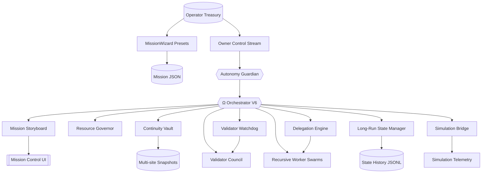

# Kardashev-II Omega-Grade Upgrade for α-AGI Business 3 · V6

> **Purpose.** Demonstrate how a non-technical operator can wield AGI Jobs v0 (v2) to spin up a Kardashev-II scale business mission – complete with redundant continuity vaults, recursive delegation, validator commit–reveal governance, and planetary resource economics – from a single command.

## 🌌 Mission Overview

The V6 upgrade layers a **Continuity Vault** with triple-redundant snapshots, a programmable **Validator Council** with commit–reveal auditing, and live **council/continuity telemetry** on top of the Omega-grade stack. Operators stay in command with richer owner verbs, a mission wizard, structured JSON dashboards, and mermaid diagrams while thousands of autonomous agents collaborate for hours or days.



## ✨ Key Capabilities

- **Continuity vaults.** Triple-replicated snapshots and JSONL histories keep the mission resumable even after catastrophic process loss.
- **Recursive autonomy.** The `DelegationEngine` (backed by a bounded background pool) reminds the agent mesh about unattended jobs, maintains parent/child DAG state, and scales recursive hiring safely.
- **Validator council.** Commit–reveal windows, stake-aware audits, and council telemetry expose validator posture directly to the operator.
- **Simulation telemetry.** The bridge republishes synthetic world updates onto the A2A bus so dashboards and downstream agents can react to planetary simulations in real time.
- **MissionWizard and CLI upgrades.** Generate presets, tune checkpoints, resize background pools, adjust validator windows, or rebalance simulations with declarative CLI flags and owner commands.

## 🚀 Quickstart

```bash
# Install agent dependencies (virtualenv recommended)
pip install -r requirements-agent.txt

# Launch the Omega-grade demo with the default mission
yarn demo:kardashev-ii-omega-upgrade-v6 -- launch

# Print telemetry, Mermaid job graph, and guardian plan in another shell
yarn demo:kardashev-ii-omega-upgrade-v6 -- status

# Generate a ready-to-run mission preset without editing JSON
yarn demo:kardashev-ii-omega-upgrade-v6 -- wizard --preset consortium --output mission.consortium.json

# Operate the owner channel (pause/resume/emergency-stop)
yarn demo:kardashev-ii-omega-upgrade-v6 -- owner pause
yarn demo:kardashev-ii-omega-upgrade-v6 -- owner resume
yarn demo:kardashev-ii-omega-upgrade-v6 -- owner emergency-stop
```

## 🧭 Owner Command Reference

| Command | Effect |
| --- | --- |
| `owner governance --worker-stake-ratio 0.2` | Adjust worker staking ratio |
| `owner governance --validator-timeout 1800` | Extend validator reveal grace period |
| `owner resources --energy-capacity 2e6` | Expand planetary energy ceiling |
| `owner mission --checkpoint-interval 90 --state-history 2048` | Tune long-run checkpoint cadence and retention |
| `owner mission --background-limit 96 --delegation-retry 45` | Resize background work pool and retry window |
| `owner mission --simulation-tick 20 --simulation-hours 4` | Sync simulation cadence and simulated hours per tick |
| `owner mission --validator-commit 600 --validator-reveal 1200` | Redefine council commit/reveal windows |
| `owner mission --continuity-interval 120 --continuity-history 2048` | Tune vault replication cadence and ledger retention |
| `owner autonomy --guardian-interval 6 --resource-target 0.78` | Speed guardian scans & raise utilisation target |
| `owner account operator --tokens 1.5e6` | Refill operator treasury |
| `owner cancel JOB_ID --reason "Operator veto"` | Cancel any job with slash-safe audit |

All commands append JSONL entries to the control stream for replay, governance, and incident response.

## 🛡️ Resilience & Auditability

- **State checkpoints.** `state-checkpoint.json` and `state-history.jsonl` keep the entire mission resumable.
- **Long-run ledger.** JSON lines capture uptime, resource posture, guardian signals, and price adjustments for CI dashboards.
- **Continuity vault ledger.** Replication events stream into `continuity-history.jsonl` so operators can audit redundancy at a glance.
- **Mission storyboard.** Readable summaries live in `storyboard.json`, while `storyboard-history.jsonl` and `insights.jsonl` chronicle the operator narrative.
- **CI mode.** `yarn demo:kardashev-ii-omega-upgrade-v6 -- ci` executes a deterministic, short mission for automated verification.

## 🖥️ Mission Artifacts

Artifacts default to `demo/.../artifacts/`:

- `status/omega-upgrade-v6/telemetry.json` – full mission snapshot
- `status/omega-upgrade-v6/telemetry-ui.json` – UI-friendly payload
- `status/omega-upgrade-v6/job-graph.mmd` – Mermaid job DAG
- `status/omega-upgrade-v6/autonomy-plan.json` – guardian plan of record
- `status/omega-upgrade-v6/autonomy-history.jsonl` – guardian history stream
- `status/omega-upgrade-v6/storyboard.json` – latest human-readable narrative
- `status/omega-upgrade-v6/storyboard-history.jsonl` – storyboard history ledger
- `status/omega-upgrade-v6/insights.jsonl` – recommended action journal
- `status/omega-upgrade-v6/long-run-ledger.jsonl` – rotating long-run ledger
- `status/omega-upgrade-v6/state-checkpoint.json` – latest planetary checkpoint
- `status/omega-upgrade-v6/state-history.jsonl` – rolling state history stream
- `status/omega-upgrade-v6/continuity-primary.json` – primary vault snapshot (with `secondary` and `tertiary` siblings)

## ✅ Designed for Non-Technical Operators

- **MissionWizard** answers “just make it work” in one command.
- **Mission Control UI** renders confidence, phases, mermaid diagrams, and guardian plans with zero manual wiring.
- **Owner supremacy** keeps pause/resume/stop/emergency-stop, governance tweaks, resource scaling, autonomy policy tuning, account management, and job cancellation at your fingertips.
- **Production ready.** Everything aligns with AGI Jobs v0 (v2) primitives and Eth mainnet-ready infrastructure, including staking, slashing, and energy accounting.

Harness the V6 upgrade to prove that AGI Jobs v0 (v2) empowers any operator to command planetary-scale AGI businesses with unprecedented clarity, continuity, and economic integrity.
