# Kardashev-II Omega-Grade Upgrade for α-AGI Business 3 · V7

> **Purpose.** Exhibit how a non-technical operator can wield **AGI Jobs v0 (v2)** to command a Kardashev-II, Omega-grade enterprise with day-long autonomy, recursive labour markets, planetary tokenomics, and sovereign validator governance from a single, human-friendly console.

## 🌌 Mission Overview

V7 rebuilds the mission core around a **Long-Run Orchestrator** capable of operating for days without intervention. Every cycle checkpoints planetary state, job graphs, validator stakes, and energy reserves so the mission can be paused, migrated, or resumed instantly. Recursive agents publish sub-jobs onto a structured A2A bus, validators guard outcomes with commit–reveal, and the operator retains total control through pause, resume, and emergency stop channels.

```mermaid
flowchart TD
    operator[(Operator Treasury)] --> wizard[MissionWizard Ω7 Presets]
    wizard --> manifest[(Mission Manifest JSON)]
    operator --> controls["Owner Control Stream"]
    controls --> guardian{{"Autonomy Guardian Ω7"}}
    guardian --> orchestrator{{"Long-Run Ω-Orchestrator"}}
    orchestrator --> ledger[("Planetary Ledger & Vaults")]
    orchestrator --> jobgraph[["Recursive Job Graph"]]
    orchestrator --> council["Validator Council"]
    orchestrator --> resources["Resource Governor"]
    orchestrator --> bus["A2A Pub/Sub"]
    orchestrator --> sim["Planetary Simulation Bridge"]
    council --> staking[("Stake Pools & Commit/Reveal")]
    jobgraph --> agents{{"Autonomous Agent Swarms"}}
    bus --> agents
    sim --> telemetry["Simulation Telemetry"]
    ledger --> ui[["Mission Control UI"]]
```



## ✨ Key Capabilities

- **Long-run autonomy.** Resilient loops, async scheduling, and rotating vault checkpoints keep the mission running for hours or days without manual babysitting.
- **Recursive job graph.** Agents spawn child jobs with explicit parent tracking; results propagate upwards automatically and surface in a Mermaid DAG.
- **Tokenised resource economics.** Every task consumes energy/compute credits priced dynamically against global supply. Stakes, rewards, and burns execute through the Resource Governor.
- **A2A mesh.** Agents subscribe to skill/topic channels and barter work via signed messages on an in-process pub/sub bus or optional gRPC transport.
- **Validator council.** Commit–reveal audits, quorum tracking, and slashing policies ensure only honest work is finalised – with operator-tunable parameters.
- **Planetary simulation bridge.** Plug in planetary-scale simulations (synthetic economy, power grids) whose state feeds resource ceilings, dashboards, and job strategies.
- **Owner supremacy.** Human operators retain explicit pause/resume/emergency stop verbs plus declarative governance controls over all mission parameters.

## 🚀 Quickstart

```bash
# Install agent dependencies (virtualenv recommended)
pip install -r requirements-agent.txt

# Launch the Omega-grade demo with the default mission
yarn demo:kardashev-ii-omega-upgrade-v7 -- launch

# Stream telemetry, job graph Mermaid, and guardian insights
yarn demo:kardashev-ii-omega-upgrade-v7 -- status

# Generate a tailored mission preset without editing JSON
yarn demo:kardashev-ii-omega-upgrade-v7 -- wizard --preset sovereign-grid --output mission.sovereign-grid.json

# Operate the owner channel (pause/resume/emergency-stop)
yarn demo:kardashev-ii-omega-upgrade-v7 -- owner pause
yarn demo:kardashev-ii-omega-upgrade-v7 -- owner resume
yarn demo:kardashev-ii-omega-upgrade-v7 -- owner emergency-stop
```

## 🧭 Owner Command Reference

| Command | Effect |
| --- | --- |
| `owner governance --worker-stake-ratio 0.25` | Tune worker staking ratio |
| `owner governance --validator-quorum 0.67` | Adjust validator quorum threshold |
| `owner resources --energy-capacity 3e6 --compute-capacity 8e6` | Expand planetary ceilings |
| `owner mission --checkpoint-interval 60 --state-history 4096` | Tune long-run checkpoint cadence |
| `owner mission --background-limit 128 --delegation-retry 30` | Resize background pools and delegation cadence |
| `owner mission --simulation-tick 15 --simulation-hours 6` | Configure simulation bridge cadence |
| `owner mission --validator-commit 900 --validator-reveal 1500` | Redefine council timing windows |
| `owner mission --continuity-interval 120 --continuity-history 8192` | Tune vault replication cadence |
| `owner autonomy --guardian-interval 5 --resource-target 0.82` | Adjust guardian vigilance |
| `owner account operator --tokens 3e6` | Top up operator treasury |
| `owner cancel JOB_ID --reason "Operator veto"` | Cancel any job with slash-safe audit |

Commands append JSONL entries to the control stream for audit, replay, and CI verification.

## 🛡️ Resilience & Auditability

- **Triple vaults.** `continuity-primary.json`, `continuity-secondary.json`, and `continuity-tertiary.json` replicate state with integrity hashes.
- **State checkpoints.** `state-checkpoint.json` and `state-history.jsonl` ensure resumability after any outage.
- **Long-run ledger.** JSONL feeds capture resource posture, validator posture, and guardian notices for dashboards.
- **Job graph exports.** `job-graph.mmd` and `job-graph.json` document recursive job relationships at every cycle.
- **Structured logging.** `structured-log.jsonl` delivers JSON logs ready for SIEM pipelines.
- **CI mode.** `yarn demo:kardashev-ii-omega-upgrade-v7 -- ci` executes a deterministic, quick mission for automated verification.

## 🖥️ Mission Artifacts

Artifacts default to `demo/.../artifacts/`:

- `status/omega-upgrade-v7/telemetry.json` – full mission snapshot
- `status/omega-upgrade-v7/telemetry-ui.json` – UI-friendly payload
- `status/omega-upgrade-v7/job-graph.mmd` – Mermaid job DAG
- `status/omega-upgrade-v7/job-graph.json` – Structured job DAG export
- `status/omega-upgrade-v7/autonomy-plan.json` – guardian plan of record
- `status/omega-upgrade-v7/autonomy-history.jsonl` – guardian history stream
- `status/omega-upgrade-v7/storyboard.json` – latest human-readable narrative
- `status/omega-upgrade-v7/storyboard-history.jsonl` – storyboard ledger
- `status/omega-upgrade-v7/insights.jsonl` – recommended action journal
- `status/omega-upgrade-v7/long-run-ledger.jsonl` – rotating long-run ledger
- `status/omega-upgrade-v7/state-checkpoint.json` – latest planetary checkpoint
- `status/omega-upgrade-v7/state-history.jsonl` – rolling state history stream
- `status/omega-upgrade-v7/continuity-primary.json` – primary vault snapshot (with `secondary` & `tertiary` siblings)
- `status/omega-upgrade-v7/structured-log.jsonl` – JSONL mission log stream

## ✅ Designed for Non-Technical Operators

- **MissionWizard** delivers point-and-click presets for complex orchestration without editing YAML/JSON by hand.
- **Mission Control UI** renders confidence, validation, energy posture, and delegation health with zero manual wiring.
- **Owner supremacy** keeps pause/resume/stop/emergency-stop, governance tweaks, resource scaling, autonomy tuning, account management, and job cancellation at your fingertips.
- **Production ready.** Aligns with AGI Jobs v0 (v2) primitives and mainnet-ready infrastructure: staking, slashing, audits, resource tokenomics, and day-long autonomy.

Harness the V7 upgrade to prove that AGI Jobs v0 (v2) empowers any operator to command planetary-scale AGI businesses with unprecedented clarity, sovereignty, and economic integrity.
