# Kardashev-II Omega-Grade Upgrade for α-AGI Business 3 · V7

> **Purpose.** Prove that a non-technical operator can command a Kardashev-II enterprise with AGI Jobs v0 (v2) by launching a self-healing, planet-scale mission that checkpoints state, audits validators, tokenises energy, and shares live telemetry across a structured mesh bus – all from a single command.

## 🌌 Mission Overview

The V7 Omega upgrade extends the orchestration fabric with a **long-run scheduler** that survives day-long missions, a **planetary resource ledger** that tokenises energy and compute, and a **structured mesh bus** that records every agent-to-agent message. Operators gain JSONL structured logging, resumable checkpoints, and visual dashboards while thousands of recursive workers coordinate autonomously for hours or days.

```mermaid
flowchart TD
    operator[(Operator Treasury)] --> wizard[MissionWizard Presets]
    wizard --> config[(Mission JSON)]
    operator --> control["Owner Control Stream"]
    control --> guardian{{"Autonomy Guardian"}}
    guardian --> orchestrator{{"Ω Orchestrator V7"}}
    orchestrator --> mesh[["Ω Mesh Bus"]]
    orchestrator --> ledger["Planetary Resource Ledger"]
    orchestrator --> continuity["Continuity Vault"]
    continuity --> replicas[("Multi-site Snapshots")]
    orchestrator --> validators["Validator Council"]
    orchestrator --> workers["Recursive Worker Swarms"]
    orchestrator --> state["Long-Run State Manager"]
    state --> history[(State History JSONL)]
    orchestrator --> delegation["Delegation Engine"]
    delegation --> workers
    orchestrator --> watchdog["Validator Watchdog"]
    watchdog --> validators
    orchestrator --> sim["Simulation Bridge"]
    sim --> telemetry["Simulation Telemetry"]
    mesh --> meshLog[["Mesh History JSONL"]]
    ledger --> ledgerLog[["Resource Ledger"]]
    orchestrator --> structLog[["Structured Mission Log"]]
    storyboard --> ui[["Mission Control UI"]]
```



## ✨ Key Capabilities

- **Long-run autonomy.** The background scheduler, checkpoint vault, and async task pool keep the mission running for multi-hour or multi-day windows with resumable state snapshots.
- **Recursive delegation.** The `DelegationEngine` maintains parent/child DAG state, nudges unattended jobs on the mesh bus, and scales recursive hiring safely.
- **Planetary ledger.** `PlanetaryResourceLedger` tokenises energy and compute usage, tracks stake movements, and persists every debit/credit event for audits.
- **Structured mesh bus.** `OmegaMessageBus` emits JSONL logs of every agent message and supports targeted pub/sub channels for thousands of agents.
- **Validator governance.** Commit–reveal windows, staking controls, and watchdog reminders mirror the AGI Jobs validation pipeline.
- **Simulation telemetry.** The simulation bridge streams world updates into the mesh so dashboards and downstream agents react to planetary forecasts instantly.
- **Operator tooling.** MissionWizard, upgraded CLI flags, and an animated mission control UI put orchestration, governance, and resource policy within reach of non-technical operators.

## 🚀 Quickstart

```bash
# Install agent dependencies (virtualenv recommended)
pip install -r requirements-agent.txt

# Launch the Omega-grade demo with the default mission
yarn demo:kardashev-ii-omega-upgrade-v7 -- launch

# Print telemetry, Mermaid job graph, and guardian plan in another shell
yarn demo:kardashev-ii-omega-upgrade-v7 -- status

# Generate a ready-to-run mission preset without editing JSON
yarn demo:kardashev-ii-omega-upgrade-v7 -- wizard --preset consortium --output mission.consortium.json

# Operate the owner channel (pause/resume/emergency-stop)
yarn demo:kardashev-ii-omega-upgrade-v7 -- owner pause
yarn demo:kardashev-ii-omega-upgrade-v7 -- owner resume
yarn demo:kardashev-ii-omega-upgrade-v7 -- owner emergency-stop
```

## 🧭 Owner Command Reference

| Command | Effect |
| --- | --- |
| `owner governance --worker-stake-ratio 0.2` | Adjust worker staking ratio |
| `owner governance --validator-timeout 1800` | Extend validator reveal grace period |
| `owner resources --energy-capacity 2e6` | Expand planetary energy ceiling |
| `owner mission --checkpoint-interval 90 --state-history 2048` | Tune long-run checkpoint cadence and retention |
| `owner mission --background-limit 96 --delegation-retry 45` | Resize background work pool and retry window |
| `owner mission --mesh-history-lines 4096` | Resize the retained mesh bus history |
| `owner mission --structured-log-history 8192` | Resize structured log retention |
| `owner mission --simulation-tick 20 --simulation-hours 4` | Sync simulation cadence and simulated hours per tick |
| `owner mission --validator-commit 600 --validator-reveal 1200` | Redefine council commit/reveal windows |
| `owner mission --continuity-interval 120 --continuity-history 2048` | Tune vault replication cadence and ledger retention |
| `owner autonomy --guardian-interval 6 --resource-target 0.78` | Speed guardian scans & raise utilisation target |
| `owner account operator --tokens 1.5e6` | Refill operator treasury |
| `owner cancel JOB_ID --reason "Operator veto"` | Cancel any job with slash-safe audit |

All commands append JSONL entries to the control stream for replay, governance, and incident response.

## 🛡️ Resilience & Auditability

- **State checkpoints.** `state-checkpoint.json` and `state-history.jsonl` keep the entire mission resumable.
- **Structured mission log.** Every orchestrator event is written to `structured-log.jsonl` for programmatic audits.
- **Mesh history.** The mesh bus records all agent-to-agent traffic in `mesh-history.jsonl` for governance review.
- **Planetary ledger.** Resource debits, stakes, and burns are recorded in `resource-ledger.json` for transparent accounting.
- **Continuity vault.** Replication events stream into `continuity-history.jsonl` so operators can audit redundancy at a glance.
- **Mission storyboard.** Human-readable narratives live in `storyboard.json`, while `storyboard-history.jsonl` and `insights.jsonl` chronicle the operator storyline.
- **CI mode.** `yarn demo:kardashev-ii-omega-upgrade-v7 -- ci` executes a deterministic, short mission for automated verification.

## 🖥️ Mission Artifacts

Artifacts default to `demo/.../artifacts/`:

- `status/omega-upgrade-v7/telemetry.json` – full mission snapshot
- `status/omega-upgrade-v7/telemetry-ui.json` – UI-friendly payload
- `status/omega-upgrade-v7/job-graph.mmd` – Mermaid job DAG
- `status/omega-upgrade-v7/autonomy-plan.json` – guardian plan of record
- `status/omega-upgrade-v7/autonomy-history.jsonl` – guardian history stream
- `status/omega-upgrade-v7/storyboard.json` – latest human-readable narrative
- `status/omega-upgrade-v7/storyboard-history.jsonl` – storyboard history ledger
- `status/omega-upgrade-v7/insights.jsonl` – recommended action journal
- `status/omega-upgrade-v7/long-run-ledger.jsonl` – rotating long-run ledger
- `status/omega-upgrade-v7/state-checkpoint.json` – latest planetary checkpoint
- `status/omega-upgrade-v7/state-history.jsonl` – rolling state history stream
- `status/omega-upgrade-v7/continuity-primary.json` – primary vault snapshot (with `secondary` and `tertiary` siblings)
- `status/omega-upgrade-v7/resource-ledger.json` – planetary resource ledger
- `status/omega-upgrade-v7/mesh-history.jsonl` – agent mesh message history
- `status/omega-upgrade-v7/structured-log.jsonl` – structured mission log

## ✅ Designed for Non-Technical Operators

- **MissionWizard** answers “just make it work” in one command.
- **Mission Control UI** renders confidence, phases, mermaid diagrams, and guardian plans with zero manual wiring.
- **Owner supremacy** keeps pause/resume/stop/emergency-stop, governance tweaks, resource scaling, autonomy policy tuning, account management, mesh/log retention, and job cancellation at your fingertips.
- **Production ready.** Everything aligns with AGI Jobs v0 (v2) primitives and Eth mainnet-ready infrastructure, including staking, slashing, and energy accounting.

Harness the V7 upgrade to show that AGI Jobs v0 (v2) empowers any operator to build, steer, and audit planetary-scale AGI businesses with unprecedented clarity, continuity, and economic integrity.
