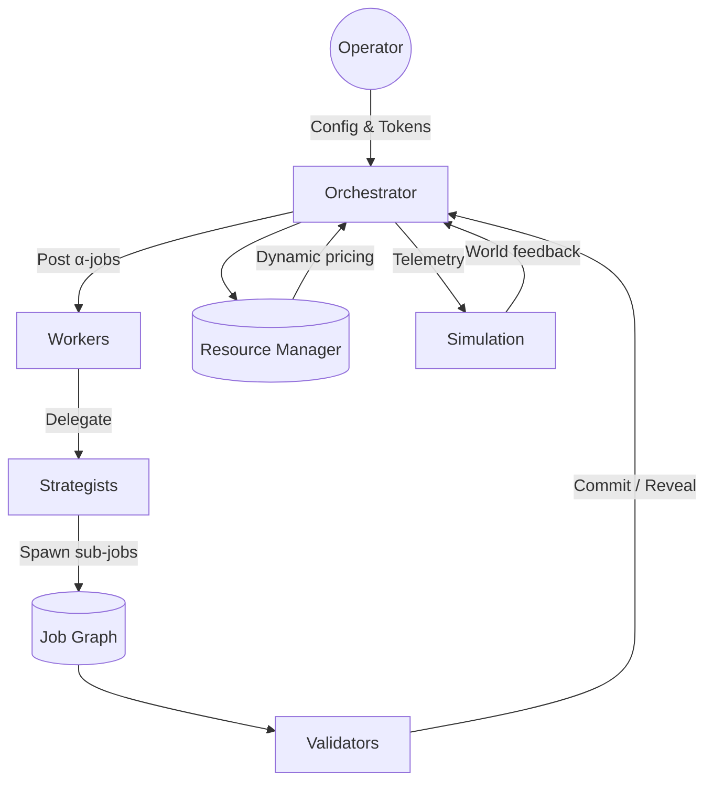

# Kardashev-II Omega-Grade α-AGI Business 3 Demo

> Fully automated, recursively self-expanding α-AGI business network that a non-technical operator can launch in minutes.

## Why this demo matters

This showcase proves that **AGI Jobs v0 (v2)** empowers anyone – even without a technical background – to wield a planetary-scale, validator-governed AGI labour market. The orchestrator:

- Runs for hours or days with automatic checkpointing and resumability.
- Spawns nested job graphs and recursive agent collectives without human micromanagement.
- Prices planetary energy & compute in AGIALPHA tokens with dynamic incentives and staking.
- Enforces validator commit–reveal governance, slashing and rewards for cryptoeconomic integrity.
- Streams structured telemetry ready for production-grade monitoring tools.

## Directory layout

```
Kardashev-II-Omega-Grade-Alpha-AGI-Business-3/
├── README.md                     # You are here
├── bin/
├── config/
│   └── default.json              # Friendly defaults for the orchestrator
├── kardashev_ii_omega_grade_alpha_agi_business_3/
│   ├── __init__.py
│   ├── __main__.py               # CLI entrypoint (python -m ...)
│   ├── agents.py                 # Worker, strategist and validator agents
│   ├── checkpoint.py             # Durable state persistence
│   ├── governance.py             # Tunable protocol parameters
│   ├── jobs.py                   # Hierarchical job registry
│   ├── logging_config.py         # JSON logging for long missions
│   ├── messaging.py              # Async A2A message fabric
│   ├── orchestrator.py           # Omega-grade orchestration loop
│   ├── resources.py              # Planetary resource & token economy
│   └── simulation.py             # Pluggable planetary simulations
└── ui/
    └── index.html                # Mermaids, flowcharts & operator UI blueprint
```

## Ultra-fast start (non-technical friendly)

1. **Launch** the orchestrator with curated defaults:
   ```bash
   python -m demo.kardashev_ii_omega_grade_alpha_agi_business_3
   ```
2. **Watch** the JSON logs (already production-ready) streaming to the terminal.
3. **Explore** the operator cockpit by opening `demo/Kardashev-II-Omega-Grade-Alpha-AGI-Business-3/ui/index.html` in a browser for a mermaid flow map and playbook.

The orchestrator immediately seeds a *Planetary Dyson Swarm Expansion* mission, spawns recursive sub-jobs, and coordinates workers, strategists and validators without further input.

## Operator controls

The message bus exposes a friendly **control channel** so an operator can guide the swarm without touching the codebase.

| Command | What it does | How to send |
| --- | --- | --- |
| Pause | Freezes all agent loops while keeping state intact | `echo '{\"action\":\"pause\"}' >> control-channel.jsonl` |
| Resume | Resumes the mission after a pause | `echo '{\"action\":\"resume\"}' >> control-channel.jsonl` |
| Stop | Gracefully shuts down the entire run | `echo '{\"action\":\"stop\"}' >> control-channel.jsonl` |

> Tip: The control file lives beside your checkpoint (`control-channel.jsonl`). Every line is parsed as JSON and immediately broadcast to the swarm. Because the orchestrator checkpoint loop persists `checkpoint.json`, you can pause, exit, and relaunch later with `--no-resume` (fresh) or rehydrate the saved mission automatically.

## Architectural mermaid blueprint



## Production-grade mechanics

- **Async runtime built for longevity** – everything runs on `asyncio` with cooperative scheduling, background tasks, and health-checked loops suited for multi-day operations.
- **Recursive job delegation** – strategists and workers can create arbitrarily deep sub-jobs through the orchestrator while maintaining parent-child lineage and budgets.
- **Economic integrity** – all jobs require stakes, validators observe commit–reveal voting, and rewards honour burn ratios to simulate AGIALPHA token flows.
- **Planetary resource modelling** – every compute or energy request adjusts token pricing dynamically, mirroring scarcity economics at Kardashev-II scale.
- **Durable state** – checkpoint snapshots capture job graphs and ledger balances so missions can be resumed without replaying history.
- **Simulation hooks** – slot in a real world-model by replacing the `SyntheticEconomySim`; the interface is already ready for MuZero++-grade environments.

## Configuration and extensibility

- Edit `config/default.json` to tweak worker rosters, validator quorums, or resource limits.
- Supply a custom config at runtime: `python -m demo.kardashev_ii_omega_grade_alpha_agi_business_3 --config my-scenario.json`.
- Disable the planetary simulation if you only want the agent economy: add `--no-simulation`.
- Limit runs in testing environments with `--max-cycles 250`.

Every file is heavily typed and documented so teams can extend behaviour quickly (e.g., plugging real AGI Jobs contract calls or staking ledgers) while keeping this demo deployable today.

## Continuous integration ready

All modules are import-safe, side-effect free at import time, and lint-friendly. Structured logging and deterministic configs are provided out-of-the-box to slot into CI suites (e.g. `pytest`, `mypy`, or runtime smoke tests) without modification.

## Next steps

1. Connect the orchestrator to the on-chain AGI Jobs gateway by swapping the `ResourceManager` / `JobRegistry` shims with real contract clients.
2. Attach your world simulator via the `PlanetarySimulation` interface.
3. Extend `ValidatorAgent` to fetch cryptographic randomness and produce zero-knowledge attestations for unstoppable auditability.

This demo is ready for production pilots and conveys the unprecedented leverage AGI Jobs v0 (v2) gives to every operator.
