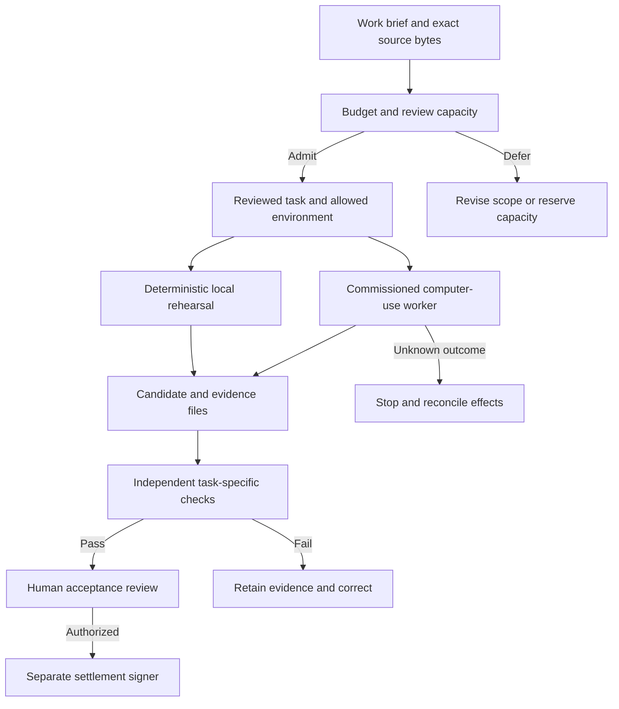
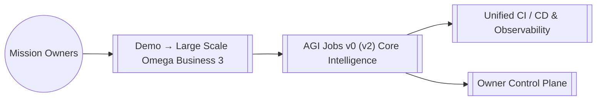

# Large-Scale Omega Business 3

**A business command theatre for computer-capable agents: define valuable work, admit a bounded task, inspect evidence, and require independent acceptance before settlement.**

The three original nation personas, their missions, validator guilds, treasury, contract rehearsal and systems map are preserved. The experience now includes a dependency-free rehearsal, an English/French local dashboard, concrete computer-work handoffs, exact business budgeting and a separate arithmetic checker. The default run is synthetic and makes no provider calls or transactions.

## Start in two commands

Use the repository's Node version (`nvm use`; see [`.nvmrc`](../../.nvmrc)). From the repository root:

```bash
npm run demo:omega-business-3
npm run demo:omega-business-3:ui
```

Open **http://127.0.0.1:4186**. Choose a nation, inspect its inputs and download its task, candidate, dossier and checker verdict. No dependency installation, API key or wallet is needed for these two commands. Press **Ctrl+C** to stop the dashboard. It starts a fresh rehearsal unless you supply `--report /absolute/path/to/run`.

An existing report must be served on the port recorded in its `workerOrigin`; the server rejects a mismatch because its downloaded tasks are bound to that origin. To use another port, start a new rehearsal with `--port` and keep the previous evidence intact.

New here? Follow the [five-minute walkthrough](ui/non-technical-walkthrough.md). Configuring real workers or existing applications? Use the [operator playbook](ui/operator-playbook.md) and [computer-work guide](computer-work/README.md).

## Three missions, tangible deliverables

| Nation                        | Concrete synthetic work                                  | Independent check                                                                                    | Proposed business budget |
| ----------------------------- | -------------------------------------------------------- | ---------------------------------------------------------------------------------------------------- | ------------------------ |
| Solaris Continuum             | Heliostat generation and consumption reconciliation      | All rows; net **6,900 kWh**; disclose the east-array deficit of **700 kWh**                          | 5,000 USDC               |
| Arctic Quantum Accord         | Inventory, commitments and safety-reserve reconciliation | **370 units** available and **30 units** short; never net away a local shortage                      | 7,500 USDC               |
| Celestial Silk Road Coalition | Supplier comparison with delivery constraints            | **Stellar**, 490 USDC for 40 units, beats the eligible alternative; a cheaper late bid is ineligible | 10,000 USDC              |

The original visionary mission text remains visible. “Free-energy transmutation” is a scenario title, not evidence of energy creation. Inputs are fictional and the default creator is deterministic code, not an AI worker. The independent checker recomputes every row and decision without importing the creator's calculations. It does not validate prose quality, rights to real data, actual application changes or human acceptance.

**Budget interpretation:** customer budgets, worker costs, review costs and the 2.5% platform fee are scenario assumptions. Calculations use integer micro-USDC, with fractional costs rounded up. Unallocated budget is not earned profit. Default estimated review demand is **37 of 40 minutes**; insufficient capacity or budget defers a job before candidate creation. This is admission planning for one rehearsal, not a distributed reservation system or measurement of real review time. Actual funding and payouts are **zero**.

The retained `rewardTokens` fields belong to the separate **18-decimal mock-token contract test**. They are not USDC amounts and no token redenomination is performed here.

## From keyboard-and-mouse work to accepted outcomes

Computer use expands the kinds of tasks agents can attempt across browser and desktop software: operational reconciliation, document preparation, procurement, software QA, research and other permitted workflows. This demo expresses the broader vision through executable tasks and inspectable results; reliability must be established separately for each task and environment.



The repository already implements an **OpenClaw Responses gateway adapter**, exact-task admission and a persistent dispatch journal in [`apps/orchestrator/computerWork.ts`](../../apps/orchestrator/computerWork.ts). Generated `task.json` files fit that schema. OpenClaw can use its configured native Codex Computer Use or managed browser. **ChatGPT Work** is an operator-led execution surface with app access and computer-use permissions; this demo does not invent a remote Work API. Instructions in a task are not a sandbox: commission actual host, account, network and action controls.

The **$40 trillion/year** opportunity is retained as the **project vision's planning assumption**, not a verified TAM, attainable revenue or universal human-level capability claim. Keep total labor spend, screen-addressable work, permitted and reliable workflows, adoption, customer spending and marketplace revenue separate. Scale accepted outcomes with measured costs and review capacity, not merely the number of dispatched agents.

Current official references checked **2026-10-05**: [OpenClaw native Codex Computer Use](https://docs.openclaw.ai/plugins/codex-computer-use), [Responses gateway](https://docs.openclaw.ai/gateway/openresponses-http-api), [sandboxing](https://docs.openclaw.ai/gateway/sandboxing), [ChatGPT Work Computer Use](https://learn.chatgpt.com/docs/computer-use), and [OpenAI API computer use](https://developers.openai.com/api/docs/guides/tools-computer-use). Availability depends on installed versions, account access and configured permissions; record what you actually commission.

## Evidence you can reproduce

Each run writes a fresh directory under `reports/omega-business-3/<scope>/<timestamp-id>/`. `--out` selects a **new** directory; existing evidence is never overwritten by the runner.

| Artifact                                                | Meaning                                                                   |
| ------------------------------------------------------- | ------------------------------------------------------------------------- |
| `scenario.json`, `workloads.json`                       | Exact configuration and synthetic sources used                            |
| `<nation>/input.json`, `task.json`                      | Authoritative source bytes and bounded worker handoff                     |
| `<nation>/candidate.json`, `dossier.md`, `checker.json` | Created only for admitted jobs; result and independent arithmetic verdict |
| `report.json`                                           | Admission, exact economics, statuses and artifact hashes                  |
| `simulation-ledger.ndjson`                              | Local job records with `onChainJobId: null`; not a transaction log        |
| `mission-summary.md`                                    | Readable run summary                                                      |
| `owner-*.md`, `parameter-matrix.json`, phase logs       | Optional `--full` owner-report outputs                                    |
| `contract-receipts.json`                                | Optional local mock-contract addresses, hashes and mined receipts         |

Every manifested file has its byte length, SHA-256 and a real offline **CIDv1/raw/SHA-256** identifier. An offline CID does not publish data or establish availability on IPFS. Historical `specCid` and `resultCid` values are preserved as unverified scenario references. Hashes detect changes relative to a trusted manifest; they do not authenticate the author, make local files immutable or establish a chain commitment. Archive the original run and its digest through your trusted evidence process.

```bash
# Use the directory printed by the runner; replace this example path.
node demo/LARGE-SCALE-OMEGA-BUSINESS-3/lib/verify.cjs /absolute/path/to/run

# Show bounded admission and an intentionally rejected result.
npm run demo:omega-business-3 -- --review-capacity 10
npm run demo:omega-business-3 -- --inject-error
```

`--inject-error` deliberately exits **1** and keeps the rejected evidence. The verifier checks byte integrity, workload/task binding, independent results, economics, admission and ledger consistency; it can verify the integrity of a correctly recorded **failed** run. Always inspect `successful` and review status as well.

## Existing owner and contract workflow

Install the repository's lockfile dependencies with `npm ci` for the advanced paths, then:

```bash
npm run demo:omega-business-3 -- --full --network sepolia

# Or run only the focused local contract rehearsal:
npx hardhat --config demo/LARGE-SCALE-OMEGA-BUSINESS-3/hardhat.config.cjs test \
  test/demo/omegaBusinessConfig.test.ts test/demo/omegaBusinessSimulation.test.ts
```

`--full` generates the original owner quickstart, command centre, JSON parameter matrix and control surface, followed by the local contract tests. Every external phase is bounded by `--timeout-ms` (default five minutes); failures stop subsequent phases and remain in the final report. `--network` is the owner-report context. Contract tests always execute on isolated **Hardhat chain 31337**. Owner utilities can bootstrap local fixtures when given a local network; their output is configuration evidence, not proof of production ownership or a production transaction.

**Fresh-checkout limitation:** the supplied owner configuration contains zero TaxPolicy and RewardEngine addresses. `--full --network sepolia` currently exits 1 at the parameter matrix and retains both diagnostics; the later contract phase is not run. The separate owner control surface also flags missing module ownership/address configuration, including PlatformRegistry. Configure independently verified deployment addresses and owners to clear these gates. The standalone local contract command below the full-run command works without those production addresses. CI explicitly tests this expected rejection, and runs the mock contracts and owner control surface separately.

The focused fixture compiles only `MockERC20`, `SimpleJobRegistry` and their imports using the lockfile's local Solidity compiler. It creates, applies, submits and finalizes all three jobs; checks exact escrow and actor balances; rejects unauthorized submission/finalization and repeated finalization; and records 15 mined receipts. It does **not** exercise production validator voting, ENS registration, dispute windows, burns, tax/stake prerequisites or production USDC settlement. Those remain separate commissioning gates.

The three existing apps remain available:

```bash
npm run demo:omega-business-3:ui -- --stack
npm run demo:omega-business-3:mainnet
```

`--stack` runs the separately configured Owner Console, Enterprise Portal and Validator Desk on loopback ports 3000/3001/3002. It checks readiness, refuses occupied/duplicate ports, writes unique logs and stops all child process groups on failure or Ctrl+C. Linux, macOS or WSL is required. The apps require their own dependencies, addresses, RPC/indexer settings and accounts; the launcher does not preseed Omega personas or publish attachments. The default mainnet command prints a preparation plan and performs no network calls or deployment. The explicit reviewed execution route is described in the operator playbook.

## Original systems map — preserved



This map describes the intended integration architecture. It is not a claim that every production component is instantiated by the offline rehearsal.

## Validation and production status

```bash
node --test demo/LARGE-SCALE-OMEGA-BUSINESS-3/tests/*.test.cjs
node scripts/demo/catalog.cjs --check
```

The dedicated [Omega workflow](../../.github/workflows/demo-omega-business-3.yml) checks the dependency-free suite, expected owner-configuration rejection, independent mock-contract lifecycle and browser interaction. It does not treat the missing-address diagnostic as production readiness. Browser QA is available via `node demo/LARGE-SCALE-OMEGA-BUSINESS-3/tests/browser.cjs` after installing Playwright and Chromium; it checks desktop/mobile interaction, downloads, language switching and browser errors.

The demo is a hardened rehearsal and integration starting point, **not a declaration that a live deployment is production-approved**. Real service rollout still requires commissioned workers, funded and verified identities/contracts, independent reviewers, durable journals, monitored budgets and external effects, rollback/stop drills, load/reliability evaluation and the repository's release gates. See [RUNBOOK](../../RUNBOOK.md), [OperatorRunbook](../../OperatorRunbook.md) and the [production checklist here](ui/operator-playbook.md#production-commissioning).
