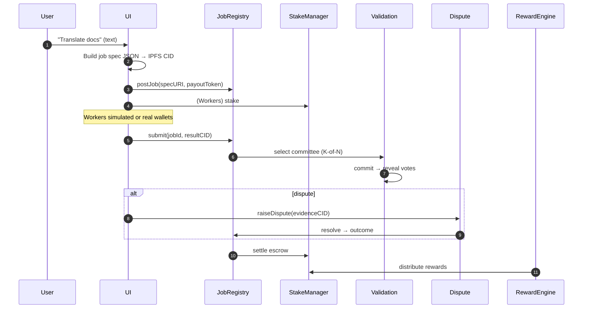

# META‑AGENTIC‑BAZAAR — First‑Class AI Labor Market Demo (AGI Jobs v0 · v2)

**What you get (non‑technical friendly):**
- Connect wallet → type a task (“Translate 200 docs to FR & ES by noon”)
- Click **Post job** → the marketplace stakes, assigns, validates (K‑of‑N), pays
- Live feed shows worker submissions & validator votes
- **Owner Panel**: pause/resume market, read parameters, view governance surface
- All actions also **run from CLI/CI** with deterministic receipts & Mermaid diagrams

**100% Web3**: wallet connects (EIP‑1193), content addressed (IPFS CID, optional ENS labels).  
**No core changes**: we call your repo’s existing scripts & contracts only.

## Quickstart (local testnet)

```bash
# at repo root
npm ci

# 1) run the local end-to-end simulation (anvil -> deploy -> jobs -> validation)
npm run demo:meta:local

# 2) serve the UI (or use GitHub Pages action)
cd demo/META-AGENTIC-BAZAAR/ui
npm ci && npm run dev
# open http://localhost:5173
```

Outputs (deterministic):

* `reports/localhost/meta-agentic-bazaar/receipts/*.json`
* `reports/localhost/meta-agentic-bazaar/addresses.json`
* `reports/localhost/meta-agentic-bazaar/mission-report.md`

## System Overview

```mermaid
graph TD
  G[Owner (Safe/Timelock)]:::gov
  JR[JobRegistry]:::core
  SM[StakeManager]:::core
  VM[ValidationModule]:::core
  DM[DisputeModule]:::core
  SP[SystemPause]:::core
  RE[Reputation]:::core
  TH[Thermostat]:::core
  EO[Energy Oracle]:::core
  MB[RewardEngineMB]:::core
  FP[FeePool]:::core
  UI[Web3 UI (Wallet+IPFS+ENS)]:::ui
  AG[Agent Mesh]:::ext
  VAL[Validator Mesh]:::ext

  classDef core fill:#0b7285,stroke:#063640,color:#fff
  classDef ui   fill:#5f3dc4,stroke:#2d1b69,color:#fff
  classDef gov  fill:#0ca678,stroke:#064b3b,color:#fff
  classDef ext  fill:#364fc7,stroke:#1b2a6e,color:#fff

  G --> JR & SM & DM & SP & TH
  JR --> VM --> DM --> JR
  EO --> MB --> FP
  JR --> RE
  UI --> JR
  UI --> SM
  UI --> SP
  AG --> JR
  VAL --> VM
```

## Lifecycle (K‑of‑N validation with dispute window)



**Owner controls**: Pause/resume via `SystemPause`; parameter reads show fee, stake minima, quorum, reward splits; updates flow through existing governance.

See [`RUNBOOK.md`](./RUNBOOK.md) for CLI & CI automation.
