# Meta-Agentic α-AGI Jobs Demo – Sovereign Economic Engine Showcase

> **Purpose** – prove that a non-technical steward can launch, supervise, and govern a world-changing economic intelligence engine with **one command** using AGI Jobs v0 (v2). Every artefact in this demo is production-grade, auditable, and ready for mainnet execution.

## Why this demo is different

- **Meta-agentic superstructure** – the Identify → Out-Learn → Out-Think → Out-Design → Out-Strategise → Out-Execute loop is fully coded and emitted as executable reports. Agents, validators, and modules are orchestrated automatically.
- **Owner supremacy baked-in** – the owner multi-sig can pause, resume, upgrade, and reallocate capital instantly using the generated command playbook and CI verifications.
- **Non-technical friendly** – a guided CLI, self-updating dashboard, and mermaid blueprints make the system legible to any operator while keeping the underlying power uncompromised.
- **CI enforced** – the demo surfaces the exact CI commands that keep AGI Jobs v0 (v2) branch-protected and green. Nothing ships unless governance + automation agree.
- **Sovereign orchestration telemetry** – alpha velocity metrics, phase matrices, and the sovereign phase flow expose how each stage compounds value while remaining owner-controlled.

## Golden path – unleash the Meta-Agentic α-AGI

```bash
# from the repository root
npm run demo:meta-agentic-alpha          # deterministic run using the baseline scenario
npm run demo:meta-agentic-alpha -- --interactive   # guided prompts to change multipliers live
npm run test:meta-agentic-alpha          # deterministic verification of the orchestration maths
```

Outputs land in `demo/Meta-Agentic-ALPHA-AGI-Jobs-v0/reports/`:

| File | Description |
| --- | --- |
| `summary.json` | Portfolio-level metrics (ROI, automation coverage, validator confidence, antifragility index). |
| `owner-control.json` | Owner control matrix with every command, emergency contact, and safeguard. |
| `owner-playbook.md` | Plain-language, copy/paste ready command playbook for the multi-sig. |
| `architecture.mmd` | Mermaid systems graph linking owner, agents, validators, and modules. |
| `timeline.mmd` | Gantt view of the Identify → Execute flow for each opportunity. |
| `coordination.mmd` | Agent-to-agent + validator mesh showing real-time coordination wiring. |
| `phase-flow.mmd` | Sovereign Identify → Out-Learn → Out-Think → Out-Design → Out-Strategise → Out-Execute orchestration. |
| `phase-matrix.json` | Phase force-multiplier matrix with reliability, automation support, and validator reach. |
| `knowledge-base.json` | Opportunity knowledge graph nodes + edges for downstream analytics. |
| `world-model.json` | Simulation curriculum, fidelity scores, and stress outcomes feeding plan selection. |
| `execution-ledger.json` | SHA-256 checksummed execution ledger for audit and compliance. |
| `ci-status.json` | Branch-protection guardrails (lint, tests, coverage, governance verifications). |
| `dashboard.json` | Data model consumed by the web UI for at-a-glance monitoring. |

> **Open the dashboard** – start any static server (for example, `npx http-server demo/Meta-Agentic-ALPHA-AGI-Jobs-v0/ui`) and navigate to `http://localhost:8080`. The UI reads the latest `dashboard.json`, renders the metrics and phase matrix, and injects live Mermaid diagrams for architecture, timeline, coordination, and the sovereign phase flow.

## Architecture in one glance

```mermaid
graph TD
    Owner[Owner Multi-Sig (4-of-6)] -->|Commands| Planner[Meta-Agentic Planner]
    Planner -->|Capital| Treasury[Treasury Manager]
    Planner -->|Governance hooks| Governance[Timelock + Multisig]
    Planner -->|Simulation| WorldModel[MuZero World Model]
    Planner -->|Opportunity feed| KnowledgeBase[Opportunity Graph]
    Planner -->|A2A control| A2ABus[Agent-to-Agent Protocol]
    A2ABus --> Identify[Identify Scout]
    A2ABus --> Learn[Curriculum Forge]
    A2ABus --> Think[Planner Core]
    A2ABus --> Design[Creative Savant]
    A2ABus --> Strategise[Meta Strategist]
    A2ABus --> Execute[Autonomous Executor]
    Execute -->|On-chain actions| Jobs[AGI Job Registry]
    Jobs --> Validators[Validator Constellation]
    Validators --> Observability[Observability + Telemetry]
    Observability --> Owner
```

## Timeline of compounding value

```mermaid
gantt
    title Identify → Execute Expansion Loop
    dateFormat  X
    axisFormat  %Hh
    section Identify
      Multi-Domain Signal Sweep     :done,    detect,        0, 18h
    section Out-Think
      Meta-Agentic Plan Search      :active,  plan,         6, 24h
    section Out-Design
      Creative Solution Drafting    :active,  design,      12, 18h
    section Out-Strategise
      Portfolio Allocation Council  :crit,    strategise,  18, 16h
    section Out-Execute
      Autonomous Execution Mesh     :active,  execute,     24, 24h
```



## Owner command power grid

Every mission-critical control path is generated for the owner. The baseline coverage score is **≥75%** meaning pause, upgrade, treasury, validator quorum, and CI guardrails are all executable instantly.

| Capability | Command | Outcome |
| --- | --- | --- |
| Emergency pause | `npm run owner:system-pause -- --action pause` | Halts execution in ≤60 seconds. |
| Resume operations | `npm run owner:system-pause -- --action unpause` | Restarts after validations clear. |
| Global upgrades | `npm run owner:update-all` | Applies mainnet-ready module upgrades. |
| Validator uplift | `npm run owner:upgrade -- --target validator` | Raises validator quorum & stake thresholds. |
| Treasury routing | `npm run owner:parameters -- --group treasury` | Rebalances capital between liquidity, reserves, R&D. |
| CI / governance audit | `npm run owner:verify-control` | Proves branch protection + governance health before merges. |

Additional safeguards:

- **Antifragility** – circuit breakers for capital drawdown, validator disagreement, and automation faults auto-trigger playbooks.
- **World-model parity** – `world-model.json` reports fidelity and stress simulation results so upgrades are evidenced.
- **24/7 coverage** – the owner playbook lists contacts, response times, and the quick-action matrix in plain language.

## Non-technical operating loop

1. Run `npm run demo:meta-agentic-alpha`. All artefacts appear in `reports/`.
2. Start the static dashboard (`npx http-server demo/Meta-Agentic-ALPHA-AGI-Jobs-v0/ui`). The UI loads metrics, commands, and diagrams automatically.
3. Review the command plan in `owner-playbook.md`. Copy/paste the desired command into your terminal or multi-sig wallet notes.
4. For drill mode, rerun the demo with `--interactive` to try higher automation multipliers or stricter confidence floors. Reports update instantly.
5. Before shipping changes, execute the surfaced CI commands (`npm run lint:check`, `npm test`, `npm run coverage:check`, `npm run owner:verify-control`, `npm run ci:verify-branch-protection`).

## Files and directories

```
demo/Meta-Agentic-ALPHA-AGI-Jobs-v0/
├── README.md
├── reports/                # Generated artefacts (created by the script)
├── scenario/
│   └── baseline.json       # Production-ready scenario baseline
├── scripts/
│   └── runDemo.ts          # Core orchestration + report generator
├── test/
│   └── meta_agentic_demo.test.ts   # Deterministic verification suite
└── ui/
    ├── index.html
    ├── app.js
    └── styles.css
```

## Assurances for the contract owner

- **Full control** – all mutable parameters are surfaced with executable commands. Governance threshold, timelock, and emergency protocols are explained in plain language.
- **Pause & resume** – deterministic pause/resume scripts are included and referenced in every report.
- **Upgrade ready** – module upgrade scripts and audit timestamps are catalogued for immediate execution.
- **Audit trail** – the execution ledger is hashed, and the knowledge base exposes every opportunity-module-agent linkage for compliance teams.

This demonstration proves that AGI Jobs v0 (v2) empowers any steward to direct a planet-scale economic machine with total confidence, minimal friction, and uncompromised safety.
