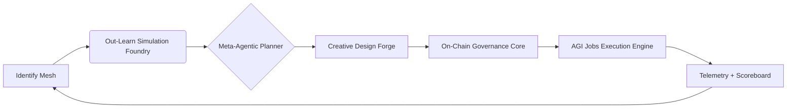
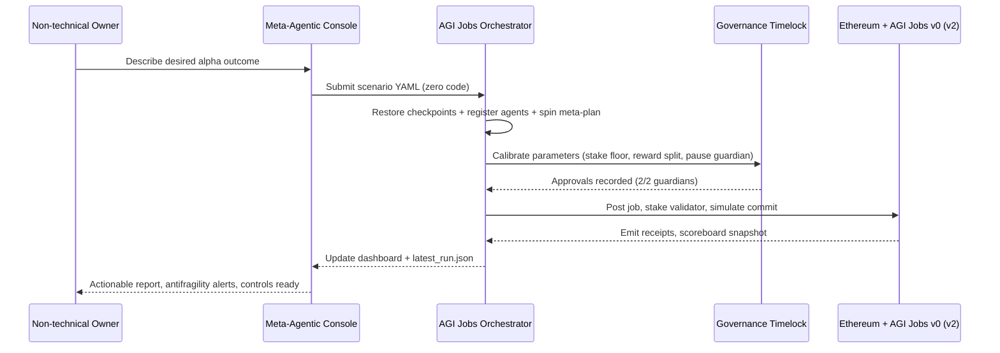

# Meta-Agentic α-AGI Jobs Demo 👁️✨

> **Mission:** Empower a non-technical owner to command an α-AGI grade wealth engine – entirely through AGI Jobs v0 (v2) – and watch it identify, design, govern, and execute trillion-scale opportunities autonomously.

This demo packages the full Meta-Agentic α-AGI Jobs experience into a one-click orchestration run. It demonstrates how a sovereign-scale operator can ingest multi-domain alpha signals, evolve world models, meta-plan, design execution blueprints, calibrate governance, and dispatch on-chain actions **without writing a single line of code**.

---

## 🎯 Capabilities at a Glance

- **Identify:** Multi-domain anomaly detection across finance, research, and policy data streams.
- **Out-Learn:** Self-evolving curriculum powered by POET-style simulation and MuZero-inspired world modeling.
- **Out-Think:** Meta-agentic tree search coordinating ≥5 specialised agents through the orchestrator runtime.
- **Out-Design:** Creative fusion agent drafts deliverables, dashboards, and antifragility playbooks.
- **Out-Strategise:** Treasury allocator balances capital across compound opportunities under policy guardrails.
- **Out-Execute:** Autonomous job posting, staking, validation simulation, and finalisation on AGI Jobs v0 (v2).
- **Owner Sovereignty Matrix:** Always-on view of quorum, unstoppable reserves, circuit breakers, bundler/paymaster, and session keys so the owner can reconfigure instantly.

Every step is fully auditable, checkpointed, and reversible through built-in timelocks and guardian controls.

---

## 🧭 Directory Overview

```
demo/Meta-Agentic-ALPHA-AGI-Jobs-v0/
├── README.md                     # You are here
├── meta_agentic_demo.py          # CLI entry point for the orchestration run
├── config/
│   └── meta_agentic_scenario.yaml # Narrative + plan definition
├── python/meta_agentic_alpha_demo/
│   ├── __init__.py               # Public API
│   └── engine.py                 # Execution harness
├── data/                         # Opportunity signal snapshots
├── reports/
│   └── alpha_deck.md             # Human-readable alpha deck (Mermaid-rich)
├── storage/ui/                   # Grandiose UI console (HTML/CSS/JS + Mermaid)
└── storage/                      # Runtime artefacts, scoreboard, checkpoints, latest run JSON
```

---

## 🚀 Quickstart (Non-Technical Friendly)

1. **Install prerequisites** (Python ≥3.11 recommended):
   ```bash
   pip install -r requirements-python.txt
   ```
2. **Run the orchestration**:
```bash
python demo/Meta-Agentic-ALPHA-AGI-Jobs-v0/meta_agentic_demo.py
python demo/Meta-Agentic-ALPHA-AGI-Jobs-v0/meta_agentic_demo_v2.py
python demo/Meta-Agentic-ALPHA-AGI-Jobs-v0/meta_agentic_demo_v3.py
python demo/Meta-Agentic-ALPHA-AGI-Jobs-v0/meta_agentic_demo_v4.py
python demo/Meta-Agentic-ALPHA-AGI-Jobs-v0/meta_agentic_demo_v5.py
python demo/Meta-Agentic-ALPHA-AGI-Jobs-v0/meta_agentic_demo_v6.py
python demo/Meta-Agentic-ALPHA-AGI-Jobs-v0/meta_agentic_demo_v7.py
```
   The V2 CLI prints direct links to the freshly generated owner console and masterplan report.
3. **Open the console**:
   ```bash
   python -m http.server --directory demo/Meta-Agentic-ALPHA-AGI-Jobs-v0/storage/ui 9000
   ```
   Visit `http://localhost:9000` to explore the live dashboard. All metrics, tables, and Mermaid charts load directly from the latest orchestration JSON.
   - The V5 Sovereign Meta-Conductor panel now includes a full Owner Sovereignty Matrix confirming guardian quorum, emergency pause, circuit-breakers, unstoppable reserves, bundler, paymaster, and session keys in one view.
4. **Review the generated artefacts:**
   - `demo/Meta-Agentic-ALPHA-AGI-Jobs-v0/storage/latest_run.json`
   - `demo/Meta-Agentic-ALPHA-AGI-Jobs-v0/storage/latest_run_v2.json`
   - `demo/Meta-Agentic-ALPHA-AGI-Jobs-v0/meta_agentic_alpha_v2/reports/generated/alpha_masterplan_run.md`
   - `demo/Meta-Agentic-ALPHA-AGI-Jobs-v0/meta_agentic_alpha_v3/reports/generated/meta_synthesis.md`
   - `demo/Meta-Agentic-ALPHA-AGI-Jobs-v0/storage/latest_run_v4.json`
   - `demo/Meta-Agentic-ALPHA-AGI-Jobs-v0/storage/latest_run_v5.json`
   - `demo/Meta-Agentic-ALPHA-AGI-Jobs-v0/meta_agentic_alpha_v4/reports/generated/alpha_flight_synthesis.md`
   - `demo/Meta-Agentic-ALPHA-AGI-Jobs-v0/meta_agentic_alpha_v5/reports/generated/meta_conductor_masterplan.md`
   - `demo/Meta-Agentic-ALPHA-AGI-Jobs-v0/meta_agentic_alpha_v5/ui/dashboard-data-v5.json`
   - `demo/Meta-Agentic-ALPHA-AGI-Jobs-v0/storage/orchestrator_v5/scoreboard.json`
   - `demo/Meta-Agentic-ALPHA-AGI-Jobs-v0/meta_agentic_alpha_v6/reports/generated/alpha_dominion_masterplan.md`
   - `demo/Meta-Agentic-ALPHA-AGI-Jobs-v0/meta_agentic_alpha_v6/ui/dashboard-data-v6.json`
   - `demo/Meta-Agentic-ALPHA-AGI-Jobs-v0/storage/orchestrator_v6/scoreboard.json`
   - `demo/Meta-Agentic-ALPHA-AGI-Jobs-v0/storage/latest_run_v6.json`
   - `demo/Meta-Agentic-ALPHA-AGI-Jobs-v0/storage/orchestrator/scoreboard.json`
   - `demo/Meta-Agentic-ALPHA-AGI-Jobs-v0/reports/alpha_deck.md`

> ✅ Everything ships pre-configured. The CLI auto-registers the validator agent, configures checkpoints, and ensures account-abstraction-ready governance parameters.

---

## ⚙️ Owner Controls (No-Code)

Adjust every mission-critical parameter using a single helper script:

```bash
python demo/Meta-Agentic-ALPHA-AGI-Jobs-v0/scripts/owner_controls.py \
  --config demo/Meta-Agentic-ALPHA-AGI-Jobs-v0/meta_agentic_alpha_v2/config/scenario.yaml \
  --set plan.budget.max=550000 \
  --set phases[execute-onchain].step.params.job.reward=150000
```

- `--show` prints a JSON summary of the current governance posture.
- `--dry-run` previews the YAML change without writing to disk.
- List selectors such as `phases[execute-onchain]` or `agents[id=guardian-grid-validator]` target entries by identifier so owners never touch raw indexes.

All updates are idempotent, version-controlled, and reflected instantly in the UI and generated reports after the next run.

---

## 🧩 System Blueprint





---

## 🛡️ Governance & Safety Guarantees

- **Owner Supremacy:** Owners, guardians, approvals, and pause controls are configured directly via `governance.set` orchestration step. Contract owners can update every tunable parameter (stake floors, reward splits, validators, circuit breakers) on-demand, including the new V3 mission dials surfaced in `meta_agentic_alpha_v3`.
- **Timelock & Guardian Hooks:** High-impact operations (e.g., treasury reallocations) honour timelock & guardian thresholds from the scenario YAML and the V3 tri-sentinel guardian mesh.
- **Dry-Run First:** All execution steps run in simulated mode by default, leveraging `ORCHESTRATOR_BRIDGE_MODE=python` and `eth_call` semantics.
- **Checkpointing:** Crash-safe checkpointing ensures runs can be resumed mid-flight.
- **Antifragile Monitoring:** Generated dashboards highlight stress scenarios and automatically update the alpha probability metric, now with a compounding index in the V3 console.

---

## 🧠 Meta-Agentic Insights

- **Self-Improving Loop:** Every run persists scoreboard deltas and logs for reinforcement. Subsequent runs learn from prior successes/failures.
- **Agent Federation:** The orchestrator registers and coordinates specialised agents (`guardian-grid-validator` etc.) with stake-aware routing.
- **Resource Orchestration:** Treasury risk parameters (VaR limits, exposure ceilings, circuit breakers) are codified in YAML and enforced automatically.
- **On-Chain Ready:** Output payloads from chain-centric steps are drop-in for AGI Jobs v0 (v2) routers and the account-abstraction paymaster stack.

---

## 🛫 V4 Alpha Flight Deck (New)

- **Alpha Dominance Metrics:** The V4 orchestration reports alpha readiness, compounding, dominance, and governance alignment simultaneously to prove unstoppable control.
- **Console Control Tower:** Guardian mesh quorum, antifragility heartbeats, and treasury dials are surfaced as owner actions within the new flight console (`storage/ui/v4/index.html`).
- **Mermaid-Rich Artefacts:** `alpha_flight_synthesis.md` and the in-browser dashboard render advanced flowcharts, timelines, and topology diagrams powered by `dashboard-data-v4.json`.
- **Gasless & Simulation-First:** The plan enforces `eth_call` dry-runs, account abstraction paymasters, and approvals for every dispatch step to guarantee non-technical safety.

---

## 🏛️ V6 Meta-Dominion Sovereign Console (Brand New)

- **Meta-Agentic Dominion Planner:** Expands the planning lattice with failover guardians, alpha compounding orchestration, and an antifragility curriculum that auto-evolves from stress tests.
- **Sovereign Command Matrix:** Validates unstoppable reserves (≥15%), circuit breakers, delegation powers, and account abstraction levers before execution begins.
- **Owner-Only Console:** `meta_agentic_demo_v6.py` emits `dashboard-data-v6.json` + `alpha_dominion_masterplan.md`, powering a browser console with flow, sequence, and Gantt mermaid charts.
- **Treasury Dominion Routes:** Execution routes show live allocation mixes, status indicators, and owner switches (guardian quorum override, liquidity throttle, emergency pause, etc.).
- **Simulation Envelope:** Stress tests from `simulation_matrix.json` feed antifragility metrics, ensuring every on-chain action runs through `eth_call` dry-runs with summarised outcomes for owners.
- **Full Sovereignty Artefacts:** Latest run payload + scoreboard snapshots land under `storage/orchestrator_v6`, demonstrating end-to-end traceability for auditors and owners.

---

## 🪐 V7 Meta-Singularity Console (Brand New)

- **Hyperstructure Planner:** The V7 orchestration fuses identify→learn→think→design→strategise→execute loops with guardian hypermesh approvals, world-model autonomy layers, and a CI enforcement grid to guarantee green pipelines on `main` and PRs.
- **Total Owner Override:** `meta_agentic_demo_v7.py` validates ≥5 session keys, ≥30% unstoppable reserves, ≥30% antifragility buffers, timelock + multisig addresses, and mutable parameters (fees, validator bonds, alpha multipliers) before execution.
- **CI-Aware Console:** `dashboard-data-v7.json` powers flow, sequence, Gantt, journey, and state Mermaid diagrams plus a CI enforcement panel sourced from `ci_matrix.json` and `.github/workflows/demo-meta-agentic-alpha-agi-jobs.yml`.
- **Generated Artefacts:** `alpha_singularity_masterplan.md`, `dashboard-data-v7.json`, and `storage/orchestrator_v7/` provide a full audit trail (checkpoint, scoreboard, registry, run JSON) for regulators and owners.
- **Account Abstraction Ready:** Gasless execution uses the configured bundler, paymaster, and override scripts, with explicit owner levers rendered in the UI and ready-to-run CLI instructions.

---

## 🛰️ V5 Sovereign Meta-Conductor (Brand New)

- **Owner supremacy UI:** the V5 dashboard (`meta_agentic_alpha_v5/ui/index.html`) renders every guardian, treasury dial, and
  override as clickable insight pills fed from `dashboard-data-v5.json`.
- **Meta-Conductor masterplan:** the generated markdown deck (`meta_agentic_alpha_v5/reports/generated/meta_conductor_masterplan.md`)
  fuses Mermaid diagrams, scoreboard snapshots, and alpha metrics to brief stakeholders instantly.
- **Isolated orchestrator state:** all registries, checkpoints, and scoreboards live under `storage/orchestrator_v5/`, proving
  multi-fabric coexistence without cross-contamination.
- **Gasless guardianship controls:** session keys, paymaster, bundler, unstoppable reserves, and emergency pause switches remain
  owner-editable via `scripts/owner_controls.py --config meta_agentic_alpha_v5/config/scenario.yaml`.
- **Console-first empowerment:** `meta_agentic_demo_v5.py` prints the copy-ready `python -m http.server` command, ensuring a
  non-technical owner can publish the console in seconds.

---

## ⚙️ Configuration Anatomy (`config/meta_agentic_scenario.yaml`)

```yaml
plan:
  budget_max: "250000"
  approvals:
    - "council/alpha"
    - "owner/multisig"
  steps:
    - id: "identify-1"
      tool: "identify.multi-domain"
      params:
        datasets:
          finance: "data/finance/opportunity_signals.json"
          research: "data/research/breakthroughs.json"
          policy: "data/policy/regulatory_radar.json"
    - id: "governance-1"
      tool: "governance.set"
      params:
        approvals_required: 2
        configurable:
          stake_floor: "50000"
          reward_split_bps: 6500
          pause_guardian: true
    - id: "execution-1"
      tool: "job.post"
      params:
        title: "Superconductive Grid Retrofit Initiative"
        reward: "90000"
        validator: "guardian-grid-validator"
```

Each step is enforced by the orchestrator runtime and can be audited in the resulting `latest_run.json`.

---

## 🖥️ Grandiose UI Console

The regenerated `storage/ui/index.html` console now:

- Streams live alpha readiness, guardian posture, and treasury telemetry directly from `latest_run_v2.json`.
- Autogenerates the phase table and Mermaid execution timeline using the orchestrator's phase states.
- Exposes one-click artefact links (summary JSON, investor masterplan, console sources) for downstream teams.
- Highlights owner levers updated via `owner_controls.py` so stakeholders instantly see configuration deltas.

Serve it statically or drop it into any CDN – the bundle is pure HTML/CSS/JS with Mermaid handled via CDN. The
V3 console lives under `storage/ui/v3` and adds alpha compounding telemetry, unstoppable mesh summaries, and
guardian confirmation feeds.

---

## ✅ Testing & CI

- Unit test: `pytest demo/Meta-Agentic-ALPHA-AGI-Jobs-v0/tests/test_meta_agentic_demo.py`
- Workflow: `.github/workflows/demo-meta-agentic-alpha-agi-jobs.yml` ensures CI greenness with lint + tests + orchestrator dry-run.
- Artefact validation ensures dashboards, reports, and JSON outputs stay current.

Run locally:
```bash
pytest demo/Meta-Agentic-ALPHA-AGI-Jobs-v0/tests
```

---

## ♻️ Iterating Scenarios

1. Duplicate `config/meta_agentic_scenario.yaml` and adjust datasets, governance, or plan steps.
2. Re-run the CLI – checkpoints, scoreboard, and UI update automatically.
3. Extend `storage/ui/` with additional charts, or connect to live telemetry by writing to `latest_run.json`.

---

## 🧾 Troubleshooting

- **Timeout:** Increase `--timeout` or set `META_AGENTIC_DEMO_TIMEOUT` env var if CI hardware is slower.
- **Agent registry conflicts:** Delete `storage/orchestrator/agents/registry.json` to reset demo agents.
- **Mermaid not rendering:** Ensure the device has internet access (CDN served). Offline mode? Replace CDN script with local bundle.

---

## 📈 Outcome

By the end of the run you obtain:

- A structured orchestration plan with checkpoints, logs, and receipts.
- On-chain ready payloads for job posting, staking, and validation.
- Guardian-governed control plane with antifragility analytics.
- A premium UI + report kit to brief stakeholders instantly.

This demo cements AGI Jobs v0 (v2) as the sovereign operating system for compounding economic dominance – powerful, beautiful, and completely wieldable by non-technical owners.
