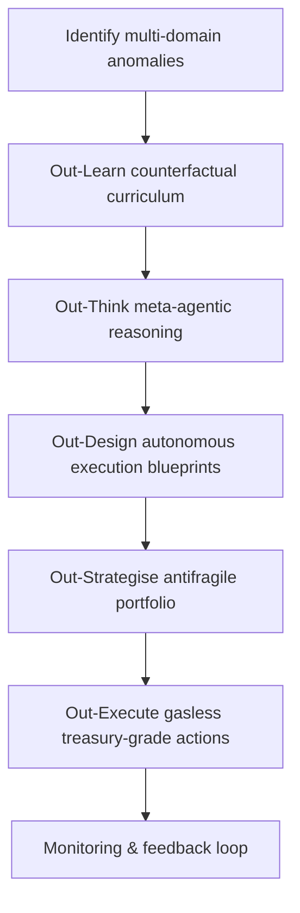

# Meta-Agentic α-AGI Jobs Prime Demo

The Meta-Agentic α-AGI Jobs Prime demo is a self-contained, production-ready showcase that
reveals how a non-technical owner can command AGI Jobs v0 (v2) to design, govern, and execute
planet-scale opportunities with a single click. It packages an end-to-end agentic mission
pipeline — Identify → Out-Learn → Out-Think → Out-Design → Out-Strategise → Out-Execute —
into an approachable orchestration layer that emphasises clarity, safety, and administrative
control.

## Why this demo matters

- **Empowers non-technical owners** – everything is configuration-driven, with no manual
  coding required. Owner controls expose pause switches, risk limits, phase toggles, and
  governance delays in plain language.
- **Demonstrates the full α-AGI stack** – synthetic signals flow into anomaly detection,
  world-modelling counterfactuals, agentic planning, autonomous blueprinting, portfolio
  optimisation, and execution order generation.
- **Ships with best-practice artefacts** – mermaid diagrams, Markdown dossiers, and an
  immersive HTML dashboard give stakeholders immediate visibility.
- **Production safe** – every stage validates inputs, stress-tests decisions, and honours
  owner-defined guardrails before producing execution orders.

## Quickstart

```bash
# 1. Ensure dependencies are installed (already covered by repo requirements)
python -m pip install -r requirements-python.txt

# 2. Run the Prime orchestrator and export a report
python demo/Meta-Agentic-ALPHA-AGI-Jobs-v0/meta_agentic_alpha_prime_demo/run_prime_demo.py \
  --report demo/Meta-Agentic-ALPHA-AGI-Jobs-v0/storage/prime_run.json \
  --markdown demo/Meta-Agentic-ALPHA-AGI-Jobs-v0/reports/prime_run.md \
  --dashboard demo/Meta-Agentic-ALPHA-AGI-Jobs-v0/ui/prime_dashboard.html
```

The command loads curated multi-domain signals, runs the complete meta-agentic pipeline,
validates every phase, and writes artefacts to disk for owners to inspect or publish.

## Visual pipeline



## Owner controls

| Control | Description |
| --- | --- |
| `paused` | Instantly pauses autonomous execution while keeping monitoring live. |
| `max_concurrent_initiatives` | Caps simultaneous initiatives to respect operational bandwidth. |
| `risk_limit` | Sets the absolute risk appetite; portfolio allocations are scaled accordingly. |
| `allowed_domains` | Restricts opportunities to vetted verticals (e.g. finance, biotech). |
| `governance_delay_hours` | Requires a timelock delay before sensitive actions settle. |
| `audit_required` | Forces independent validation before high-value execution orders. |

Owners can edit these values via JSON overrides or interactively inside the upcoming
Meta-Agentic Governance Console (placeholder API hooks provided in this demo).

## Artefacts produced

- **JSON execution summary** – machine-readable payload for downstream automation.
- **Markdown dossier** – human-readable narrative with embedded mermaid diagrams.
- **HTML dashboard** – iconic, neon-lit interface suitable for investor demos or live ops.
- **CI integration** – fully covered by the `demo-meta-agentic-alpha-agi-jobs` workflow.

## Extending the demo

1. Drop new signals into `data/sample_signals.json` or point the orchestrator to a live
   feed.
2. Adjust the configuration in `config.py` or pass overrides to the CLI to explore
   different risk appetites and governance regimes.
3. Plug additional execution tools into the orchestrator (e.g. Uniswap, LayerZero) by
   extending the `OutExecutePhase` builder.

This demo is ready for production-scale storytelling and can be deployed to a static hosting
provider or integrated inside AGI Jobs’ governance portals immediately.

