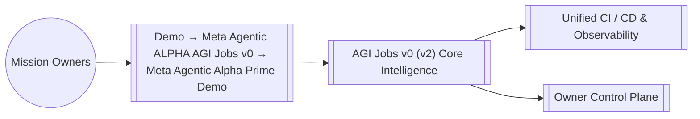

# Meta-Agentic ALPHA Prime

Prime is the preserved signal-to-strategy reference simulation. Its configured outcomes do not establish live economic performance or settlement.

Open **Prime demonstration** in the [complete workbench](https://montrealai.github.io/AGIJobsv0/experiments/meta-agentic-alpha/#archive), or start `npm run demo:meta-agentic-alpha:serve`. The complete viewer supplies local diagram rendering. An exported HTML report keeps the diagram source readable without that renderer.

From the repository root:

```bash
python demo/Meta-Agentic-ALPHA-AGI-Jobs-v0/meta_agentic_alpha_prime_demo/run_prime_demo.py --report reports/prime.json --markdown reports/prime.md --dashboard reports/prime.html
```

Choose new destination files to preserve earlier exports. For the complete isolated rehearsal use [the main guide](../README.md). Configuration overrides remain available through `--config` and repeated `--override key=value` arguments; inspect `--help` and `config.py` before use.

## Original systems map


```mermaid
flowchart LR
    Operators((Mission Owners)) --> demo_Meta_Agentic_ALPHA_AGI_Jobs_v0_meta_agentic_alpha_prime_demo[[Demo → Meta Agentic ALPHA AGI Jobs v0 → Meta Agentic Alpha Prime Demo]]
    demo_Meta_Agentic_ALPHA_AGI_Jobs_v0_meta_agentic_alpha_prime_demo --> Core[["AGI Jobs v0 (v2) Core Intelligence"]]
    Core --> Observability[[Unified CI / CD & Observability]]
    Core --> Governance[[Owner Control Plane]]
```
