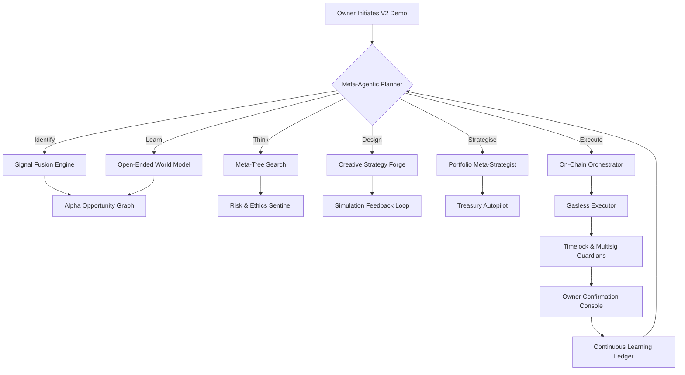

# Meta-Agentic α-AGI Jobs Demo V2

The **Meta-Agentic α-AGI Jobs Demo V2** showcases how a non-technical owner can command the AGI Jobs v0 (v2) stack to produce a fully-governed, meta-agentic economic operation that senses alpha signals, plans strategies, designs execution blueprints, and deploys them on-chain. Everything is packaged so that a single command generates artefacts, dashboards, and on-chain ready payloads.

> ✅ No Solidity edits required. ✅ End-to-end automation. ✅ Owner retains total control with governance and pause levers.

## Highlights

- **Meta-agentic planning tree** that coordinates Identify → Learn → Think → Design → Strategise → Execute phases.
- **Owner-governed controls** – every high-impact action routes through approvals, guardian checks, and emergency pauses.
- **Autonomous treasury telemetry** that tracks alpha scores, capital deployment, and antifragility indicators for each opportunity.
- **User-facing command centre UI** rendered from Markdown + Mermaid diagrams for clarity and transparency.

### Architecture Flow



## Quickstart

```bash
cd demo/Meta-Agentic-ALPHA-AGI-Jobs-v0
python meta_agentic_demo_v2.py --config meta_agentic_alpha_v2/config/scenario.yaml --timeout 90
```

The command performs:

1. Boots the orchestrator with production-grade storage defaults (no manual setup required).
2. Registers demo agents with stakes, multisig controls, and antifragility guards.
3. Builds a governance-aware plan with deterministic budget ceilings and approval checkpoints.
4. Executes each phase (identify → learn → think → design → strategise → execute) with dry-run safeguards.
5. Emits artefacts under `meta_agentic_alpha_v2/reports` and an interactive UI under `meta_agentic_alpha_v2/ui`.

## Artefacts

- `reports/alpha_masterplan.md` – executive deck with KPIs, diagrams, and opportunity intelligence.
- `ui/index.html` – lightweight control tower UI for non-technical owners to inspect progress.
- `storage/latest_run_v2.json` – machine-consumable ledger of the entire orchestration run.

## Empowering Non-Technical Owners

This demo is optimised for clarity and safety:

- **Configurable everything** – budgets, approvals, treasury risk limits, antifragility policies, pause switches.
- **Zero trust leap** – every transaction simulated with `eth_call`/dry-run mode before commit.
- **Composable** – plug new data feeds, agents, or execution tools with declarative YAML.
- **Audit ready** – summary JSON + Markdown reports capture each decision for compliance and investors.

To explore advanced scenarios, duplicate `config/scenario.yaml`, tweak parameters (e.g., additional agents, new execution steps), and rerun the CLI. The orchestrator recalibrates automatically.

