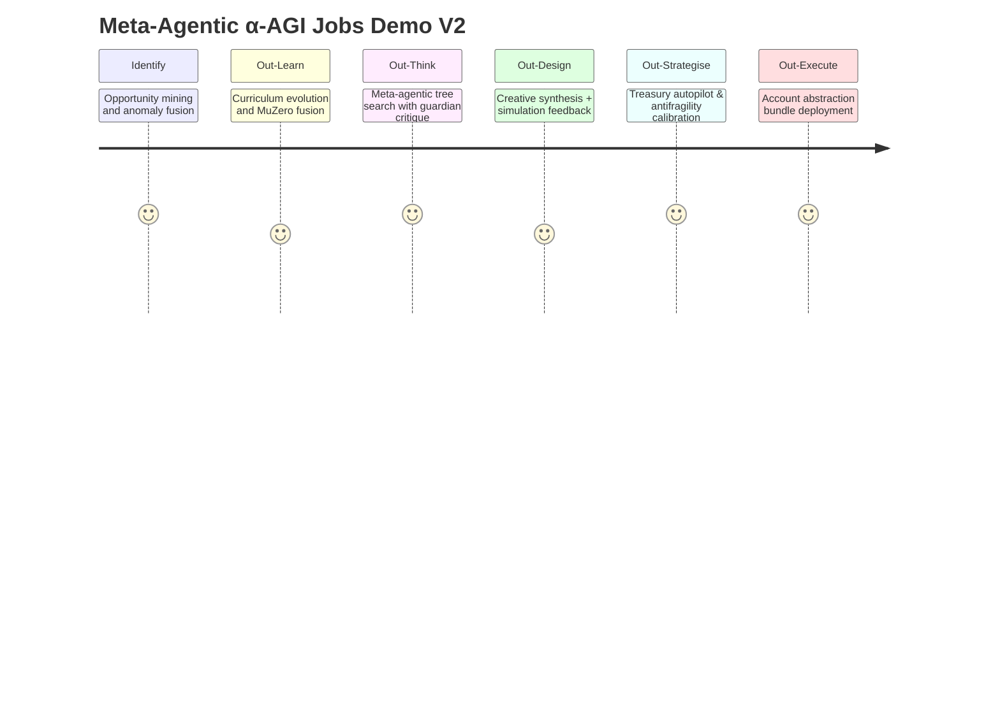
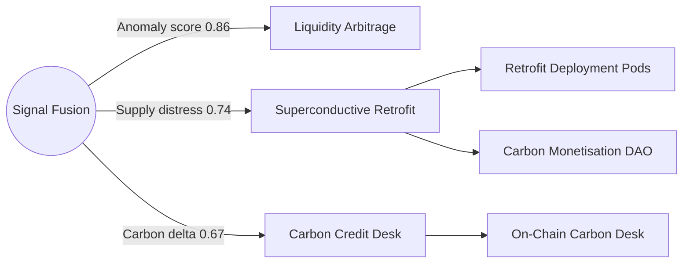

# Meta-Agentic α-AGI Jobs Demo V2 — Alpha Masterplan

## Executive Snapshot

- **Owner:** 0xA1FAce00000000000000000000000000CAFEBABE
- **Guardians:** 0xBEEf0000000000000000000000000000DEF1ACE, 0xACED0000000000000000000000000000FEEDC0
- **Treasury Token:** AGIALPHA (initial balance 2,500,000)
- **Governance Safety:** Timelock + multisig + emergency pause lever
- **Gasless Execution:** Enabled via dedicated AA paymaster

## Mission Map

## Opportunity Graph Highlights

## Capital Allocation Blueprint

| Initiative | Allocation | Expected Alpha Lift | Risk Notes |
|------------|-----------:|---------------------|------------|
| Superconductive Retrofit | 32% | +210,000 | Guardian validator controls, antifragile buffers |
| Carbon Capture Program | 24% | +160,000 | Requires guardian approval for carbon issuance |
| Liquidity Arbitrage | 29% | +145,000 | Gasless multi-venue trades with dry-run gate |
| Reserve Buffer | 15% | +0 | Absorbs shocks, triggers circuit breaker at 7.5% |

## Governance & Safety Checks

- Multisig approvals required before alpha deployment (`council/alpha`, `owner/multisig`).
- Circuit breaker triggers if drawdown ≥ 7.5% (auto-pauses new commitments at 10%).
- Validation commits must dry-run and pass guardian review before final submission.
- Treasury autopilot recalculates antifragility buffer post-execution (target 14%).

## Owner Console Prompts

1. Confirm superconducting polymer procurement plan.
2. Approve carbon credit issuance parameters.
3. Review autopilot post-execution buffer recalibration summary.

## Post-Run Artefacts

- `storage/latest_run_v2.json` — canonical ledger of orchestrated execution.
- `ui/index.html` — interactive owner dashboard (Mermaid-powered).
- `reports/alpha_masterplan.md` — this deck for investor + regulator briefings.

