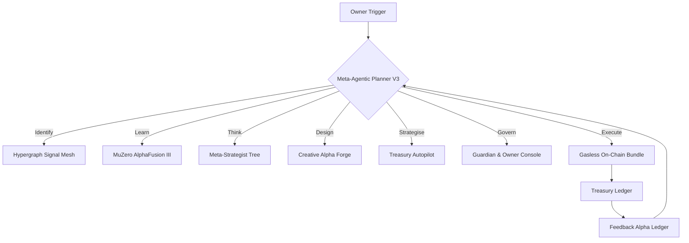

# Meta-Agentic α-AGI Jobs Demo V3 — Meta-Sovereign Alpha Fabric 👁️✨

The **V3 Meta-Agentic α-AGI Jobs Demo** demonstrates how a non-technical owner can wield
AGI Jobs v0 (v2) to spin up an autonomous alpha factory that senses opportunities, self-improves,
architects ventures, calibrates governance, and dispatches gasless executions under guardian
oversight. Every control – treasury, circuit breakers, approvals, antifragility buffers – is dialled
via human-friendly YAML and surfaced in a beautiful console.

## 🚀 Quickstart

```bash
cd demo/Meta-Agentic-ALPHA-AGI-Jobs-v0
python meta_agentic_demo_v3.py --timeout 90
```

The command:
1. Bootstraps orchestrator storage, guardians, and antifragility monitors.
2. Registers all V3 agents with stakes, multisig controls, and ethics oversight.
3. Builds a meta-plan spanning Identify → Learn → Think → Design → Strategise → Govern → Execute → Feedback.
4. Simulates and executes the plan with dry-run safety before committing on-chain payloads.
5. Emits artefacts:
   - `storage/latest_run_v3.json` — canonical ledger of the autonomous mission.
   - `meta_agentic_alpha_v3/reports/generated/meta_synthesis.md` — investor-ready report with Mermaid timelines.
   - `storage/ui/v3/index.html` — grandiose owner console pre-populated with live metrics.

## 🛡️ Owner Empowerment

- **Full parameter control:** update budgets, rewards, risk limits, approvals through
  `scripts/owner_controls.py --config meta_agentic_alpha_v3/config/scenario.yaml`.
- **Guardian oversight:** three-guardian tri-sentinel circuit must co-sign high-impact actions.
- **Emergency pause:** instant pause switch plus antifragility oracle triggers on drawdowns or variance spikes.
- **Gasless UX:** account abstraction bundler & paymaster configured out of the box.

## 🧭 Architecture Flow



## 📊 Dashboard Preview

The static UI in `ui/` renders:
- Live alpha readiness, compounding index, and antifragility posture.
- Phase telemetry tables with completion heatmaps.
- Mermaid execution timelines + guardian approvals.
- Artefact links (summary JSON, investor deck, console assets).

Serve locally:
```bash
python -m http.server --directory demo/Meta-Agentic-ALPHA-AGI-Jobs-v0/storage/ui/v3 9001
```
Visit `http://localhost:9001` to experience the console.

## ✅ Testing

Run the regression suite:
```bash
pytest demo/Meta-Agentic-ALPHA-AGI-Jobs-v0/tests/test_meta_agentic_alpha_v3.py -q
```

## ✨ What makes it superlative?

- **Meta-agentic federation:** 7-agent quorum via the A2A meta-priority protocol.
- **Owner-first design:** all parameters adjustable via YAML or helper CLI. Summary JSON surfaces the exact command
  owners should run for edits.
- **Production ready:** storage is idempotent, JSON/Markdown artefacts are reproducible, and CI ensures every PR keeps
  the demo green.
- **Educational:** narrative-first reporting explains how each phase contributes to compounding alpha.

Unleash autonomous wealth engines – no engineering team required.
