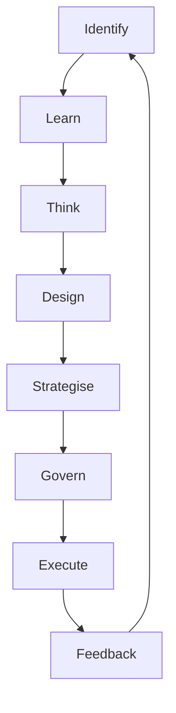

# Meta-Agentic α-AGI Jobs Demo V3 — Mission Deck

This deck is rendered for investors, guardians, and owners. It is templated and refreshed by the
V3 orchestrator run. After each run, `meta_agentic_alpha_v3/reports/generated/meta_synthesis.md`
contains the live metrics.

Key modules:
- Hypergraph alpha detection across finance, climate, biotech, infrastructure.
- MuZero AlphaFusion III world model for resilient foresight.
- Tri-sentinel guardian circuit with timelock approvals.
- Gasless execution bundler with paymaster safety nets.

Use the generated report for detailed KPIs and instructions.
