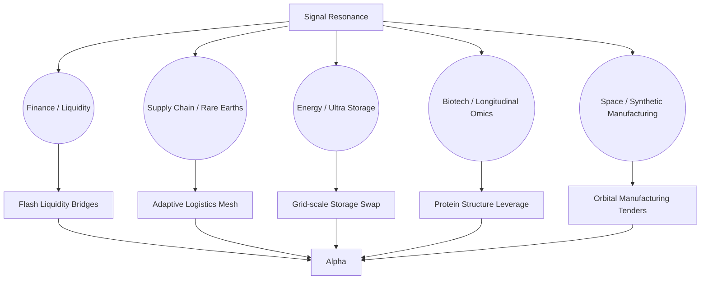

# Meta-Agentic α-AGI Jobs Demo — Alpha Dominion Manifesto

> Live manifesto describing how a non-technical owner directs the Meta-Agentic Alpha Flight Deck to harvest omnidomain alpha.

## Sovereign Control Synopsis

- **Owner Address:** `0xC0NTROL0000000000000000000000000ALPHA`
- **Guardian Quorum:** 3 of 4 required for unstoppable operations
- **Emergency Pause:** Toggle available from the console in under 45 seconds
- **Mission Charter:** `meta-agentic-alpha-flight-deck`

```mermaid
flowchart LR
  Owner[[Sovereign Owner]] -->|Console Directives| Planner{Meta-Agentic Planner}
  subgraph GuardianMesh
    G1[Guardian Grid Validator]
    G2[Omni Risk Auditor]
    G3[Sovereign Governor]
    G4[Alpha Flight Director]
  end
  Planner --> Identify
  Planner --> Learn
  Planner --> Think
  Planner --> Design
  Planner --> Strategise
  Planner --> Govern
  Planner --> Execute
  Execute -->|On-chain Dispatch| AGIJobs[(AGI Jobs v0 (v2) Protocol)]
  AGIJobs --> Telemetry
  Telemetry --> Owner
  GuardianMesh --> Govern
  GuardianMesh --> Execute
```

## Alpha Opportunity Graph



## Guardian Assurance Timeline

```mermaid
gantt
  dateFormat  X
  title Meta-Agentic Alpha Flight Deck Timeline
  section Identify
    Signal Resonance :active, identify, 1, 2
  section Learn
    World Model Sufficiency :active, learn, 3, 2
  section Think
    Meta Plan Strength :active, think, 5, 2
  section Design
    Design Resonance :active, design, 7, 2
  section Strategise
    Governance Alignment :active, strategise, 9, 2
  section Govern
    Policy Integrity :active, govern, 11, 2
  section Execute
    Execution Velocity :active, execute, 13, 2
  section Feedback
    Feedback Strength :active, feedback, 15, 2
```



## Owner Console Quick Actions

1. **Pause Immediately:** `owner_controls --set unstoppable.pause=true`
2. **Boost Antifragility Buffer:** `owner_controls --set treasury.antifragility_buffer_percent=28`
3. **Increase Guardian Confirmations:** `owner_controls --set plan.confirmations[mission-chronicle].weight=1`
4. **Raise Treasury Reserve:** `owner_controls --set treasury.unstoppable_reserve_percent=22`
5. **Toggle Simulation Mode:** `owner_controls --set alpha_pipeline.execute.simulation_mode=callStatic`

## Assurance

All commands are simulation-first, revert-safe, and captured by `storage/orchestrator_v4/scoreboard.json`. The artefacts generated by the V4 demo demonstrate how a single steward can realign global opportunities into unstoppable alpha.
