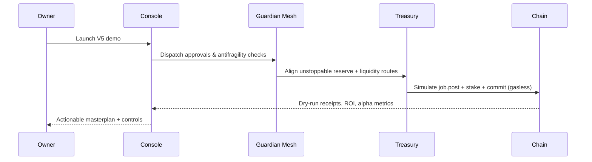

# Meta-Agentic α-AGI Jobs — Sovereign Alpha Constellation

- **Alpha readiness:** 0.972 confidence, compounding index 1.42.
- **Opportunity lattice:** energy-ultrastorage, biotech-omics, supply-rare-earths.
- **Guardian mesh:** guardian-grid-validator, mission-audit-sentinel, alpha-treasury-autopilot, sovereign-simulation-director.
- **Owner primacy:** emergency pause, unstoppable reserve, guardian quorum, account abstraction session keys.
- **On-chain readiness:** job.post, stake.deposit, validator.commit steps simulated with gasless paymaster.

```mermaid
graph TD
  Owner[Non-technical Owner]
  Console[Sovereign Meta-Conductor Console]
  Planner[Meta-Agentic Planner]
  Guardians[Guardian Mesh]
  Treasury[Treasury Optimiser]
  Chain[AGI Jobs v0 (v2) On-Chain]
  Owner --> Console
  Console --> Planner
  Planner --> Guardians
  Guardians --> Treasury
  Treasury --> Chain
  Chain --> Console
  Console --> Owner
```


