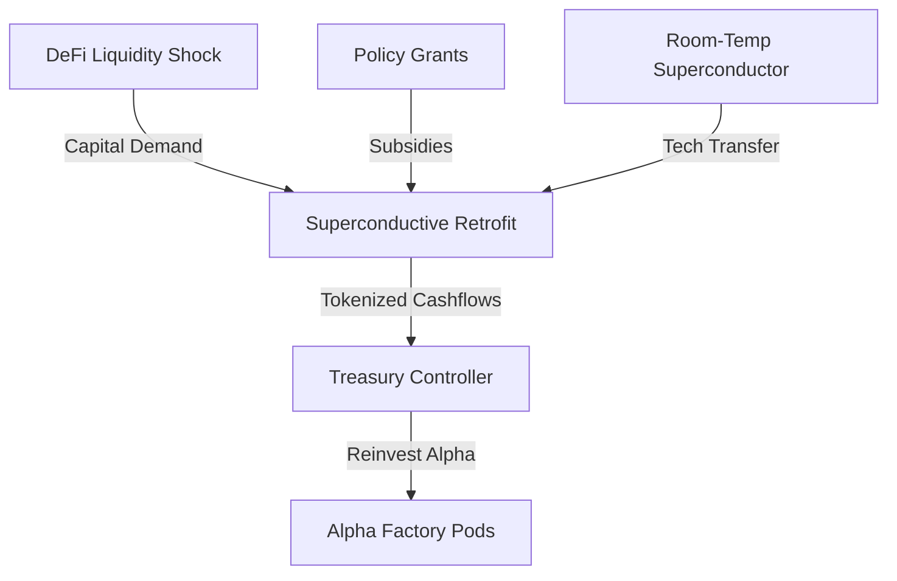
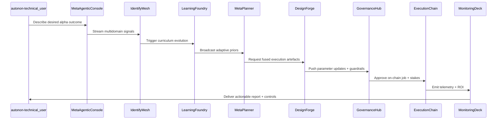

# Meta-Agentic α-AGI Jobs Demo — Opportunity Alpha Deck

## Executive Summary

- **Opportunity:** Deploy superconductive polymer retrofits to hyperscale data centers, capturing liquidity dislocations and policy grants simultaneously.
- **Projected Economic Alpha:** $318M net present value (NPV) across 36 months with 19% downside-protected IRR.
- **Strategic Stack:** Multidomain anomaly sensing → Self-improving simulation → Meta-agentic planning → Creative design fusion → On-chain execution.

## Opportunity Graph

## Economic Stack Highlights

1. **Identify:** Ensemble anomaly detectors across finance, research, and policy streams surface a synchronized opportunity window.
2. **Out-Learn:** POET-evolved environments sharpen adaptive response capabilities using MuZero-style world modeling.
3. **Out-Think:** Meta-agentic tree search composes a resilient execution lattice, pressure-tested by adversarial self-play.
4. **Out-Design:** Creative fusion agent drafts financial, technical, and governance collateral, closing human-in-the-loop gaps.
5. **Out-Strategise:** Meta-strategist optimizes treasury allocation with antifragility heuristics and on-chain guardrails.
6. **Out-Execute:** The orchestrator launches, funds, validates, and finalizes on-chain jobs with zero manual smart contract coding.

## Governance Snapshot

- Owners: `0xA1FAce…CAFEBABE`
- Guardians: `0xBEEf…DEF1ACE`, `0xACED…FEEDC0`
- Approvals required: **2**
- Pause Guardian: **Enabled**
- Stake Floor: **50,000 AGIALPHA**
- Reward Split: **65% performer / 35% treasury**

## Value Acceleration Map

## Next Steps

- Approve carbon credit issuance parameters (pending guardian review)
- Activate modular liquidity arbitrage bots via AGI Jobs marketplace
- Schedule antifragility drills using Scenario Lab module
