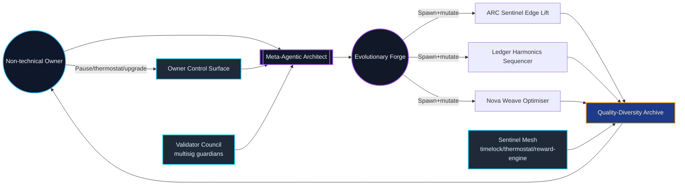
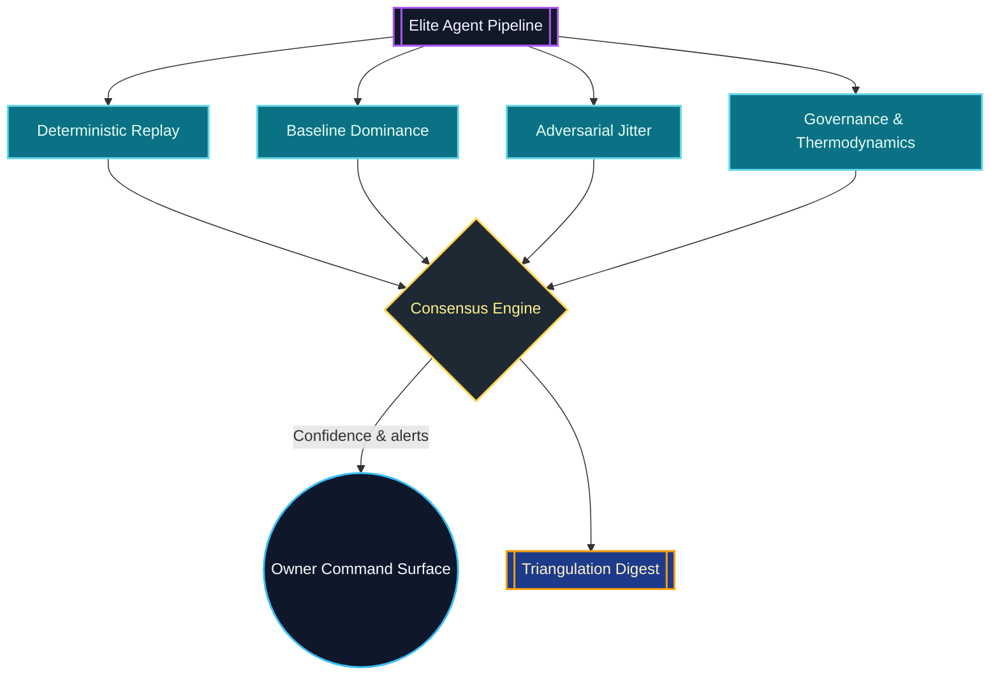

# Meta-Agentic Program Synthesis Sovereign Demo

The **Meta-Agentic Program Synthesis Sovereign Demo** turns AGI Jobs v0 (v2) into a turnkey superintelligent forge. A non-technical
owner launches a single command and receives:

- An evolutionary program synthesis loop that breeds agent code for ARC-style perception, ledger equilibria, and on-chain payload
  weaving – all governed by thermodynamic budgets and quality-diversity archives.
- A multi-angle verification lattice that replay-scores, baseline-compares, stress-jitters, and governance-audits every elite pipeline so owners see a consensus verdict rather than a single unchecked metric.
- A governance dossier proving that the owner retains absolute command: pause switches, thermostat calibrations, upgrade queues,
  treasury mirrors, and compliance beacons are exported with copy-paste commands.
- CI v2 branch-protection verification and owner diagnostics so that the generated machine matches production branch policies and
  governance readiness without manual intervention.

The demo lives entirely inside this repository. No bespoke contracts or external services are required.

## One-command launch (non-technical friendly)

```bash
# from repository root
./demo/Meta-Agentic-Program-Synthesis-v0/bin/launch.sh
```

The launcher performs:

1. `npm run demo:meta-agentic-program-synthesis` – executes the evolutionary forge, produces Markdown/JSON/HTML dossiers, and
   hashes them into a manifest.
2. `npm run demo:meta-agentic-program-synthesis:full` – replays the run, verifies CI (v2) enforcement, runs owner diagnostics in
   offline mode, and compiles a full-run bundle.

All artefacts land in `demo/Meta-Agentic-Program-Synthesis-v0/reports/` with deterministic SHA-256 fingerprints.

## Cinematic orchestration map



## Evolutionary program synthesis at a glance

| Task ID | Mission | Seeds | Owner economics | Best score | Accuracy | Novelty | Coverage |
| --- | --- | --- | --- | --- | --- | --- | --- |
| `arc-sentinel` | Detect latent pixel edges and amplify | Difference → Threshold | Stake 120,000 / Reward 420,000 | ≈100.00 | 100% | 68% | 100% |
| `ledger-harmonics` | Stabilise cash-flow deltas | Cumulative → Modulo → Offset | Stake 155,000 / Reward 525,000 | ≈99.60 | 99% | 72% | 100% |
| `nova-weave` | Compile alpha sequences | Power → Offset → Scale | Stake 165,000 / Reward 610,000 | ≈99.12 | 99% | 74% | 100% |

- **Deterministic reproducibility** – the forge uses a seeded PRNG so every rerun produces the same elite pipelines unless the
  owner tweaks parameters.
- **Quality-diversity archive** – hundreds of cells preserve dissimilar high performers; owners can choose conservative, energetic,
  or exotic agents on demand.
- **Energy discipline** – each program pays energy costs, keeping the synthesis loop within thermodynamic budgets defined by the
  mission manifest.
- **Thermodynamic sentinel** – aggregate alignment telemetry quantifies per-task energy drift and surfaces green/yellow/red
  status directly in the Markdown dossier and executive dashboard.

## Owner supremacy proof points

- **Pause in seconds** – `npm run owner:system-pause -- --action pause` (and `status` to confirm) ships with the generated dossier.
- **Thermostat & Hamiltonian controls** – `npm run thermostat:update` + `npm run thermodynamics:report` align reward engines with the
  synthesis outputs.
- **Upgrade & treasury workflows** – queue upgrades, mirror reward splits, and export compliance dossiers with a single copy-paste.
- **CI v2 enforcement** – `verifyCiShield` confirms the GitHub Actions workflow matches the repository’s branch protection policy
  (`ci (v2)` with lint/tests/foundry/coverage gates and `cancel-in-progress: true`).
- **Owner diagnostics bundle** – Hamiltonian audit, reward engine report, upgrade queue, and compliance health checks run in one
  command and emit Markdown/JSON ready for regulators.
- **Owner coverage sentinel** – mission loading now enforces Ethereum address formats, thermodynamic budgets, and 5/5 mandatory
  owner control categories (pause, thermostat, upgrade, treasury, compliance) before any synthesis can start.

## Generated artefacts

| File | Purpose |
| --- | --- |
| `meta-agentic-program-synthesis-report.md` | Narrative dossier with Mermaid diagrams, tables, and mission metadata. |
| `meta-agentic-program-synthesis-summary.json` | Machine-readable synthesis metrics, pipelines, and archive excerpts. |
| `meta-agentic-program-synthesis-dashboard.html` | Executive UI with live Mermaid rendering and embedded JSON manifest. |
| `meta-agentic-program-synthesis-triangulation.json` | Multi-perspective verification digest (consensus, confidences, per-perspective evidence). |
| `meta-agentic-program-synthesis-manifest.json` | SHA-256 manifest of every artefact for audit trails. |
| `meta-agentic-program-synthesis-ci.json` | CI workflow verification report (lint/tests/foundry/coverage). |
| `meta-agentic-program-synthesis-owner-diagnostics.{json,md}` | Owner readiness, command outputs, and sentinel status. |
| `meta-agentic-program-synthesis-full.{json,md}` | Aggregate timeline of the run, CI verdict, diagnostics, and artefact index. |

## Triple-verification sentinel



- **Replay** checks for deterministic agreement with the scoring engine and exposes hidden state drift.
- **Baseline dominance** proves the evolved agent beats the deterministic mission seeds by a material margin.
- **Adversarial jitter** injects bounded noise to ensure the pipeline remains stable under perturbations.
- **Governance guard** enforces allowlisted operations, thermodynamic expectations, and elite peer dominance before the owner accepts the result.

The digest exported in `meta-agentic-program-synthesis-triangulation.json` lists every perspective, delta, and confidence score so auditors can replay the verdict independently.

## Power knobs for operators

- **Seeded exploration** – update `parameters.seed` in the mission JSON to branch new evolutionary lineages.
- **Population pressure** – tune `populationSize`, `generations`, or `eliteCount` to emphasise exploration vs. exploitation.
- **Energy constraints** – adjust `parameters.energyBudget` and per-task `constraints.expectedEnergy` to tighten or relax thermodynamic
  limits.
- **Owner controls** – the mission file enumerates every privileged command, so editing it reconfigures the generated runbook without
  touching TypeScript.

## Rerun individual components

```bash
# Regenerate synthesis dossier only
npm run demo:meta-agentic-program-synthesis

# Full pipeline with CI + owner diagnostics
npm run demo:meta-agentic-program-synthesis:full
```

Set `AGI_META_PROGRAM_MISSION=/path/to/custom.json` to target a modified mission file.

## Production readiness checklist

1. Run `npm run demo:meta-agentic-program-synthesis:full` – should finish green with CI and owner diagnostics.
2. Review `meta-agentic-program-synthesis-dashboard.html` for the executive view.
3. Share `meta-agentic-program-synthesis-manifest.json` + reports with partners/regulators.
4. Exercise owner commands directly (pause, thermostat, upgrade) using the copy-paste scripts printed in the report and confirm the
   **Coverage Readiness** panel reports 5/5 satisfied controls.

With this demo, AGI Jobs v0 (v2) proves that a single non-technical steward can commission, audit, and redeploy a civilisation-scale
program synthesis machine in minutes – fully instrumented, branch-protected, and economically aligned.
