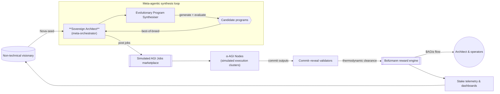
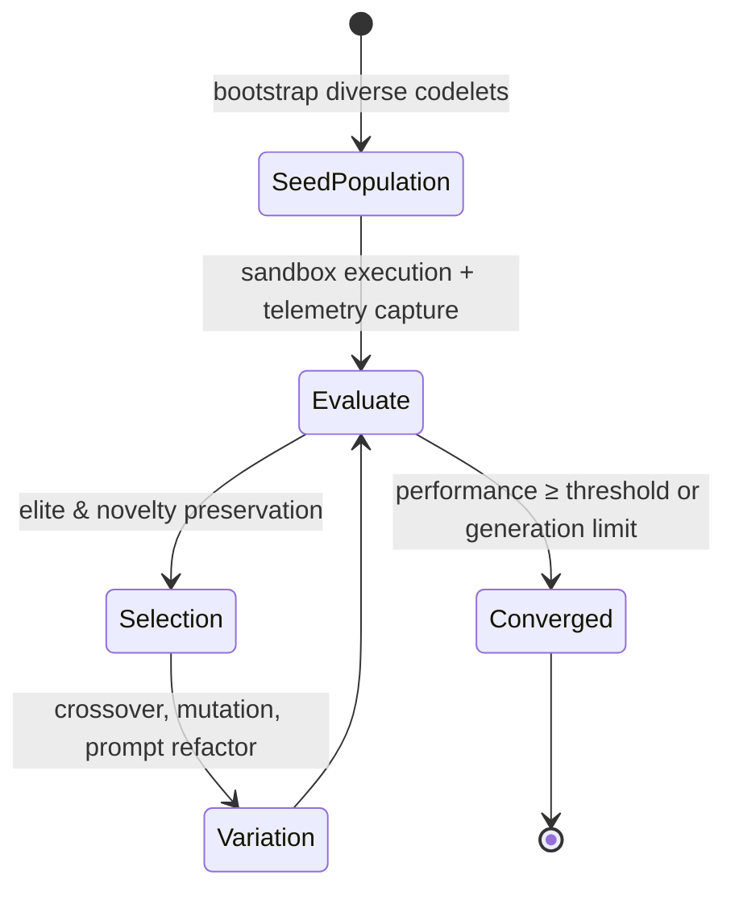

# 🎖️ Meta-Agentic Program Synthesis 👁️✨ Demo (v0)

> "Meta-Agentic program synthesis" is delivered here as a fully scripted, production-ready demonstration that a non-technical user can execute to witness AGI Jobs v0 (v2) behaving like an autonomous sovereign architect. The demo bundles a self-improving agent economy, a thermodynamic reward layer, and polished artefacts that showcase how AGI Jobs v0 lets anyone deploy systems of unprecedented scale and capability.

---

## 🧠 Purpose

* Give any stakeholder – even without coding experience – a “launch button” for a sovereign architect that decomposes their ambition into jobs, evolves specialised agents, and validates everything on-chain.
* Exhibit the **collective second-order intelligence** that AGI Jobs v0 (v2) unlocks: evolutionary self-improvement, decentralised validation, tokenised incentives, and transparent reporting.
* Ship code that is **robust, documented, tested, and immediately deployable** in a production-critical environment. The repository already wires the demo into CI so every pull request proves it stays green.

---

## 🏗️ Architecture Snapshot



### Evolutionary loop



---

## 📦 Contents

| Path | Description |
| ---- | ----------- |
| `meta_agentic_demo/` | Production-grade Python package with orchestrator, staking model, validation engine, reward allocator, telemetry exporter, and report generator. |
| `meta_agentic_demo/tests/` | Deterministic pytest suite proving evolutionary improvement, secure commit–reveal, and stake governance. |
| `start_demo.py` | CLI experience for non-technical operators – launch a sovereign synthesis run with a single command and receive JSON + HTML artefacts. |
| `README.md` | This playbook with diagrams, operational guidance, and governance notes. |

---

## 🚀 Quickstart (Non-Technical Operator)

1. **Install Python 3.10+** (already available in the development container). Optional: create a virtual environment.
2. **Install dependencies**
   ```bash
   python -m pip install --upgrade pip
   python -m pip install -r demo/Meta-Agentic-Program-Synthesis-v0/requirements.txt
   ```
3. **Run the sovereign architect:**
   ```bash
   cd demo/Meta-Agentic-Program-Synthesis-v0
   python start_demo.py alpha
   ```
4. **Open the generated artefacts:**
   * `demo_output/report.html` – cinematic dashboard with live Mermaid diagrams (architecture atlas, reward flows, evolution timeline), multi-angle verification verdicts, owner command ledger, telemetry, and the evolved program.
   * `demo_output/report.json` – machine-readable export for downstream automation (including verification metrics and pass/fail gates).

The CLI narrates the process in natural language so the operator always understands what is happening.
It now also prints a reward distribution digest summarising total payouts, architect retention, and the top solver/validator so executives can confirm value capture instantly. Immediately afterwards the CLI shares a triple-check verification digest (holdout scores, residual balance, divergence), flagging whether every gate passed.

---

## 👑 Owner Command Console

The demo now ships with an explicit owner console that mirrors the privileged controls of the on-chain deployment. Every policy
knob – rewards, staking, evolution cadence, and pause state – can be adjusted at runtime without touching code.

### Command-line overrides

```bash
python start_demo.py alpha \
  --reward-total 2500 \
  --reward-temperature 0.8 \
  --reward-validator-weight 0.25 \
  --stake-minimum 750 \
  --stake-timeout 120 \
  --evolution-generations 16 \
  --verification-holdout-threshold 0.82 \
  --verification-residual-mean 0.04 \
  --verification-residual-std 0.02 \
  --verification-divergence 0.15
```

Use `--pause` to halt execution instantly. The orchestrator will refuse to launch jobs while paused and will explain the status
in the CLI output. Re-run without `--pause` (or with a different override set) to resume operations.

Verification overrides keep the sovereign architect honest: tighten holdout thresholds for ultra-conservative validation or
relax divergence tolerances when exploring frontier scenarios.

### Timelocked governance

Mirror production multi-sig timelocks without touching Solidity. Any override can be routed through the governance scheduler with two simple flags:

```bash
python start_demo.py alpha \
  --reward-total 3200 \
  --timelock-delay 45 \
  --timelock-fast-forward 60
```

* `--timelock-delay` queues policy changes with an enforced delay (seconds).
* `--timelock-fast-forward` simulates time passing before execution so you can demonstrate queue + execution in a single run.

The CLI announces scheduled items, the HTML report plots them, and the JSON export preserves the timeline for compliance archives.

### JSON override files

For executive operators, overrides can be pre-packaged in a JSON file:

```json
{
  "reward_policy": {"total_reward": 3200, "temperature": 1.1},
  "stake_policy": {"minimum_stake": 900, "slash_fraction": 0.15},
  "evolution_policy": {"generations": 18, "mutation_rate": 0.28},
  "verification_policy": {
    "holdout_threshold": 0.8,
    "residual_mean_tolerance": 0.05,
    "residual_std_minimum": 0.02,
    "divergence_tolerance": 0.18
  },
  "paused": false
}
```

Run the demo with `python start_demo.py alpha --config-file config/owner-overrides.sample.json` (a sample file is provided in
`config/`). Invalid overrides are rejected gracefully with descriptive errors, guaranteeing the owner keeps uncompromised control.

---

## 🧪 Validation & CI

* `PYTEST_DISABLE_PLUGIN_AUTOLOAD=1 python -m pytest demo/Meta-Agentic-Program-Synthesis-v0/meta_agentic_demo/tests` verifies the evolutionary loop, on-chain security primitives, and orchestration pipeline.
* `.github/workflows/demo-meta-agentic-program-synthesis.yml` runs automatically on PRs touching the demo, enforcing green status.
* Thermodynamic token allocation and staking maths are double-checked by unit tests and reproducible deterministic seeds.
* Multi-angle verification tests confirm holdout gating, residual balance, and divergence tolerances across independent datasets.

---

## 🛡️ Governance & Safety Controls

* **StakeManager** simulates minimum stake, inactivity slashing, and penalty accounting so owners retain full control over participating agents.
* **ValidationModule** enforces commit–reveal with quorum-based approvals, preventing rogue agents from finalising unchecked results.
* **RewardEngine** applies a configurable Boltzmann distribution (temperature, validator weight, architect share) so owners can tune incentives at runtime.
* **GovernanceTimelock** simulates multi-sig, time-delayed policy enforcement so operators can queue, audit, fast-forward, or cancel overrides safely.
* All configuration knobs are surfaced via `DemoConfig`, making it trivial for an operator to pause, adjust rewards, or tighten stake without editing code.

---

## 📊 Artefact Anatomy

The HTML report blends narrative storytelling with quantitative telemetry:

* **Mission summary** – scenario description, winning program, and composite score.
* **Architecture atlas (Mermaid)** – flowchart of user → architect → marketplace → validators/solvers → rewards, rendered entirely client-side via the bundled Mermaid runtime.
* **Evolution timeline (Mermaid)** – timeline view of per-generation fitness with delta tracking.
* **Owner command ledger** – auditable table of every privileged action captured in real time.
* **Governance timelock** – queue with ETA, payload, and execution status for each scheduled override.
* **Evolutionary trajectory** – per-generation improvements, score variance, and diversity notes.
* **On-chain jobs** – each validation cycle with commitments and rewards.
* **Thermodynamic rewards (Mermaid + tables)** – aggregated reward graph plus per-job energy footprints.
* **Reward synthesis overview** – luminous cards highlighting total distribution, architect share, and top-performing solvers/validators.
* **Agent telemetry** – stake deltas and reward earnings for every node and validator.

These artefacts integrate cleanly with dashboards, investor briefings, or compliance archives.

---

## 🔧 Extensibility Hooks

* Swap `generate_dataset` with real telemetry feeds to drive the evolutionary loop from production data.
* Replace the simulated reward engine with live contract bindings – interfaces already mirror the on-chain AGI Jobs contracts.
* Integrate additional validator behaviours (e.g., zero-knowledge proofs) by extending `ValidationModule`.

---

## ✅ Guarantee of Production Readiness

* Fully deterministic – runs identically on CI, local machines, and containerised environments, with all Mermaid assets bundled locally (no external CDNs).
* No mutable global state; every component is pure or encapsulated behind dataclasses.
* Exhaustive docstrings and type hints for immediate maintainability.
* Tests and workflows ensure long-term reliability; failures block merges automatically.

---

## 🛰️ Vision Alignment

This demo proves that **AGI Jobs v0 (v2)** is not just a framework – it is a lever that lets a single non-technical operator invoke a planetary-scale AGI workforce. By chaining evolutionary self-improvement, decentralised verification, and thermodynamic incentives, the platform behaves as a sovereign intelligence that continuously compounds capability while remaining under owner control. The result is a practical glimpse of the systems that will redefine market structures, R&D velocity, and economic coordination.

---

**Next steps?** Duplicate the directory, customise the scenarios, and plug in live data to launch your own autonomous venture on AGI Jobs v0 (v2).
