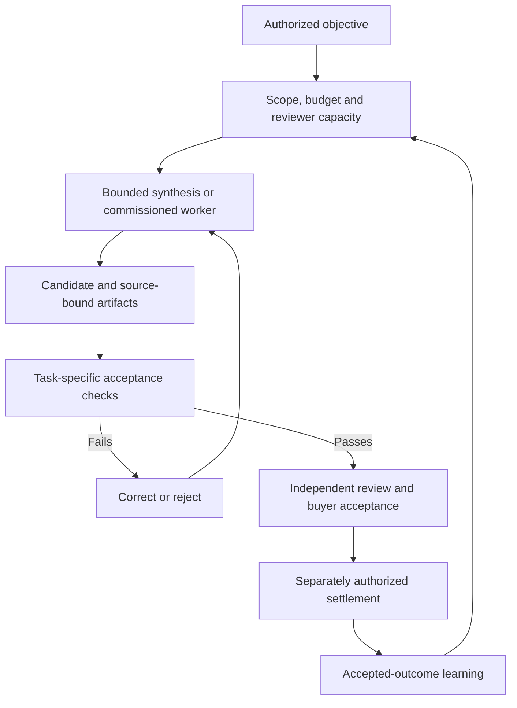
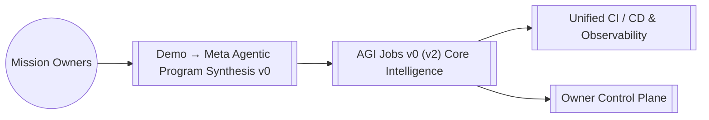

# Meta-Agentic Program Synthesis · The Synthesis Foundry

**Turn an objective into a tested program, reviewable evidence and an accountable work order.**

[Open the Synthesis Foundry](https://montrealai.github.io/AGIJobsv0/experiments/program-synthesis/) · [Operator runbook](RUNBOOK.md) · [OpenClaw / ChatGPT Work integration](INTEGRATION.md)

AGI Jobs is designed as a scalable machine labor layer for authorized, lawful screen-based work—coordinating specialized agents to execute tasks, produce reviewable evidence, and support independent verification and settlement across a broad range of computer-based workflows.

This module implements a complete **local synthesis and evidence laboratory**. Its live-provider entry point uses the repository's admitted OpenClaw adapter. Actual provider commissioning, external independent acceptance, buyer use and paid settlement remain deployment-specific. Local scores and generated dossiers are not proof of a production fleet or universal human-level capability.

## Start in two minutes

The public website needs only a modern browser. Choose a task, search, challenge the candidate and export its JSON. Prepare a draft USDC work order, inspect the economics, and explore both preserved engines and their flowcharts.

For local use, from the repository root with Node matching `.nvmrc` and Python 3.11+:

```bash
npm ci
npm run demo:program-synthesis:site
python3 -m http.server 18792 --bind 127.0.0.1 --directory build/program-synthesis
```

Open `http://127.0.0.1:18792`. The build executes the Python and TypeScript engines and includes their actual generated reports. No model key, wallet, paid API call or blockchain connection is needed.

## What works here

| Component | Executable behavior | Evidence boundary |
| --- | --- | --- |
| Browser synthesis lab | Search up to 400 candidate programs, at most three operations; three synthetic transformation tasks; cancellation; candidate and challenge exports | Safe fixed operation language, not arbitrary generated code |
| Separate Python checker | Replay the exact exported program on training examples and fixed acceptance cases, bind source bytes and expected task, reject wrong candidates | Separate implementation, not an independent external reviewer or a formal proof |
| Work-order planner | Exact six-decimal USDC arithmetic, cost coverage, reviewer-time admission, rights and authorization assertions, editable scope and JSON export | Draft only; assertions require verification; no dispatch, fund reservation or payment |
| Python research engine | Four scenario datasets; evolutionary search; holdout, residual, stress and numerical checks; simulated ledger and owner controls | Seeded synthetic experiment; simulation credits; no actual on-chain jobs |
| TypeScript research engine | Vector-pipeline synthesis, quality-diversity archive, triangulation, owner-command inspection and artifact manifest | Separate synthetic experiment; configuration inspection does not execute owner commands or establish passing CI |
| OpenClaw worker route | Exact task admission, dedicated profile, persistent dispatch journal and bounded receipt through the shared adapter | Requires actual isolated worker/tool commissioning; starts with no admitted jobs |
| ChatGPT Work route | Operator-led scoped computer use followed by artifact export and acceptance review | Documented procedure, not a remote Work API |

The browser laboratory and the two original engines serve different purposes; their scores must not be combined into a single performance claim. All original code paths, presentations and diagram sources remain available. Presentations and checked-in historical reports are archival material; fresh reports generated by the build carry the current evidence boundary.

## Produce and challenge a candidate

```bash
node demo/Meta-Agentic-Program-Synthesis-v0/scripts/lab.mjs normalize > /tmp/candidate.json
python3 demo/Meta-Agentic-Program-Synthesis-v0/computer-work/review.py /tmp/candidate.json --task normalize
```

Choose `normalize`, `ledger` or `catalog`. The checker requires an explicit expected task, validates the source SHA-256 and fixed language, and checks unseen cases. Use the website's **Try a wrong candidate** export to verify rejection. A rehashed wrong answer must still fail semantic checks.

## From local programs to useful machine work

Computer-use workers can operate browsers, documents, spreadsheets, presentations, code tools and approved desktop applications. Use structured integrations when available and visual control where needed. Every job needs explicit scope, access rights, budgets, stop conditions, a reviewable deliverable and task-specific acceptance checks. Keep secrets, production signers and personal sessions outside worker environments. The [integration guide](INTEGRATION.md) covers both routes and recovery.

Useful starting categories include public-data report production, open-source features, automated QA, numerical reproduction, editable presentations and authorized operational workflows. These are work-order categories, not claims that this lab has delivered those customer projects.

## Productive capacity and long-term scale

The intended progression is accepted work → reusable capabilities → stronger research and engineering → more productive infrastructure. Scientific discovery, energy-system design and large infrastructure programs still require real-world validation, capital and governance. The website makes that ambition explorable without presenting civilizational outcomes as achieved.

The **$40 trillion/year** figure is a project-supplied planning assumption, not an independently verified TAM or revenue forecast. The calculator applies separate digital-addressability, access/licensing, acceptance, adoption and fee assumptions. Accepted work value is distinct from platform revenue and profit. Simulation credits in legacy research ledgers are not USDC balances or promises to pay; proposed new work orders use USDC.

## Architecture


```mermaid
flowchart TD
    Objective["Authorized objective"] --> Admission["Scope, budget and reviewer capacity"]
    Admission --> Search["Bounded synthesis or commissioned worker"]
    Search --> Evidence["Candidate and source-bound artifacts"]
    Evidence --> Check["Task-specific acceptance checks"]
    Check -->|Fails| Correction["Correct or reject"]
    Correction --> Search
    Check -->|Passes| Review["Independent review and buyer acceptance"]
    Review --> Settlement["Separately authorized settlement"]
    Settlement --> Learning["Accepted-outcome learning"]
    Learning --> Admission
```

### Original systems map, preserved


```mermaid
flowchart LR
    Operators((Mission Owners)) --> demo_Meta_Agentic_Program_Synthesis_v0[[Demo → Meta Agentic Program Synthesis v0]]
    demo_Meta_Agentic_Program_Synthesis_v0 --> Core[["AGI Jobs v0 (v2) Core Intelligence"]]
    Core --> Observability[[Unified CI / CD & Observability]]
    Core --> Governance[[Owner Control Plane]]
```

## Validate changes

```bash
python3 -m pip install -r demo/Meta-Agentic-Program-Synthesis-v0/requirements.txt
PYTEST_DISABLE_PLUGIN_AUTOLOAD=1 python3 -m pytest demo/Meta-Agentic-Program-Synthesis-v0/meta_agentic_demo/tests
npm run demo:program-synthesis:test
npm run demo:meta-agentic-program-synthesis:full -- --report-dir /tmp/synthesis-dossier
npm run demo:program-synthesis:site
npx playwright install chromium
npm run demo:program-synthesis:qa
```

The targeted CI runs the engines, regression tests, candidate rejection checks, website build and browser checks. The Pages workflow builds and verifies the complete observatory before deployment. Changes land through a PR with passing checks; a local generated CI report only inspects workflow declarations.

## Directory guide

- `workbench/`: complete static website, bounded operation language and synthetic fixtures.
- `computer-work/`: exact worker task, unadmitted profile, shared adapter entry point and separate checker.
- `meta_agentic_demo/`, `start_demo.py`, `run_demo.py`: original Python engine, validated configuration, reports and tests.
- `scripts/`, `config/`, `bin/`: original TypeScript engine and launcher, new build/lab/QA entry points.
- `reports/`: historical dossiers; use a fresh `--report-dir` for current output.
- `presentation/`: preserved historical PDF/PPTX.
- `tests/`: new runtime, export, admission and semantic regressions.

See [VALIDATION.md](VALIDATION.md) for the change record and qualification limits, and the [repository operator guide](../../OperatorRunbook.md) for separately commissioned owner operations.

Mermaid rendering corrections dated October 8, 2026 are recorded in the [historical report manifest](reports/meta-agentic-program-synthesis-manifest.json). They preserve the original simulation values and timestamps; they do not represent a new execution or new production evidence.
