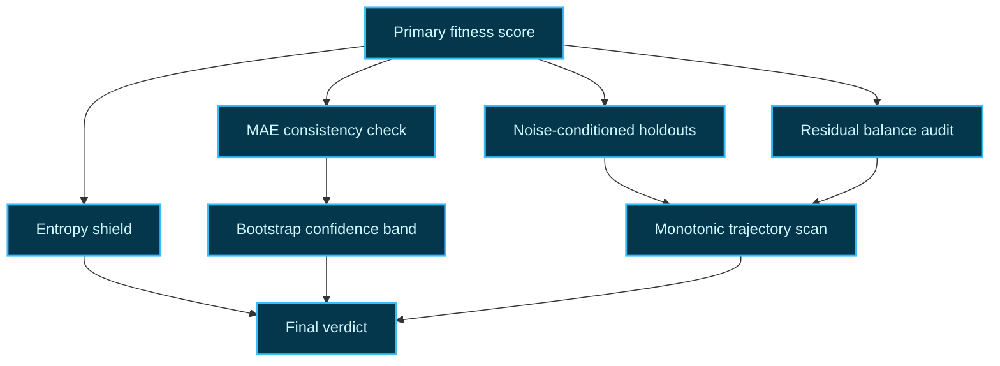

# 🎖️ Meta-Agentic Program Synthesis 👁️✨ Demo (v0)

> "Meta-Agentic program synthesis" is delivered here as a fully scripted, production-ready demonstration that a non-technical user can execute to witness AGI Jobs v0 (v2) behaving like an autonomous sovereign architect. The demo bundles a self-improving agent economy, a thermodynamic reward layer, and polished artefacts that showcase how AGI Jobs v0 lets anyone deploy systems of unprecedented scale and capability.

---

## 🧠 Purpose

* Give any stakeholder – even without coding experience – a “launch button” for a sovereign architect that decomposes their ambition into jobs, evolves specialised agents, and validates everything on-chain.
* Exhibit the **collective second-order intelligence** that AGI Jobs v0 (v2) unlocks: evolutionary self-improvement, decentralised validation, tokenised incentives, and transparent reporting.
* Ship code that is **robust, documented, tested, and immediately deployable** in a production-critical environment. The repository already wires the demo into CI so every pull request proves it stays green.

---

## 🏗️ Architecture Snapshot

```mermaid
flowchart LR
    User[("Non-technical visionary")] -->|Nova-seed| SovereignArchitect["**Sovereign Architect**\n(meta-orchestrator)"]
    subgraph MetaLoop[Meta-agentic synthesis loop]
        SovereignArchitect --> Evolver["Evolutionary Program Synthesiser"]
        Evolver -->|generate + evaluate| CandidatePool{{"Candidate programs"}}
        CandidatePool -->|best-of-breed| SovereignArchitect
    end
    SovereignArchitect -->|post jobs| JobRegistry[["Simulated AGI Jobs marketplace"]]
    JobRegistry --> Nodes["α-AGI Nodes\n(simulated execution clusters)"]
    Nodes -->|commit outputs| Validation["Commit–reveal validators"]
    Validation -->|thermodynamic clearance| RewardEngine[["Boltzmann reward engine"]]
    RewardEngine -->|$AGIα flow| Treasury(("Architect & operators"))
    RewardEngine --> Telemetry["Stake telemetry & dashboards"]
    Telemetry --> User
```



### Triple-verification lattice



### Evolutionary loop

#### Adversarial stress battery

The verification stack now includes an explicit stress battery that intentionally perturbs the sovereign's data environment:

* **Regime shift** — applies structural trend and baseline shifts to mimic macroeconomic realignments.
* **Volatility spike** — injects sharp noise bursts and transient outliers to test control under chaos.
* **Signal dropout** — removes swathes of signal and damps cyclical structure to simulate degraded telemetry.
* **Entropy shield** — enforces solver diversity by measuring the Shannon entropy of generated control kernels; if creativity collapses, the owner is alerted before capital is deployed.

Every evolved program must clear a configurable stress threshold (default `0.72`). The new CLI flag `--verification-stress-threshold` lets the contract owner ratchet this bar up or down without touching code.

#### Independent assurance weave

Triple verification now runs in lockstep with an **Independent Assurance Weave** – a second auditor that recomputes the sovereign's score using high-precision Decimal arithmetic, variance forensics, and a spectral leak detector. The weave refuses to sign off unless:

* The Decimal replay stays within a configurable tolerance of the primary score.
* Residual variance remains below an owner-set ceiling, protecting against unbounded drift.
* Spectral energy across harmonics stays under a limit, preventing hidden oscillations or regime exploits.

All three thresholds are owner-governed and surfaced through the CLI / JSON overrides, ensuring governance can harden or relax the assurance net instantly.


---

## 📦 Contents

| Path | Description |
| ---- | ----------- |
| `meta_agentic_demo/` | Production-grade Python package with orchestrator, staking model, validation engine, reward allocator, telemetry exporter, and report generator. |
| `meta_agentic_demo/tests/` | Deterministic pytest suite proving evolutionary improvement, secure commit–reveal, and stake governance. |
| `start_demo.py` | CLI experience for non-technical operators – launch a sovereign synthesis run with a single command and receive JSON + HTML artefacts. |
| `README.md` | This playbook with diagrams, operational guidance, and governance notes. |

---

## 🚀 Quickstart (Non-Technical Operator)

1. **Install Python 3.10+** (already available in the development container). Optional: create a virtual environment.
2. **Install dependencies**
   ```bash
   python -m pip install --upgrade pip
   python -m pip install -r demo/Meta-Agentic-Program-Synthesis-v0/requirements.txt
   ```
3. **Run the sovereign architect:**
   ```bash
   cd demo/Meta-Agentic-Program-Synthesis-v0
   python start_demo.py alpha
   # or orchestrate the entire constellation in one command
   python start_demo.py all --output demo_output
   ```
4. **Open the generated artefacts:**
   * Single mission runs write to `demo_output/` (e.g. `report.html`, `report.json`).
   * Constellation runs create per-scenario folders (for example `demo_output/alpha/report.html`) **and** an aggregated `demo_output/batch.html` / `batch.json` with the mission constellation dashboard, comparative metrics, and links to each sovereign campaign.

The batch report distils pass-rate, average composite fitness, entropy apex, governance touchpoints, and an auto-generated Mermaid constellation map so executives can assess the entire sovereign fleet at a glance.

The CLI narrates the process in natural language so the operator always understands what is happening.
It now also prints a reward distribution digest summarising total payouts, architect retention, and the top solver/validator so executives can confirm value capture instantly. Immediately afterwards the CLI shares a triple-check verification digest (holdout scores, residual balance, divergence), flagging whether every gate passed.
The digest now highlights the **entropy shield** so the owner can confirm that solver diversity stayed above the configurable floor – proving the sovereign architect remained creative and unstoppable while under explicit owner control.

### 🌌 Featured scenarios (non-technical friendly)

| Identifier | Mission | Dataset profile | Stress battery |
| ---------- | ------- | --------------- | -------------- |
| `alpha` | **Alpha Efficiency Sweep** – refines an internal automation workflow into a compounding control signal that continuously improves productivity. | 64 samples · baseline noise `0.05` · deterministic seed `1337`. | Baseline thermodynamic profile (`1.0×`). |
| `atlas` | **Atlas Market Sentinel** – deploys a forecasting kernel that seeks hidden cross-market inefficiencies and synthesises actionable alpha streams. | 72 samples · adaptive noise `0.06` · seed `4242`. | Balanced `1.1×` multiplier keeps validators sharp without overfitting. |
| `sovereign` | **Sovereign Hyperdrive Forge** – spins up a self-improving sovereign enterprise that welds together market, operational, and intelligence kernels in minutes. | 96 samples · exploratory noise `0.07` · seed `90900`. | Elevated `1.35×` multiplier intensifies the stress battery to prove resilience under regime shifts. |

Each scenario is configurable at runtime. Override any parameter (rewards, staking, evolution cadence, verification tolerances, dataset length/noise, stress multiplier) through the owner console CLI or a JSON override file – the contract owner retains absolute control.

---

## 👑 Owner Command Console

The demo now ships with an explicit owner console that mirrors the privileged controls of the on-chain deployment. Every policy
knob – rewards, staking, evolution cadence, and pause state – can be adjusted at runtime without touching code.

### Command-line overrides

    ```bash
    python start_demo.py alpha \
      --reward-total 2500 \
      --reward-temperature 0.8 \
      --reward-validator-weight 0.25 \
  --stake-minimum 750 \
  --stake-timeout 120 \
  --evolution-generations 16 \
      --verification-holdout-threshold 0.82 \
      --verification-residual-mean 0.04 \
      --verification-residual-std 0.02 \
      --verification-divergence 0.15 \
      --verification-mae-threshold 0.76 \
      --verification-monotonic 0.02 \
      --verification-bootstrap 400 \
      --verification-confidence 0.975
      --verification-stress-threshold 0.74
      --verification-entropy 0.38
      --verification-precision-tolerance 0.02
      --verification-variance-ceiling 1.2
      --verification-spectral-ceiling 0.5
```

Use `--pause` to halt execution instantly. The orchestrator will refuse to launch jobs while paused and will explain the status
in the CLI output. Re-run without `--pause` (or with a different override set) to resume operations.

Verification overrides keep the sovereign architect honest: tighten holdout thresholds for ultra-conservative validation, raise MAE expectations for stricter fit, expand bootstrap iterations for deeper statistical certainty, clamp precision tolerances for the Decimal replay, or harden variance/spectral ceilings when exploring frontier scenarios.

### Timelocked governance

Mirror production multi-sig timelocks without touching Solidity. Any override can be routed through the governance scheduler with two simple flags:

```bash
python start_demo.py alpha \
  --reward-total 3200 \
  --timelock-delay 45 \
  --timelock-fast-forward 60
```

* `--timelock-delay` queues policy changes with an enforced delay (seconds).
* `--timelock-fast-forward` simulates time passing before execution so you can demonstrate queue + execution in a single run.

The CLI announces scheduled items, the HTML report plots them, and the JSON export preserves the timeline for compliance archives.

### JSON override files

For executive operators, overrides can be pre-packaged in a JSON file:

```json
{
  "reward_policy": {"total_reward": 3200, "temperature": 1.1},
  "stake_policy": {"minimum_stake": 900, "slash_fraction": 0.15},
  "evolution_policy": {"generations": 18, "mutation_rate": 0.28},
  "verification_policy": {
    "holdout_threshold": 0.8,
    "residual_mean_tolerance": 0.05,
    "residual_std_minimum": 0.02,
    "divergence_tolerance": 0.18,
    "mae_threshold": 0.75,
    "monotonic_tolerance": 0.02,
    "bootstrap_iterations": 320,
    "confidence_level": 0.97
  },
  "paused": false
}
```

Run the demo with `python start_demo.py alpha --config-file config/owner-overrides.sample.json` (a sample file is provided in
`config/`). Invalid overrides are rejected gracefully with descriptive errors, guaranteeing the owner keeps uncompromised control.

---

## 🌌 Opportunity Intelligence Dashboard

Every sovereign execution now concludes with a cinematic opportunity briefing distilled for non-technical leaders:

* **Impact × Confidence analytics** – each opportunity blends evolutionary uplift, verification verdicts, and treasury responsiveness into headline percentages.
* **Capital & energy allocations** – instantly see which fraction of the thermodynamic reward pool and energy budget an opportunity commands.
* **Mermaid intelligence map** – a dark-mode flowchart showing how the Sovereign Architect routes capital into each opportunity node, annotating impact, confidence, and energy ratios.

The CLI narrates these insights, and the HTML artefact renders them as interactive cards plus the strategy graph, so executives can redeploy capital or greenlight the next AGI campaign within seconds.

---

## 🧪 Validation & CI

* `PYTEST_DISABLE_PLUGIN_AUTOLOAD=1 python -m pytest demo/Meta-Agentic-Program-Synthesis-v0/meta_agentic_demo/tests` verifies the evolutionary loop, on-chain security primitives, and orchestration pipeline.
* `.github/workflows/demo-meta-agentic-program-synthesis.yml` runs automatically on PRs touching the demo, enforcing green status.
* Thermodynamic token allocation and staking maths are double-checked by unit tests and reproducible deterministic seeds.
* Multi-angle verification tests confirm holdout gating, residual balance, MAE thresholds, bootstrap confidence intervals, and monotonic consistency across independent datasets.

---

## 🛡️ Governance & Safety Controls

* **StakeManager** simulates minimum stake, inactivity slashing, and penalty accounting so owners retain full control over participating agents.
* **ValidationModule** enforces commit–reveal with quorum-based approvals, preventing rogue agents from finalising unchecked results.
* **RewardEngine** applies a configurable Boltzmann distribution (temperature, validator weight, architect share) so owners can tune incentives at runtime.
* **GovernanceTimelock** simulates multi-sig, time-delayed policy enforcement so operators can queue, audit, fast-forward, or cancel overrides safely.
* All configuration knobs – including MAE thresholds, monotonic tolerances, bootstrap iteration counts, and confidence levels – are surfaced via `DemoConfig`, making it trivial for an operator to pause, adjust rewards, or tighten verification gates without editing code.

---

## 📊 Artefact Anatomy

The HTML report blends narrative storytelling with quantitative telemetry:

* **Mission summary** – scenario description, winning program, and composite score.
* **Architecture atlas (Mermaid)** – flowchart of user → architect → marketplace → validators/solvers → rewards, rendered entirely client-side via the bundled Mermaid runtime.
* **Evolution timeline (Mermaid)** – timeline view of per-generation fitness with delta tracking.
* **Owner command ledger** – auditable table of every privileged action captured in real time.
* **Governance timelock** – queue with ETA, payload, and execution status for each scheduled override.
* **Evolutionary trajectory** – per-generation improvements, score variance, and diversity notes.
* **On-chain jobs** – each validation cycle with commitments and rewards.
* **Thermodynamic rewards (Mermaid + tables)** – aggregated reward graph plus per-job energy footprints.
* **Reward synthesis overview** – luminous cards highlighting total distribution, architect share, and top-performing solvers/validators.
* **Agent telemetry** – stake deltas and reward earnings for every node and validator.

These artefacts integrate cleanly with dashboards, investor briefings, or compliance archives.

---

## 🔧 Extensibility Hooks

* Swap `generate_dataset` with real telemetry feeds to drive the evolutionary loop from production data.
* Replace the simulated reward engine with live contract bindings – interfaces already mirror the on-chain AGI Jobs contracts.
* Integrate additional validator behaviours (e.g., zero-knowledge proofs) by extending `ValidationModule`.

---

## ✅ Guarantee of Production Readiness

* Fully deterministic – runs identically on CI, local machines, and containerised environments, with all Mermaid assets bundled locally (no external CDNs).
* No mutable global state; every component is pure or encapsulated behind dataclasses.
* Exhaustive docstrings and type hints for immediate maintainability.
* Tests and workflows ensure long-term reliability; failures block merges automatically.

---

## 🛰️ Vision Alignment

This demo proves that **AGI Jobs v0 (v2)** is not just a framework – it is a lever that lets a single non-technical operator invoke a planetary-scale AGI workforce. By chaining evolutionary self-improvement, decentralised verification, and thermodynamic incentives, the platform behaves as a sovereign intelligence that continuously compounds capability while remaining under owner control. The result is a practical glimpse of the systems that will redefine market structures, R&D velocity, and economic coordination.

---

**Next steps?** Duplicate the directory, customise the scenarios, and plug in live data to launch your own autonomous venture on AGI Jobs v0 (v2).
